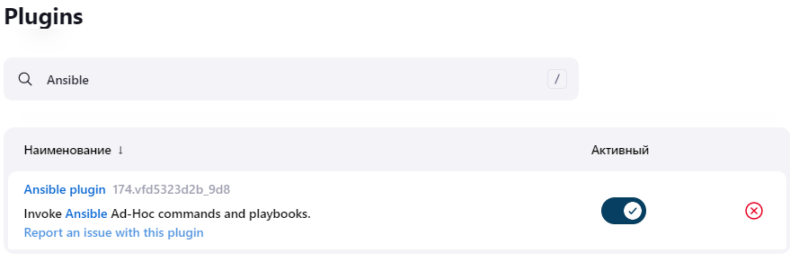
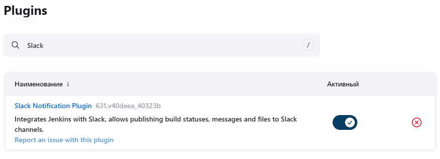
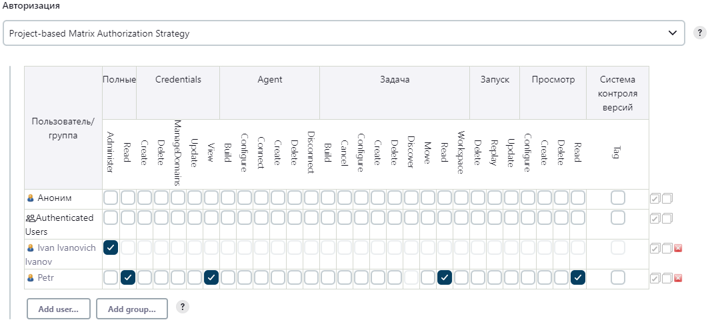
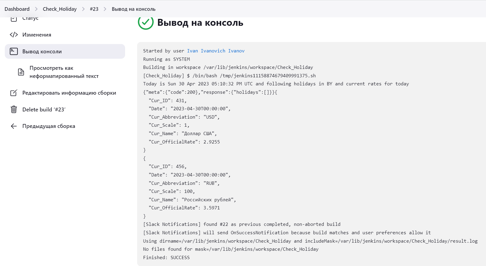

### Config.xml
```bash
<?xml version='1.1' encoding='UTF-8'?>
<project>
  <actions/>
  <description></description>
  <keepDependencies>false</keepDependencies>
  <properties/>
  <scm class="hudson.scm.NullSCM"/>
  <canRoam>true</canRoam>
  <disabled>false</disabled>
  <blockBuildWhenDownstreamBuilding>false</blockBuildWhenDownstreamBuilding>
  <blockBuildWhenUpstreamBuilding>false</blockBuildWhenUpstreamBuilding>
  <triggers>
    <hudson.triggers.TimerTrigger>
      <spec>H 13 * * *</spec>
    </hudson.triggers.TimerTrigger>
  </triggers>
  <concurrentBuild>false</concurrentBuild>
  <builders>
    <hudson.tasks.Shell>
      <command>#!/bin/bash
today=$(date +&quot;&amp;year=%Y&amp;month=%m&amp;day=%d&quot;)
echo &quot;Today is $(date) and following holidays in BY and current rates for today&quot;
curl -s &quot;https://calendarific.com/api/v2/holidays?&amp;api_key=**********&amp;country=BY&amp;${today}&quot; | cat &gt; result.log
curl -s https://www.nbrb.by/api/exrates/rates/431 | jq | cat &gt;&gt; result.log
curl -s https://www.nbrb.by/api/exrates/rates/456 | jq | cat &gt;&gt; result.log
cat result.log</command>
      <configuredLocalRules/>
    </hudson.tasks.Shell>
  </builders>
  <publishers>
    <jenkins.plugins.slack.SlackNotifier plugin="slack@664.vc9a_90f8b_c24a_">
      <baseUrl></baseUrl>
      <teamDomain></teamDomain>
      <authToken></authToken>
      <tokenCredentialId>slack_jenkins</tokenCredentialId>
      <botUser>false</botUser>
      <room></room>
      <sendAsText>false</sendAsText>
      <iconEmoji></iconEmoji>
      <username></username>
      <startNotification>false</startNotification>
      <notifySuccess>true</notifySuccess>
      <notifyAborted>false</notifyAborted>
      <notifyNotBuilt>false</notifyNotBuilt>
      <notifyUnstable>false</notifyUnstable>
      <notifyRegression>false</notifyRegression>
      <notifyFailure>false</notifyFailure>
      <notifyEveryFailure>true</notifyEveryFailure>
      <notifyBackToNormal>false</notifyBackToNormal>
      <notifyRepeatedFailure>false</notifyRepeatedFailure>
      <includeTestSummary>false</includeTestSummary>
      <includeFailedTests>false</includeFailedTests>
      <uploadFiles>true</uploadFiles>
      <artifactIncludes>/var/lib/jenkins/workspace/Check_Holiday/result.log</artifactIncludes>
      <commitInfoChoice>NONE</commitInfoChoice>
      <includeCustomMessage>false</includeCustomMessage>
      <customMessage></customMessage>
      <customMessageSuccess></customMessageSuccess>
      <customMessageAborted></customMessageAborted>
      <customMessageNotBuilt></customMessageNotBuilt>
      <customMessageUnstable></customMessageUnstable>
      <customMessageFailure></customMessageFailure>
    </jenkins.plugins.slack.SlackNotifier>
  </publishers>
  <buildWrappers/>
</project>
```
## Nginx.conf

```bash
server {
listen 80;
listen [::]:80;

root /var/www/jen/html;
index index.html index.htm index.nginx-debian.html;
server_name jenkins.com www.jenkins.com;

location / {
        try_files $uri $uri/ =404;
        proxy_pass          http://localhost:8080;
        proxy_read_timeout  90s;
        proxy_redirect      http://localhost  http://jenkins.com;
        proxy_set_header    Host        $host;
        proxy_set_header    X-Real-IP   $remote_addr;
        proxy_set_header    X-Forwarded-For     $proxy_add_x_forwarded_for;
        proxy_set_header    X-Forwarded-Proto   http;
}

access_log            /var/log/nginx/jenkins.access.log;
error_log             /var/log/nginx/jenkins.error.log;
}

```
