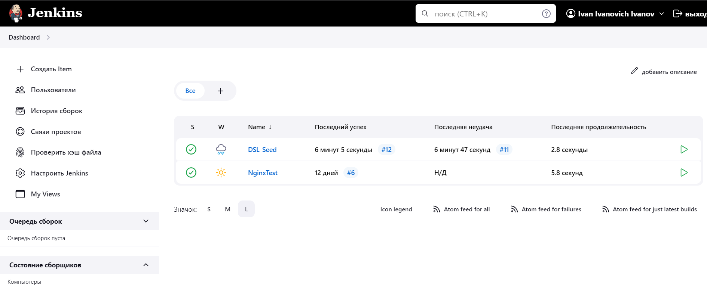
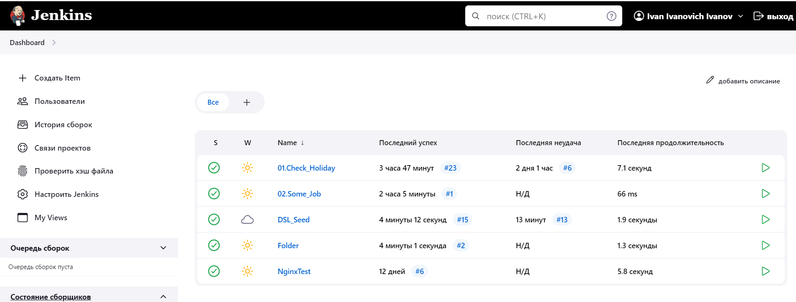

GitHub Repo -> [Link](https://github.com/anton-bartoshevich/Jenkins.git)

## CaSC file
```bash
jobs:
  - script: >
     job('DSL_Seed') {
             scm {
                git {
                  remote {
                     url 'https://github.com/anton-bartoshevich/Jenkins.git'
               }
            branch('main')
            }
          }
        steps {
          dsl {
            external('seed.groovy')
          }
        }
      }
```
### Without jobs

### After launch DSL job 
