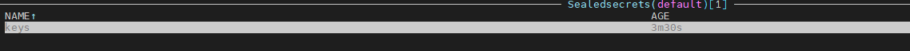

# Anton Ivanov HW12

## Install sealed-secrets
```
wget https://github.com/bitnami-labs/sealed-secrets/releases/download/v0.24.2/kubeseal-0.24.2-linux-amd64.tar.gz  
tar -C /usr/local/bin -xzf  kubeseal-0.24.2-linux-amd64.tar.gz
kubectl apply -f https://github.com/bitnami-labs/sealed-secrets/releases/download/v0.24.2/controller.yaml
```

## Command for create secrets
```sh
kubectl create secret generic keys --from-file=id_rsa.pub --from-file=id_rsa --dry-run=client -o yaml > root-keys-secret.yaml
kubeseal < root-keys-secret.yaml > root-keys-sealed-secret.yaml
kubectl apply -f root-keys-sealed-secret.yaml
```


