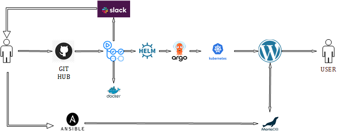

#  Project report

### **Project's reporter:** Anton Ivanov

### **Group number:** m-sa2-25-23

## Description of application for deployment
### **Name of application:** Wordpress 
### **Which programming language is this application written in:** PHP
### **What kind of DB:** MariaDB

---

## Pipeline.High Level Design

---

## Technologies which were used in project
### **Orchestration:** Kubernetes

### **Automation tools:** Ansible, Github Actions, ArgoCD

### **Database:** MariaDB on the remote host

### **SCM:** Github

### **Other tools:** Helm, Docker

### **Notifications:** Slack

---

## CI description: 
### By pushing to the git repository, github actions are launched. A new image is created from the docker folder with a new tag and published to dockerhub. A Helm package is created with a new tag  and sends notification in Slack. AgroCD syncs with Helm repository, deploys application to kubernetes cluster.

---

## Links

### [Project repository](https://github.com/AntonIvanovDevOps/Project)
