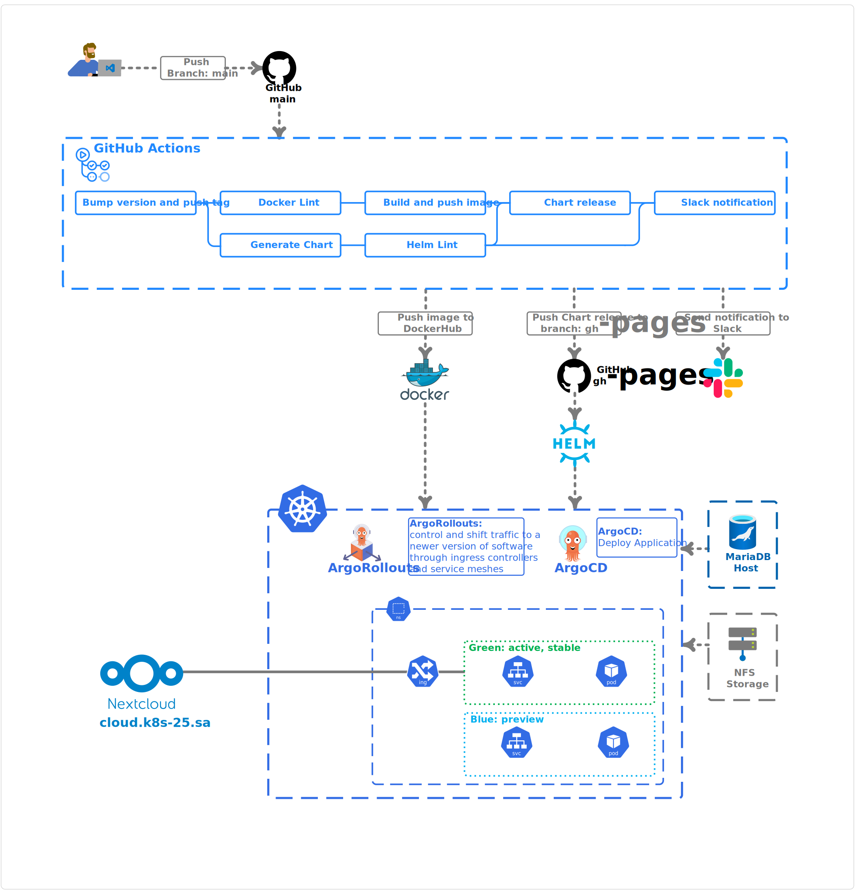

Status of last build and package  
 

---
# **Project report**
### **Project's reporter:** Anton Skuratovich
### **Group number:** md-sa2-21-22
---
## **Description of application for deployment**
- **Application:** Nextcloud
- **Programimg language:** PHP
- **DB:** MariaDB
- **Official git repository link:** https://github.com/nextcloud/docker
---
## Pipeline. High Level Design

---
## Technologies which were used in project
- **Orchestration:** Kubernetes
- **Automation tools:** Github actions, Argo CD
- **SCM:** GitHub
- **Notification:** Slack
- **Other tools:** Docker, Helm, Argo Rollouts
---

## CI/CD description:
GitHub actions workflow starting after pushing to the main branch.

### CI following steps:
| Action|Description|
|------------|------------------------------------------------|
|**Bump version and push tag** | Automatically bump and push tag. |
|**Docker Lint** | Verifying `Dockerfile`.|
|**Build and push image**|Build docker image and push it to the Docker Hub. This action will not start if the **Docker Lint** fails.|
|**Generate Chart**|Update *appVersion* and *version* in the `Chart.yaml` and push changes to the **main** branch.|
|**Helm Lint**|Verifying Helm Chart. This action will not start if the **Generate Chart** fails.|
|**Chart release**|This action generates a helm diagram package and updates file `index.yaml`. Push changes to the **gh-pages** branch. Will not be start if **Build and push image** or **Helm Lint** fail.|
|**Slack Notification**|Send notification to the Slack mesenger.|

### CD following steps:

- GitHub pages used as helm diagram artifactory
- ArgoCD used for deploying aplication
- ArgoRollouts (BlueGreen Update strategy) controll and shift traffic to a newer version of software throw ingress controller and service meshes. After deploying new version of aplication needs to promote rollout in the ArgoCD web UI or in terminal by command `kubectl argo rollouts promote nextcloud -n nextcloud` 
- We can check status in the ArgoCD web UI or in the terminal by command `kubectl argo rollouts get rollout nextcloud -n nextcloud` 

## Rollback flow description and implementation

Rollback from the terminal by command: `kubectl argo rollouts undo nextcloud -n nextcloud` 
This command back to the previous revision of rollout.
Then needs promote again.

---

## Links: 
Project repository: https://github.com/Tony-BY/nextcloud-ci