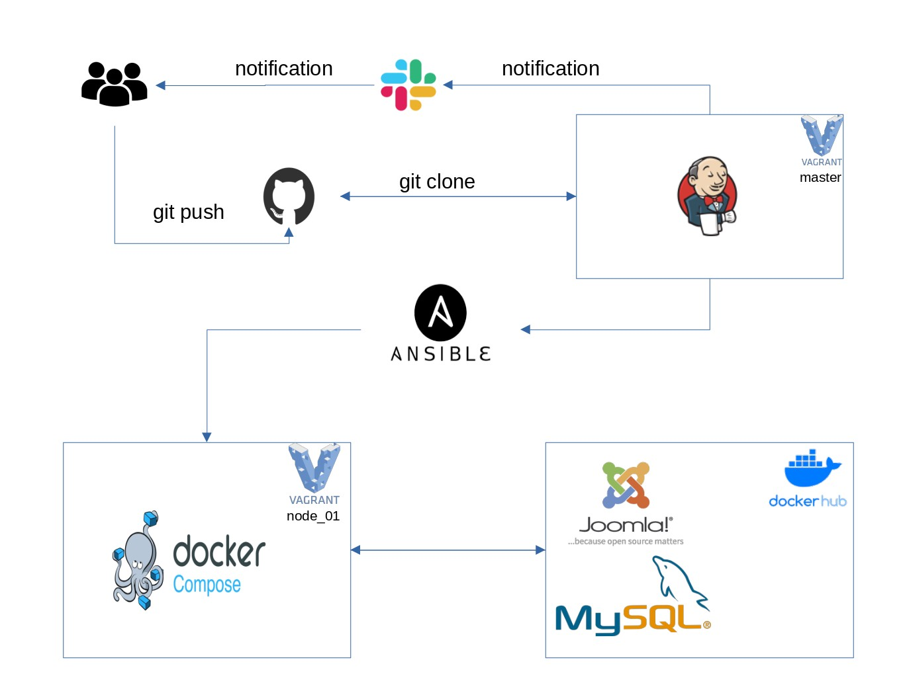

# Project report

### Project's reporter: Arkadzi, Tarkan

---

### Group number: m-sa2-16-21

## Description of application for deployment

### Name: Joomla

### Programming language: PHP and JavaScript

### BD: MySQL

### Website: www.joomla.org

### Git: https://github.com/joomla/joomla-cms

---

## Pipeline. High Level Design

---

## Technologies which were used in project

### Orchestration: Jenkins

### Automation tools: Ansible

### SCM: GitHub

### CI description: by schedule (every day in 6:00 am)

### Other: Vagrant, Docker, Mysql

---

## Deployment flows short description:

### Users submit code to github. Jenrins is scheduled to launch a pipeline. Ansible deploys all the necessary infrastructure to run containers, makes backups of databases and applications.

---

## Rollback flow description and implementation:

### In case of an unsuccessful update, ansible stops and deletes the current container, restores the database and application files from the backup, starts the previous container. Sends notification to slack.

---

## Links

 ### [GitHub](https://github.com/arkadzit/project.git)