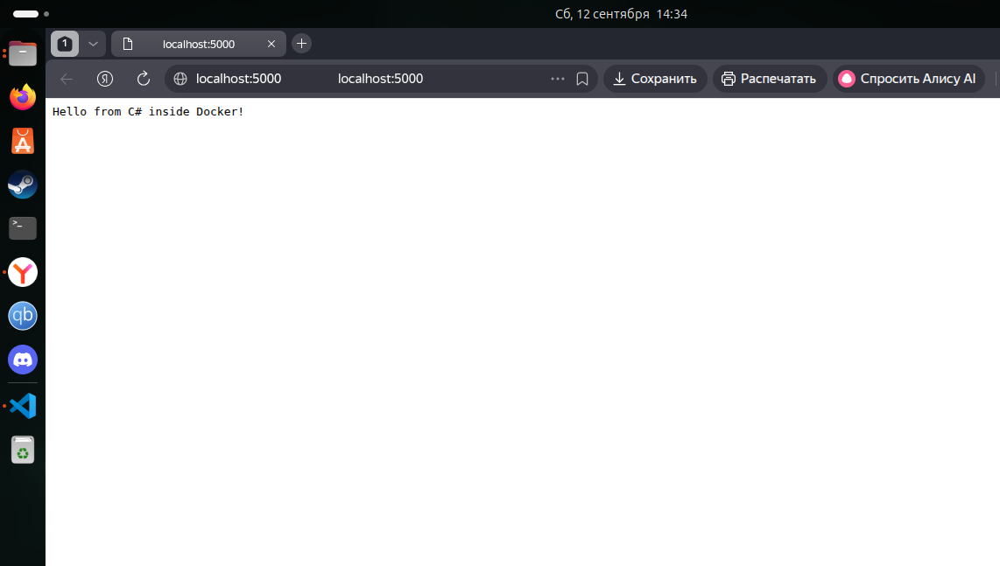
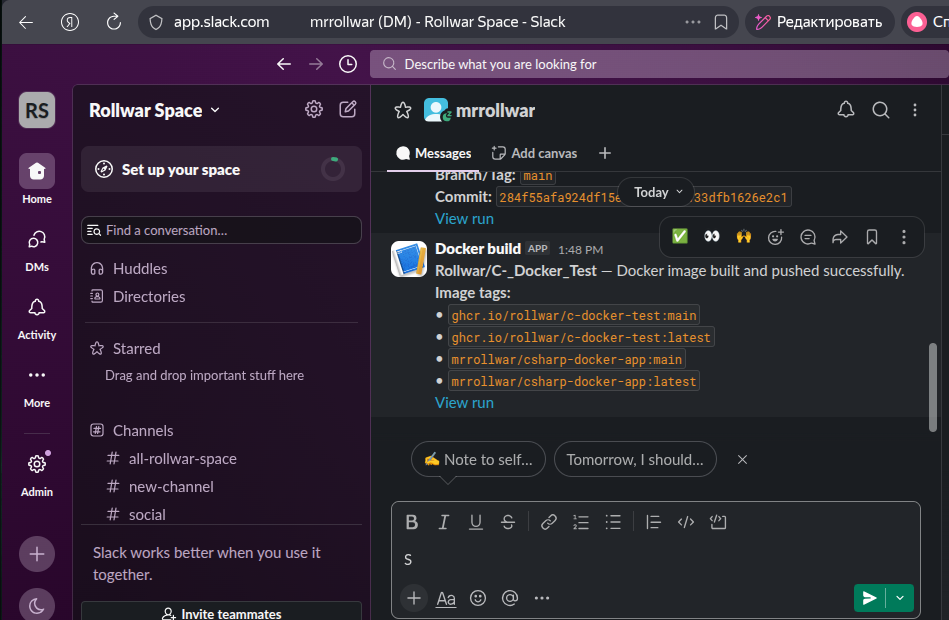

# 09. Docker. Basic concept

## Assignment 1: Docker Installation and Basic Commands

### Install docker
```bash
sudo apt update
sudo apt install -y ca-certificates curl gnupg
sudo install -m 0755 -d /etc/apt/keyrings
curl -fsSL https://download.docker.com/linux/ubuntu/gpg | sudo gpg --dearmor -o /etc/apt/keyrings/docker.gpg
sudo chmod a+r /etc/apt/keyrings/docker.gpg
echo \
  "deb [arch=$(dpkg --print-architecture) signed-by=/etc/apt/keyrings/docker.gpg] https://download.docker.com/linux/ubuntu \
  $(. /etc/os-release && echo "$VERSION_CODENAME") stable" | \
  sudo tee /etc/apt/sources.list.d/docker.list > /dev/null
sudo apt update
sudo apt install -y docker-ce docker-ce-cli containerd.io docker-buildx-plugin docker-compose-plugin
sudo usermod -aG docker $USER
newgrp docker
```

### Check version 
```bash
docker --version
Docker version 29.7.2, build a7dcaa6
```

### Run Hello-world container

```text
Hello from Docker!
This message shows that your installation appears to be working correctly.

To generate this message, Docker took the following steps:
 1. The Docker client contacted the Docker daemon.
 2. The Docker daemon pulled the "hello-world" image from the Docker Hub.
    (amd64)
 3. The Docker daemon created a new container from that image which runs the
    executable that produces the output you are currently reading.
 4. The Docker daemon streamed that output to the Docker client, which sent it
    to your terminal.

To try something more ambitious, you can run an Ubuntu container with:
 $ docker run -it ubuntu bash
```

```bash
 docker pull hello-world
 docker run hello-world
 docker ps
 # CONTAINER ID   IMAGE     COMMAND   CREATED   STATUS    PORTS     NAMES
 docker ps -a
 # CONTAINER ID IMAGE  COMMAND CREATED STATUS PORTS     NAMES
#f249603eecd0 hello-world "/hello" 2 hours ago   Exited (0) 2 hours ago             cranky_newton
```

## Assignment 2: Building a Docker Image with Dockerfile

Original repository: [Rollwar->C--Docker-Test](https://github.com/Rollwar/C-_Docker_Test).

```bash
docker build -t csharp-docker-app:1.0 .
docker run -d --name csharp-app -p 5000:5000 csharp-docker-app:1.
```

Docker container was checked via a browser. (http://localhost:5000)


## Assignment 3: Building a Docker Image with Dockerfile
Original pipeline [here](https://github.com/Rollwar/C-_Docker_Test/blob/main/.github/workflows/docker-publish.yml) 
This folder also contains `docker-publish.yml`.

### Result docker link 
[Docker](https://hub.docker.com/repository/docker/mrrollwar/csharp-docker-app/general)

### Slack Notifications
