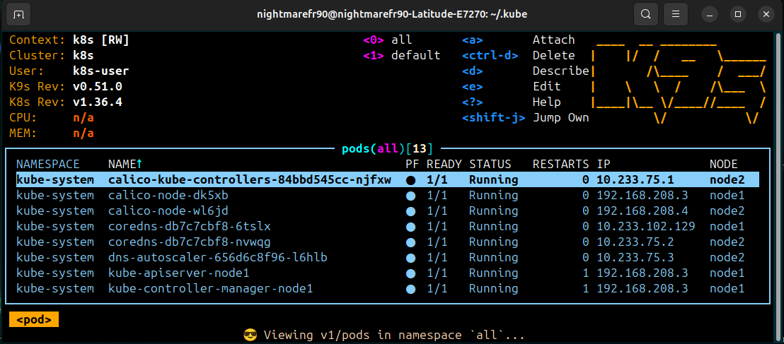
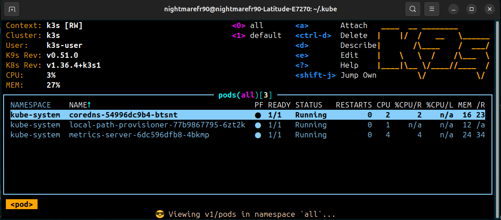
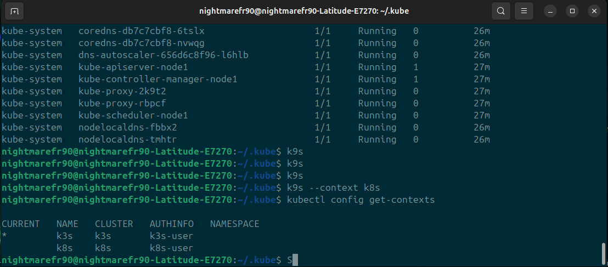
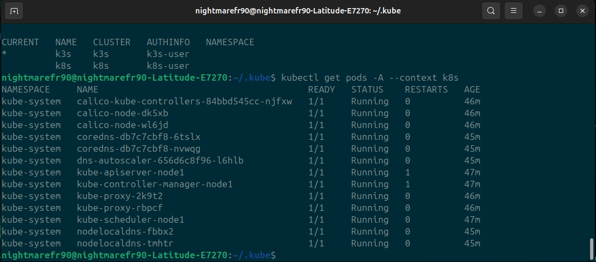
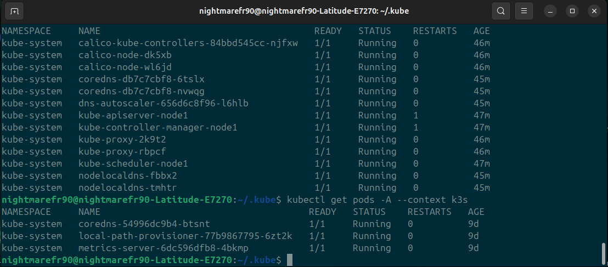

# 11. Kubernetes installation

## Assignment 1: K8s Installation

This file does not include the steps for installing k3s, since an installation example was provided in the previous task.

### Installation k8s via kuberspray
```bash
git clone https://github.com/kubernetes-sigs/kubespray.git
sudo pip install -r requirements.txt
cp -rfp inventory/sample inventory/mycluster
ansible-playbook -i inventory/mycluster/inv.ini cluster.yml -u student -b
```

### inv.ini example
```yaml
node1 ansible_host=192.168.208.3 ip=192.168.208.3 etcd_member_name=etcd1 ansible_python_interpreter=/usr/bin/python3
node2 ansible_host=192.168.208.4 ip=192.168.208.4 ansible_python_interpreter=/usr/bin/python3

[kube_control_plane]
node1

[etcd:children]
kube_control_plane

[kube_node]
node1
node2
```

## Screenshots 











Here are examples of github actions.
[Github Actions](https://github.com/Rollwar/kuber-healthcheck/actions/runs/36311195807)