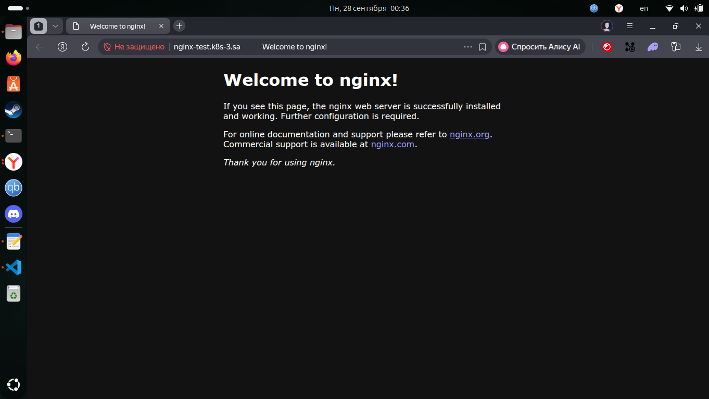
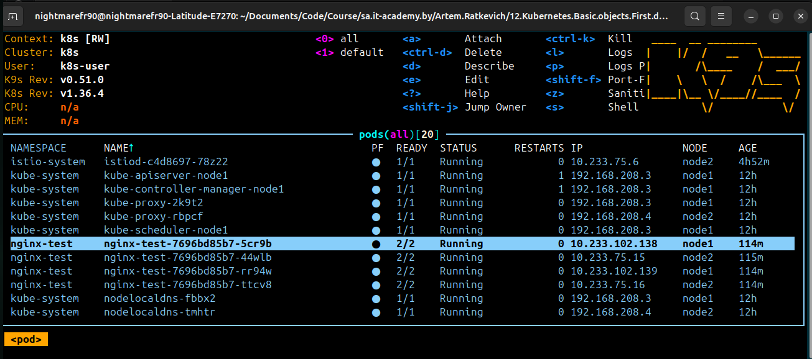
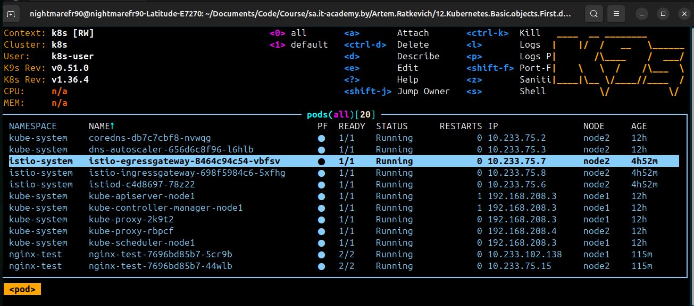

# 12. Kubernetes. First deployment

## Assignment 1: NGINX Installation

### Architecture Overview
```text
Browser → DNS (nginx-test.k8s-3.sa → Bastion IP) → NodePort 30001 → istio-ingressgateway → Gateway → VirtualService → nginx-service → 4× nginx pods
```

### Install istioctl
```bash
curl -L https://istio.io/downloadIstio | sh -  
cd istio-1.31.1/
sudo install -m 0755 bin/istioctl /usr/local/bin/
istioctl x precheck --context k8s
istioctl version --context k8s
istioctl x precheck --context k8s
kubectl create namespace istio-system --context k8s 2>/dev/null || true
istioctl install -y --set profile=demo --context k8s
kubectl label ns default istio-injection=enabled --overwrite --context k8s
```

### Deploy nginx and services
```bash
kubectl apply -f nginx-deployment.yaml --context k8s
```

### Update ingressgateway nodeport
```bash
kubectl -n istio-system get svc istio-ingressgateway --context k8s -o yaml > igw-svc.yaml
### Setup nodeport http2 30001
nano igw-svc.yaml
kubectl apply -f igw-svc.yaml --context k8s
```

## Screenshots 





