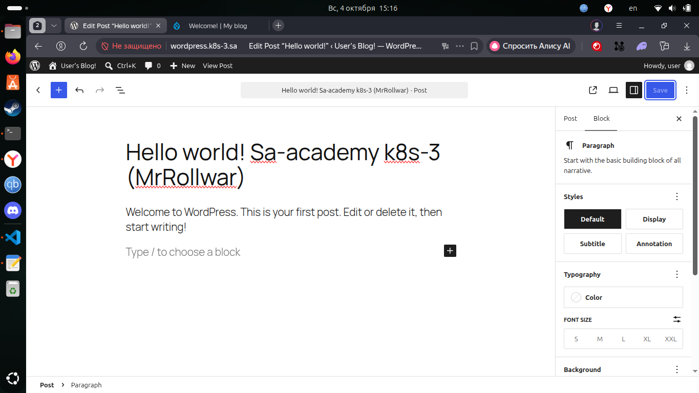
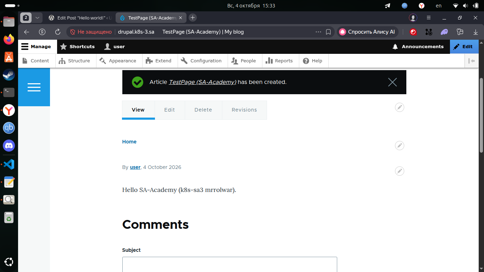
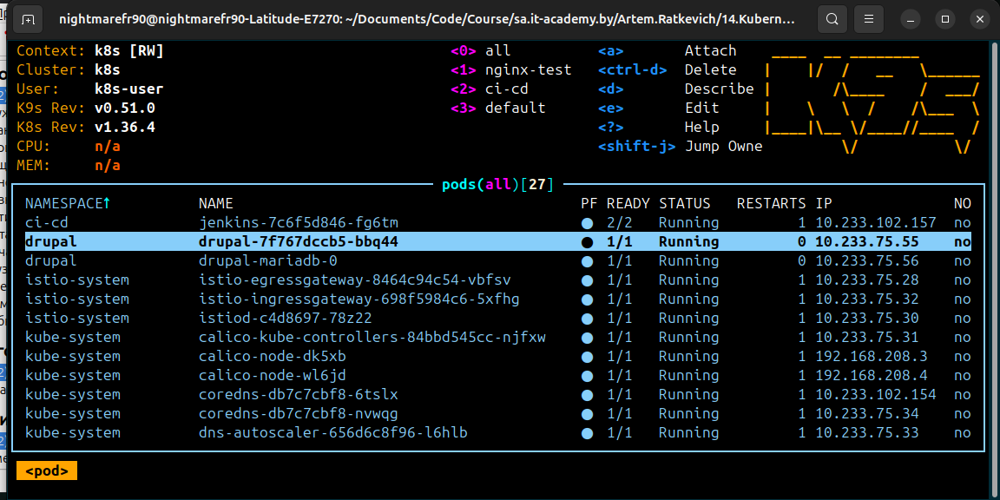
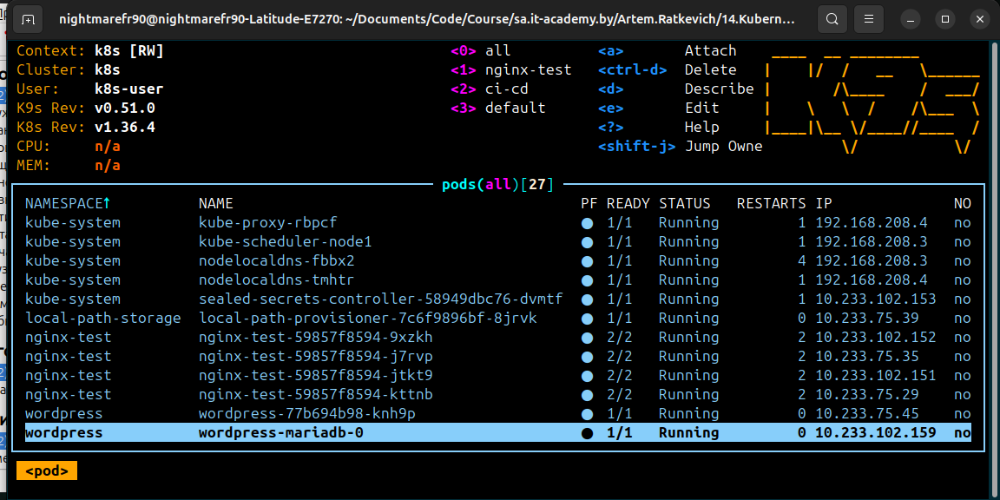

# 14. Kubernetes Helm

## Assignment 1: Wordpress + Drupal Installation

### Installation helm
```bash
sudo apt-get install curl gpg apt-transport-https --yes
curl -fsSL https://packages.buildkite.com/helm-linux/helm-debian/gpgkey | gpg --dearmor | sudo tee /usr/share/keyrings/helm.gpg > /dev/null
echo "deb [signed-by=/usr/share/keyrings/helm.gpg] https://packages.buildkite.com/helm-linux/helm-debian/any/ any main" | sudo tee /etc/apt/sources.list.d/helm-stable-debian.list
sudo apt-get update
sudo apt-get install helm
```

### Install wordpress via helm
```bash
helm repo add bitnami https://charts.bitnami.com/bitnami
helm repo update

helm install wordpress bitnami/wordpress -n wordpress --create-namespace -f wordpress-values.yaml -f drupal-credentials.yaml --kube-context k8s
kubectl -n wordpress get pods -w --context k8s

# Get admin password (login is `user`)
kubectl -n wordpress get secret wordpress -o jsonpath='{.data.wordpress-password}' --context k8s | base64 -d; echo
```

### Install drupal via helm
```bash
helm install drupal bitnami/drupal -n drupal --create-namespace -f drupal-values.yaml -f drupal-credentials.yaml --kube-context k8s
kubectl -n drupal get pods -w --context k8s

# Get admin password (login is `user`). Password is the same as in 'drupal-credentials.yaml'
kubectl -n drupal get secret drupal -o jsonpath='{.data.drupal-password}' | base64 -d; echo
```
### Apply changes for istio
```bash
kubectl apply -f istio-ingress.yaml --context k8s
```

## Screenshots 








