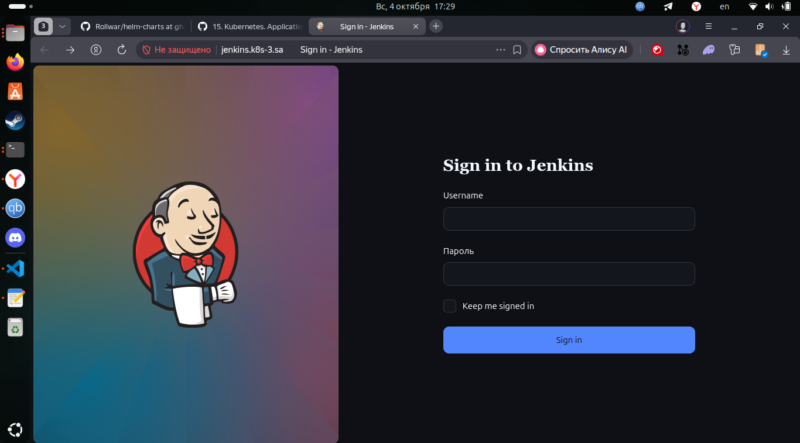

# 15. Kubernetes. Application deployment

## Assignment 1: Transform Jenkins deployment to Helm

Current structure of helm repository 

```text
jenkins/
├── Chart.yaml
├── values.yaml
└── templates/
    ├── 1-namespace-rbac.yaml     # Namespace, ServiceAccount, Role, RoleBinding
    ├── 02-storage.yaml           # PV, PVC
    ├── 03-config.yaml            # Secret, ConfigMap (JCasC), ConfigMap (groovy)
    └── 04-jenkins.yaml           # Deployment, Service
```

### Build helm
```bash
helm lint jenkins
helm template jenkins jenkins -n ci-cd          

helm install jenkins ./jenkins

helm package jenkins
# -> jenkins-0.1.0.tgz

cp jenkins-0.1.0.tgz /home/Helm/
cd /home/Helm/
helm repo index . --url https://Rollwar.github.io/helm-charts
git add . && git commit -m "publish jenkins-0.1.0" && git push

helm repo add Helm.Jenkins https://Rollwar.github.io/helm-charts
helm repo update
helm install jenkins Helm.Jenkins/jenkins -n ci-cd
```


### Jenkins screenshot example
[HelmRepo](https://github.com/Rollwar/helm-charts/tree/gh-pages)

