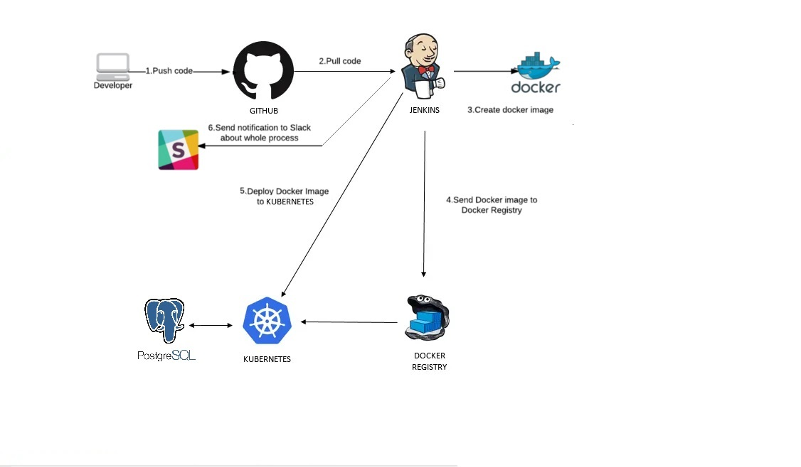

## Project report

### Project's reporter: Artem Onishchuk
### Group number: m-sa2-14-20

## Description of application for deployment
- Name: Drupal
- Application is written in PHP
- Used database: PostgreSQL
- [CI & CD GitHub repository](https://github.com/ArtemOnishchuk/project_ci-cd)

### Project scheme 

### Technologies which were used in project
- **Orchestration:** Jenkins
- **Automation tools:** Jenkins
- **Infrastructure:** Kubernetes
- **Container:** Docker
- **SCM:** GitHub
- **Notification:** Slack

   