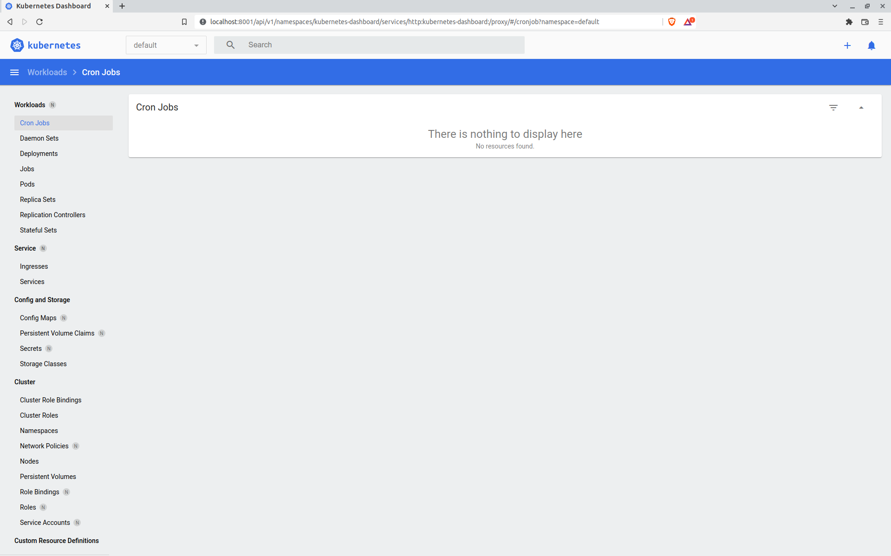
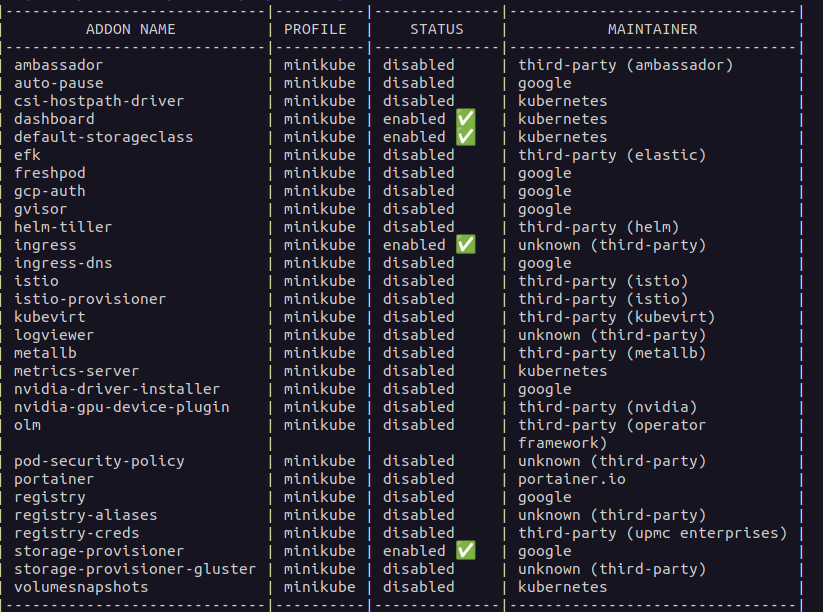

# 10. Kubernetes

## Minikube


### Enable plugin: ingress


### Prepare command for run minikube with different HW options (RAM/CPU)
```bash
minikube start --memory 8192 --cpus 4
```
## Add final summary of ansible play to your report as separate section

```bash
PLAY RECAP ******************************************************************************************
localhost                  : ok=4    changed=0    unreachable=0    failed=0    skipped=0    rescued=0    ignored=0   
node1                      : ok=693  changed=100  unreachable=0    failed=0    skipped=1171 rescued=0    ignored=3   
node2                      : ok=471  changed=50   unreachable=0    failed=0    skipped=656  rescued=0    ignored=1   

Sunday 13 February 2022  18:39:52 +0000 (0:00:00.031)       0:29:01.163 ******* 
=============================================================================== 
kubernetes-apps/ansible : Kubernetes Apps | Lay Down CoreDNS templates ---------------------- 48.25s
download : download_container | Download image if required ---------------------------------- 45.52s
download : download_container | Download image if required ---------------------------------- 44.80s
download : download_container | Download image if required ---------------------------------- 40.19s
kubernetes-apps/ansible : Kubernetes Apps | Start Resources --------------------------------- 36.40s
kubernetes/control-plane : kubeadm | Initialize first master -------------------------------- 34.40s
download : download_container | Download image if required ---------------------------------- 32.34s
download : download_container | Download image if required ---------------------------------- 32.06s
network_plugin/calico : Calico | Create calico manifests ------------------------------------ 28.24s
download : download_container | Download image if required ---------------------------------- 22.38s
kubernetes/kubeadm : Join to cluster -------------------------------------------------------- 21.11s
download : download_container | Download image if required ---------------------------------- 20.65s
download : download_container | Download image if required ---------------------------------- 19.50s
policy_controller/calico : Create calico-kube-controllers manifests ------------------------- 18.80s
download : download_file | Download item ---------------------------------------------------- 17.94s
network_plugin/calico : Start Calico resources ---------------------------------------------- 17.50s
download : download_container | Download image if required ---------------------------------- 16.42s
download : download_container | Download image if required ---------------------------------- 16.03s
download : download_container | Download image if required ---------------------------------- 16.00s
download : download_file | Download item ---------------------------------------------------- 15.84s
```