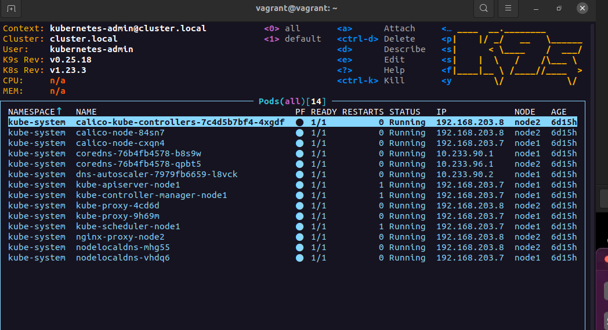
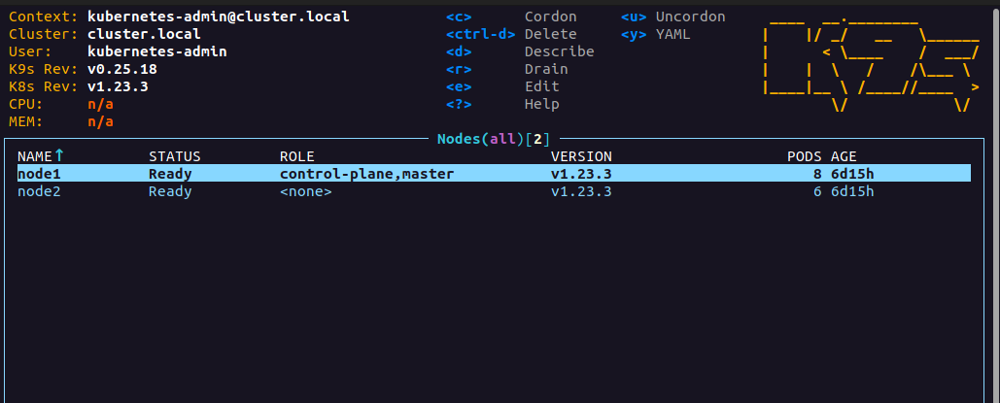
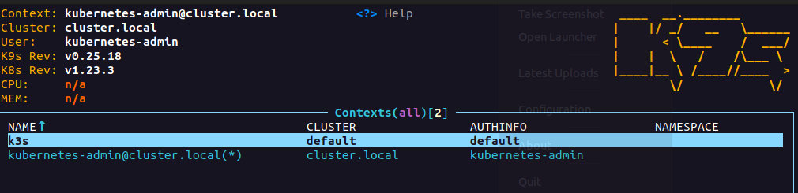

# 11.Kubernetes.Installation


## k9s


### Nodes



## kubectl config view
```yaml
apiVersion: v1
clusters:
- cluster:
    certificate-authority-data: DATA+OMITTED
    server: https://192.168.203.7:6443
  name: cluster.local
- cluster:
    certificate-authority-data: DATA+OMITTED
    server: https://192.168.203.26:6443
  name: k3s
contexts:
- context:
    cluster: default
    user: default
  name: k3s
- context:
    cluster: cluster.local
    user: kubernetes-admin
  name: kubernetes-admin@cluster.local
current-context: kubernetes-admin@cluster.local
kind: Config
preferences: {}
users:
- name: default
  user:
    client-certificate-data: REDACTED
    client-key-data: REDACTED
- name: kubernetes-admin
  user:
    client-certificate-data: REDACTED
    client-key-data: REDACTED
```
## context


### Switched to context
```bash
vagrant@vagrant:~$ kubectl config use-context  kubernetes-admin@cluster.local 
Switched to context "kubernetes-admin@cluster.local".
```
### get nodes
```bash
vagrant@vagrant:~$ kubectl get nodes
NAME    STATUS   ROLES                  AGE     VERSION
node1   Ready    control-plane,master   6d22h   v1.23.3
node2   Ready    <none>                 6d22h   v1.23.3
```
### get pods
```bash
vagrant@vagrant:~$ kubectl get pods --all-namespaces
NAMESPACE     NAME                                       READY   STATUS    RESTARTS   AGE
kube-system   calico-kube-controllers-7c4d5b7bf4-4xgdf   1/1     Running   0          6d21h
kube-system   calico-node-84sn7                          1/1     Running   0          6d22h
kube-system   calico-node-cxqn4                          1/1     Running   0          6d22h
kube-system   coredns-76b4fb4578-b8s9w                   1/1     Running   0          6d21h
kube-system   coredns-76b4fb4578-qpbt5                   1/1     Running   0          6d21h
kube-system   dns-autoscaler-7979fb6659-l8vck            1/1     Running   0          6d21h
kube-system   kube-apiserver-node1                       1/1     Running   1          6d22h
kube-system   kube-controller-manager-node1              1/1     Running   1          6d22h
kube-system   kube-proxy-4cd6d                           1/1     Running   0          6d22h
kube-system   kube-proxy-9h69m                           1/1     Running   0          6d22h
kube-system   kube-scheduler-node1                       1/1     Running   1          6d22h
kube-system   nginx-proxy-node2                          1/1     Running   0          6d22h
kube-system   nodelocaldns-mhg55                         1/1     Running   0          6d21h
kube-system   nodelocaldns-vhdq6                         1/1     Running   0          6d21h
```