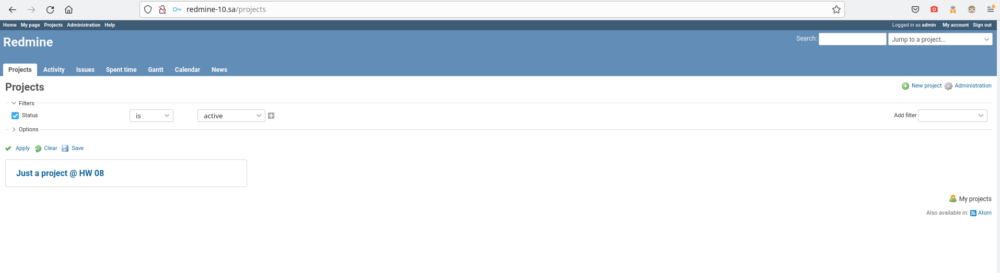

#08 Ansible Workshop

##Redmine screenshot


##Ansible workflow
```bash
 ansible-playbook redmine.yaml -i host_list.yaml 

PLAY [redmine] ***************************************************************************************************************************************************************************************************

TASK [Gathering Facts] *******************************************************************************************************************************************************************************************
Tuesday 14 June 2022  05:59:28 +0300 (0:00:00.067)       0:00:00.067 ********** 
ok: [redmine_10]

TASK [debug] *****************************************************************************************************************************************************************************************************
Tuesday 14 June 2022  05:59:31 +0300 (0:00:02.723)       0:00:02.791 ********** 
ok: [redmine_10] => {
    "msg": "192.168.201.10"
}

TASK [Include pre_tasks vars] ************************************************************************************************************************************************************************************
Tuesday 14 June 2022  05:59:31 +0300 (0:00:00.045)       0:00:02.836 ********** 
ok: [redmine_10]

TASK [Redmine. Install packages] *********************************************************************************************************************************************************************************
Tuesday 14 June 2022  05:59:31 +0300 (0:00:00.027)       0:00:02.864 ********** 
changed: [redmine_10]

TASK [mysql : MySQL.Install MYSQL] *******************************************************************************************************************************************************************************
Tuesday 14 June 2022  05:59:56 +0300 (0:00:24.814)       0:00:27.678 ********** 
ok: [redmine_10]

TASK [mysql : MySQL.Create DB] ***********************************************************************************************************************************************************************************
Tuesday 14 June 2022  05:59:58 +0300 (0:00:02.678)       0:00:30.357 ********** 
changed: [redmine_10]

TASK [mysql : MySQL.Create DB User] ******************************************************************************************************************************************************************************
Tuesday 14 June 2022  06:00:00 +0300 (0:00:01.466)       0:00:31.823 ********** 
changed: [redmine_10]

TASK [redmine : Redmine. Clone repository] ***********************************************************************************************************************************************************************
Tuesday 14 June 2022  06:00:01 +0300 (0:00:01.298)       0:00:33.121 ********** 
changed: [redmine_10]

TASK [redmine : Redmine. Change permissions] *********************************************************************************************************************************************************************
Tuesday 14 June 2022  06:00:18 +0300 (0:00:16.498)       0:00:49.619 ********** 
changed: [redmine_10]

TASK [redmine : Redmine. Change permissions] *********************************************************************************************************************************************************************
Tuesday 14 June 2022  06:00:19 +0300 (0:00:01.060)       0:00:50.680 ********** 
changed: [redmine_10]

TASK [redmine : Config database] *********************************************************************************************************************************************************************************
Tuesday 14 June 2022  06:00:20 +0300 (0:00:00.920)       0:00:51.600 ********** 
changed: [redmine_10]

TASK [redmine : Redmine. Setup 01] *******************************************************************************************************************************************************************************
Tuesday 14 June 2022  06:00:22 +0300 (0:00:02.190)       0:00:53.790 ********** 
changed: [redmine_10]

TASK [redmine : Session store secret generation] *****************************************************************************************************************************************************************
Tuesday 14 June 2022  06:00:28 +0300 (0:00:06.502)       0:01:00.293 ********** 
changed: [redmine_10]

TASK [redmine : Redmine. Setup 02] *******************************************************************************************************************************************************************************
Tuesday 14 June 2022  06:00:31 +0300 (0:00:02.909)       0:01:03.202 ********** 
changed: [redmine_10]

TASK [redmine : Configuration files for virtualhost] *************************************************************************************************************************************************************
Tuesday 14 June 2022  06:00:51 +0300 (0:00:19.367)       0:01:22.569 ********** 
changed: [redmine_10]

RUNNING HANDLER [redmine : apache restart] ***********************************************************************************************************************************************************************
Tuesday 14 June 2022  06:00:52 +0300 (0:00:01.632)       0:01:24.202 ********** 
changed: [redmine_10]

TASK [Include post_tasks variables] ******************************************************************************************************************************************************************************
Tuesday 14 June 2022  06:00:56 +0300 (0:00:03.959)       0:01:28.161 ********** 
ok: [redmine_10]

TASK [Add redmine-10.sa to host file] ****************************************************************************************************************************************************************************
Tuesday 14 June 2022  06:00:56 +0300 (0:00:00.086)       0:01:28.248 ********** 
changed: [redmine_10]

TASK [uri] *******************************************************************************************************************************************************************************************************
Tuesday 14 June 2022  06:00:57 +0300 (0:00:00.855)       0:01:29.103 ********** 
ok: [redmine_10]

TASK [lineinfile] ************************************************************************************************************************************************************************************************
Tuesday 14 June 2022  06:01:03 +0300 (0:00:06.216)       0:01:35.320 ********** 
changed: [redmine_10]

PLAY RECAP *******************************************************************************************************************************************************************************************************
redmine_10                 : ok=20   changed=14   unreachable=0    failed=0    skipped=0    rescued=0    ignored=0   

Tuesday 14 June 2022  06:01:04 +0300 (0:00:00.998)       0:01:36.319 ********** 
=============================================================================== 
Redmine. Install packages -------------------------------------------------------------------------------------------------------------------------------------------------------------------------------- 24.81s
redmine : Redmine. Setup 02 ------------------------------------------------------------------------------------------------------------------------------------------------------------------------------ 19.37s
redmine : Redmine. Clone repository ---------------------------------------------------------------------------------------------------------------------------------------------------------------------- 16.50s
redmine : Redmine. Setup 01 ------------------------------------------------------------------------------------------------------------------------------------------------------------------------------- 6.50s
uri ------------------------------------------------------------------------------------------------------------------------------------------------------------------------------------------------------- 6.22s
redmine : apache restart ---------------------------------------------------------------------------------------------------------------------------------------------------------------------------------- 3.96s
redmine : Session store secret generation ----------------------------------------------------------------------------------------------------------------------------------------------------------------- 2.91s
Gathering Facts ------------------------------------------------------------------------------------------------------------------------------------------------------------------------------------------- 2.72s
mysql : MySQL.Install MYSQL ------------------------------------------------------------------------------------------------------------------------------------------------------------------------------- 2.68s
redmine : Config database --------------------------------------------------------------------------------------------------------------------------------------------------------------------------------- 2.19s
redmine : Configuration files for virtualhost ------------------------------------------------------------------------------------------------------------------------------------------------------------- 1.63s
mysql : MySQL.Create DB ----------------------------------------------------------------------------------------------------------------------------------------------------------------------------------- 1.47s
mysql : MySQL.Create DB User ------------------------------------------------------------------------------------------------------------------------------------------------------------------------------ 1.30s
redmine : Redmine. Change permissions --------------------------------------------------------------------------------------------------------------------------------------------------------------------- 1.06s
lineinfile ------------------------------------------------------------------------------------------------------------------------------------------------------------------------------------------------ 1.00s
redmine : Redmine. Change permissions --------------------------------------------------------------------------------------------------------------------------------------------------------------------- 0.92s
Add redmine-10.sa to host file ---------------------------------------------------------------------------------------------------------------------------------------------------------------------------- 0.86s
Include post_tasks variables ------------------------------------------------------------------------------------------------------------------------------------------------------------------------------ 0.09s
debug ----------------------------------------------------------------------------------------------------------------------------------------------------------------------------------------------------- 0.05s
Include pre_tasks vars ------------------------------------------------------------------------------------------------------------------------------------------------------------------------------------ 0.03s

```
