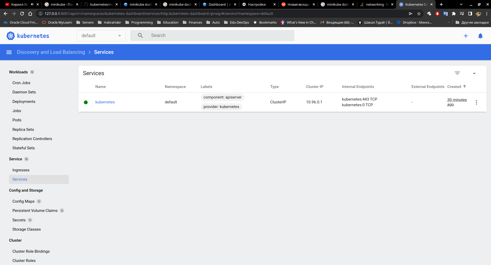
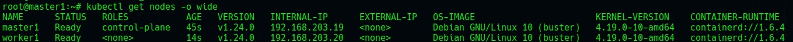

##### 10.Kubernetes


##Minikube commands:
```bash
[vagrant@Kube-centos ~]$ history
    1  curl -LO https://storage.googleapis.com/minikube/releases/latest/minikube-latest.x86_64.rpm
    2  sudo rpm -Uvh minikube-latest.x86_64.rpm
    3  minikube start
    4  minikube kubectl -- get pods -A
    5  sudo netstat -anp|less
    6  vi ~/.bashrc 
    7  . ~/.bashrc 
    8  sudo netstat -anp|less
    9  minikube dashboard --url
   10  sudo netstat -anp|less
   11  sudo netstat -anp|grep LISTEN|less
   12  minikube 
   13  minikube addons list
   14  minikube addons enable ingress
   15  minikube addons list

```

```bash
[vagrant@Kube-centos ~]$ minikube addons list
|-----------------------------|----------|--------------|--------------------------------|
|         ADDON NAME          | PROFILE  |    STATUS    |           MAINTAINER           |
|-----------------------------|----------|--------------|--------------------------------|
| ambassador                  | minikube | disabled     | third-party (ambassador)       |
| auto-pause                  | minikube | disabled     | google                         |
| csi-hostpath-driver         | minikube | disabled     | kubernetes                     |
| dashboard                   | minikube | enabled ✅   | kubernetes                     |
| default-storageclass        | minikube | enabled ✅   | kubernetes                     |
| efk                         | minikube | disabled     | third-party (elastic)          |
| freshpod                    | minikube | disabled     | google                         |
| gcp-auth                    | minikube | disabled     | google                         |
| gvisor                      | minikube | disabled     | google                         |
| helm-tiller                 | minikube | disabled     | third-party (helm)             |
| ingress                     | minikube | enabled ✅   | unknown (third-party)          |
| ingress-dns                 | minikube | disabled     | google                         |
| istio                       | minikube | disabled     | third-party (istio)            |
| istio-provisioner           | minikube | disabled     | third-party (istio)            |
| kong                        | minikube | disabled     | third-party (Kong HQ)          |
| kubevirt                    | minikube | disabled     | third-party (kubevirt)         |
| logviewer                   | minikube | disabled     | unknown (third-party)          |
| metallb                     | minikube | disabled     | third-party (metallb)          |
| metrics-server              | minikube | disabled     | kubernetes                     |
| nvidia-driver-installer     | minikube | disabled     | google                         |
| nvidia-gpu-device-plugin    | minikube | disabled     | third-party (nvidia)           |
| olm                         | minikube | disabled     | third-party (operator          |
|                             |          |              | framework)                     |
| pod-security-policy         | minikube | disabled     | unknown (third-party)          |
| portainer                   | minikube | disabled     | portainer.io                   |
| registry                    | minikube | disabled     | google                         |
| registry-aliases            | minikube | disabled     | unknown (third-party)          |
| registry-creds              | minikube | disabled     | third-party (upmc enterprises) |
| storage-provisioner         | minikube | enabled ✅   | google                         |
| storage-provisioner-gluster | minikube | disabled     | unknown (third-party)          |
| volumesnapshots             | minikube | disabled     | kubernetes                     |
|-----------------------------|----------|--------------|--------------------------------|
```

##Dashboard screenshot



##Remote Academy k8s cluster screenshot :



##k8s cluster deploing log:
```bash
10.Kubernetes> ansible-playbook -i ./kube_hosts master_playbook.yml 
Using /home/devitskiy_a/.ansible.cfg as config file

PLAY [workers, masters] ******************************************************************************************************************************************************************************************

TASK [Gathering Facts] *******************************************************************************************************************************************************************************************
ok: [worker1]
ok: [master1]

PLAY [masters, workers] ******************************************************************************************************************************************************************************************

TASK [Gathering Facts] *******************************************************************************************************************************************************************************************
ok: [master1]
ok: [worker1]

TASK [Set hostname] **********************************************************************************************************************************************************************************************
changed: [worker1] => {"changed": true, "cmd": "hostnamectl set-hostname worker1", "delta": "0:00:00.167176", "end": "2022-05-23 10:56:27.073954", "rc": 0, "start": "2022-05-23 10:56:26.906778", "stderr": "", "stderr_lines": [], "stdout": "", "stdout_lines": []}
changed: [master1] => {"changed": true, "cmd": "hostnamectl set-hostname master1", "delta": "0:00:00.164683", "end": "2022-05-23 10:56:27.087669", "rc": 0, "start": "2022-05-23 10:56:26.922986", "stderr": "", "stderr_lines": [], "stdout": "", "stdout_lines": []}

PLAY [host file update - Local DNS setup across all the servers] *************************************************************************************************************************************************

TASK [Gathering Facts] *******************************************************************************************************************************************************************************************
ok: [worker1]
ok: [master1]

TASK [Update the /etc/hosts file with node name] *****************************************************************************************************************************************************************
[WARNING]: conditional statements should not include jinja2 templating delimiters such as {{ }} or . Found: ansible_hostname != "{{ item }}" or ansible_hostname == "{{ item }}"
[WARNING]: conditional statements should not include jinja2 templating delimiters such as {{ }} or . Found: ansible_hostname != "{{ item }}" or ansible_hostname == "{{ item }}"
ok: [master1] => (item=master1) => {"ansible_loop_var": "item", "backup": "", "changed": false, "item": "master1", "msg": ""}
ok: [worker1] => (item=master1) => {"ansible_loop_var": "item", "backup": "", "changed": false, "item": "master1", "msg": ""}
ok: [worker1] => (item=worker1) => {"ansible_loop_var": "item", "backup": "", "changed": false, "item": "worker1", "msg": ""}
ok: [master1] => (item=worker1) => {"ansible_loop_var": "item", "backup": "", "changed": false, "item": "worker1", "msg": ""}

PLAY [masters, workers] ******************************************************************************************************************************************************************************************

TASK [Gathering Facts] *******************************************************************************************************************************************************************************************
ok: [worker1]
ok: [master1]

TASK [releaseinfo change] ****************************************************************************************************************************************************************************************
[WARNING]: Consider using the apt module rather than running 'apt-get'.  If you need to use command because apt is insufficient you can add 'warn: false' to this command task or set 'command_warnings=False' in
ansible.cfg to get rid of this message.
changed: [master1] => {"changed": true, "cmd": "apt-get --allow-releaseinfo-change-suite update", "delta": "0:00:21.566923", "end": "2022-05-23 10:56:53.035492", "rc": 0, "start": "2022-05-23 10:56:31.468569", "stderr": "", "stderr_lines": [], "stdout": "Hit:1 http://security.debian.org/debian-security buster/updates InRelease\nHit:2 http://deb.debian.org/debian buster InRelease\nHit:3 http://deb.debian.org/debian buster-updates InRelease\nGet:4 https://download.docker.com/linux/debian buster InRelease [54.0 kB]\nHit:5 https://packages.cloud.google.com/apt kubernetes-xenial InRelease\nFetched 54.0 kB in 21s (2,620 B/s)\nReading package lists...", "stdout_lines": ["Hit:1 http://security.debian.org/debian-security buster/updates InRelease", "Hit:2 http://deb.debian.org/debian buster InRelease", "Hit:3 http://deb.debian.org/debian buster-updates InRelease", "Get:4 https://download.docker.com/linux/debian buster InRelease [54.0 kB]", "Hit:5 https://packages.cloud.google.com/apt kubernetes-xenial InRelease", "Fetched 54.0 kB in 21s (2,620 B/s)", "Reading package lists..."]}
changed: [worker1] => {"changed": true, "cmd": "apt-get --allow-releaseinfo-change-suite update", "delta": "0:00:21.566363", "end": "2022-05-23 10:56:53.047497", "rc": 0, "start": "2022-05-23 10:56:31.481134", "stderr": "", "stderr_lines": [], "stdout": "Hit:1 http://deb.debian.org/debian buster InRelease\nHit:2 http://security.debian.org/debian-security buster/updates InRelease\nHit:3 http://deb.debian.org/debian buster-updates InRelease\nHit:4 https://download.docker.com/linux/debian buster InRelease\nHit:5 https://packages.cloud.google.com/apt kubernetes-xenial InRelease\nReading package lists...", "stdout_lines": ["Hit:1 http://deb.debian.org/debian buster InRelease", "Hit:2 http://security.debian.org/debian-security buster/updates InRelease", "Hit:3 http://deb.debian.org/debian buster-updates InRelease", "Hit:4 https://download.docker.com/linux/debian buster InRelease", "Hit:5 https://packages.cloud.google.com/apt kubernetes-xenial InRelease", "Reading package lists..."]}

TASK [install sudo] **********************************************************************************************************************************************************************************************
ok: [master1] => {"cache_update_time": 1653317084, "cache_updated": false, "changed": false}
ok: [worker1] => {"cache_update_time": 1653316916, "cache_updated": false, "changed": false}

TASK [Ensure group "ansible" exists] *****************************************************************************************************************************************************************************
ok: [worker1] => {"changed": false, "gid": 1001, "name": "ansible", "state": "present", "system": false}
ok: [master1] => {"changed": false, "gid": 1001, "name": "ansible", "state": "present", "system": false}

TASK [Create user accounts] **************************************************************************************************************************************************************************************
ok: [worker1] => {"append": false, "changed": false, "comment": "", "group": 100, "groups": "ansible", "home": "/home/ansible", "move_home": false, "name": "ansible", "shell": "/bin/bash", "state": "present", "uid": 1001}
ok: [master1] => {"append": false, "changed": false, "comment": "", "group": 100, "groups": "ansible", "home": "/home/ansible", "move_home": false, "name": "ansible", "shell": "/bin/bash", "state": "present", "uid": 1001}

TASK [Add authorized keys] ***************************************************************************************************************************************************************************************
ok: [master1] => {"changed": false, "comment": null, "exclusive": false, "follow": false, "key": "ssh-rsa AAAAB3NzaC1yc2EAAAADAQABAAABAQDr09D/EvMOq8Ms6XV+l7K5fCPRkAaEdt2FRoN6ljO2PxQGS+AMs0eTRY/ureZjWX6EpiZKMqzhOYFD0KZ2AAw9ZYZoN0SKtpxOuDlrF5xT6a/VSjDowLX1JH6tyH+dmUpbsfa/Nyj0uq7yhG4YjXLa82MwCivlhWbijis66aA07+7ittQXOWc6Jodzz4ep5EJCASioEBcPndGdJlNrWXZLrZAEJEfm1m38bIqamsv88DFE+mPE/NLfwc8q8WGCB/anIlGDtbQgpHOhvioDTE0fOWds1bmZm4E/bzV2tgAg005MmSFHLoYtVGPYfQm2uEN1oJH68JZ2u15FR1ARGSST devitskiy_a@PC-Devitsky.lwo.by", "key_options": null, "keyfile": "/home/ansible/.ssh/authorized_keys", "manage_dir": true, "path": null, "state": "present", "user": "ansible", "validate_certs": true}
ok: [worker1] => {"changed": false, "comment": null, "exclusive": false, "follow": false, "key": "ssh-rsa AAAAB3NzaC1yc2EAAAADAQABAAABAQDr09D/EvMOq8Ms6XV+l7K5fCPRkAaEdt2FRoN6ljO2PxQGS+AMs0eTRY/ureZjWX6EpiZKMqzhOYFD0KZ2AAw9ZYZoN0SKtpxOuDlrF5xT6a/VSjDowLX1JH6tyH+dmUpbsfa/Nyj0uq7yhG4YjXLa82MwCivlhWbijis66aA07+7ittQXOWc6Jodzz4ep5EJCASioEBcPndGdJlNrWXZLrZAEJEfm1m38bIqamsv88DFE+mPE/NLfwc8q8WGCB/anIlGDtbQgpHOhvioDTE0fOWds1bmZm4E/bzV2tgAg005MmSFHLoYtVGPYfQm2uEN1oJH68JZ2u15FR1ARGSST devitskiy_a@PC-Devitsky.lwo.by", "key_options": null, "keyfile": "/home/ansible/.ssh/authorized_keys", "manage_dir": true, "path": null, "state": "present", "user": "ansible", "validate_certs": true}

TASK [Allow admin users to sudo without a password] **************************************************************************************************************************************************************
ok: [worker1] => {"backup": "", "changed": false, "msg": ""}
ok: [master1] => {"backup": "", "changed": false, "msg": ""}

PLAY [masters] ***************************************************************************************************************************************************************************************************

TASK [Gathering Facts] *******************************************************************************************************************************************************************************************
ok: [master1]

TASK [set the swap off] ******************************************************************************************************************************************************************************************
changed: [master1] => {"changed": true, "cmd": "swapoff -a", "delta": "0:00:00.004251", "end": "2022-05-23 10:57:24.118952", "rc": 0, "start": "2022-05-23 10:57:24.114701", "stderr": "", "stderr_lines": [], "stdout": "", "stdout_lines": []}

TASK [switch nftables to iptables] *******************************************************************************************************************************************************************************
changed: [master1] => (item=update-alternatives --set iptables /usr/sbin/iptables-legacy) => {"ansible_loop_var": "item", "changed": true, "cmd": "update-alternatives --set iptables /usr/sbin/iptables-legacy", "delta": "0:00:00.003598", "end": "2022-05-23 10:57:24.715476", "item": "update-alternatives --set iptables /usr/sbin/iptables-legacy", "rc": 0, "start": "2022-05-23 10:57:24.711878", "stderr": "", "stderr_lines": [], "stdout": "", "stdout_lines": []}
changed: [master1] => (item=update-alternatives --set ip6tables /usr/sbin/ip6tables-legacy) => {"ansible_loop_var": "item", "changed": true, "cmd": "update-alternatives --set ip6tables /usr/sbin/ip6tables-legacy", "delta": "0:00:00.003424", "end": "2022-05-23 10:57:25.261571", "item": "update-alternatives --set ip6tables /usr/sbin/ip6tables-legacy", "rc": 0, "start": "2022-05-23 10:57:25.258147", "stderr": "", "stderr_lines": [], "stdout": "", "stdout_lines": []}

TASK [install packages with apt] *********************************************************************************************************************************************************************************
[DEPRECATION WARNING]: Invoking "apt" only once while using a loop via squash_actions is deprecated. Instead of using a loop to supply multiple items and specifying `name: "{{ item }}"`, please use `name: 
['apt-transport-https', 'gnupg2', 'ca-certificates', 'software-properties-common']` and remove the loop. This feature will be removed in version 2.11. Deprecation warnings can be disabled by setting 
deprecation_warnings=False in ansible.cfg.
ok: [master1] => (item=['apt-transport-https', 'gnupg2', 'ca-certificates', 'software-properties-common']) => {"ansible_loop_var": "item", "cache_update_time": 1653317084, "cache_updated": false, "changed": false, "item": ["apt-transport-https", "gnupg2", "ca-certificates", "software-properties-common"]}

TASK [add apt-key for Docker] ************************************************************************************************************************************************************************************
ok: [master1] => {"changed": false}

TASK [add apt repo for Docker] ***********************************************************************************************************************************************************************************
ok: [master1] => {"changed": false, "repo": "deb https://download.docker.com/linux/debian buster stable", "state": "present"}

TASK [install Docker] ********************************************************************************************************************************************************************************************
ok: [master1] => {"cache_update_time": 1653317084, "cache_updated": false, "changed": false}

TASK [add Kubernetes apt-key] ************************************************************************************************************************************************************************************
ok: [master1] => {"changed": false}

TASK [add Kubernetes' APT repository] ****************************************************************************************************************************************************************************
ok: [master1] => {"changed": false, "repo": "deb http://apt.kubernetes.io/ kubernetes-xenial main", "state": "present"}

TASK [install kubelet] *******************************************************************************************************************************************************************************************
ok: [master1] => {"cache_update_time": 1653317084, "cache_updated": false, "changed": false}

TASK [install kubeadm] *******************************************************************************************************************************************************************************************
ok: [master1] => {"cache_update_time": 1653317084, "cache_updated": false, "changed": false}

TASK [install kubectl] *******************************************************************************************************************************************************************************************
ok: [master1] => {"cache_update_time": 1653317084, "cache_updated": false, "changed": false}

PLAY [workers] ***************************************************************************************************************************************************************************************************

TASK [Gathering Facts] *******************************************************************************************************************************************************************************************
ok: [worker1]

TASK [set the swap off] ******************************************************************************************************************************************************************************************
changed: [worker1] => {"changed": true, "cmd": "swapoff -a", "delta": "0:00:00.004002", "end": "2022-05-23 10:58:30.027154", "rc": 0, "start": "2022-05-23 10:58:30.023152", "stderr": "", "stderr_lines": [], "stdout": "", "stdout_lines": []}

TASK [switch nftables to iptables] *******************************************************************************************************************************************************************************
changed: [worker1] => (item=update-alternatives --set iptables /usr/sbin/iptables-legacy) => {"ansible_loop_var": "item", "changed": true, "cmd": "update-alternatives --set iptables /usr/sbin/iptables-legacy", "delta": "0:00:00.003506", "end": "2022-05-23 10:58:30.518518", "item": "update-alternatives --set iptables /usr/sbin/iptables-legacy", "rc": 0, "start": "2022-05-23 10:58:30.515012", "stderr": "", "stderr_lines": [], "stdout": "", "stdout_lines": []}
changed: [worker1] => (item=update-alternatives --set ip6tables /usr/sbin/ip6tables-legacy) => {"ansible_loop_var": "item", "changed": true, "cmd": "update-alternatives --set ip6tables /usr/sbin/ip6tables-legacy", "delta": "0:00:00.003737", "end": "2022-05-23 10:58:30.930506", "item": "update-alternatives --set ip6tables /usr/sbin/ip6tables-legacy", "rc": 0, "start": "2022-05-23 10:58:30.926769", "stderr": "", "stderr_lines": [], "stdout": "", "stdout_lines": []}

TASK [install packages with apt] *********************************************************************************************************************************************************************************
ok: [worker1] => {"cache_update_time": 1653316916, "cache_updated": false, "changed": false}

TASK [add apt-key for Docker] ************************************************************************************************************************************************************************************
ok: [worker1] => {"changed": false}

TASK [add apt repo for Docker] ***********************************************************************************************************************************************************************************
ok: [worker1] => {"changed": false, "repo": "deb https://download.docker.com/linux/debian buster stable", "state": "present"}

TASK [install Docker] ********************************************************************************************************************************************************************************************
ok: [worker1] => {"cache_update_time": 1653316916, "cache_updated": false, "changed": false}

TASK [add Kubernetes apt-key] ************************************************************************************************************************************************************************************
ok: [worker1] => {"changed": false}

TASK [add Kubernetes' APT repository] ****************************************************************************************************************************************************************************
ok: [worker1] => {"changed": false, "repo": "deb http://apt.kubernetes.io/ kubernetes-xenial main", "state": "present"}

TASK [install kubelet] *******************************************************************************************************************************************************************************************
ok: [worker1] => {"cache_update_time": 1653316916, "cache_updated": false, "changed": false}

TASK [install kubeadm] *******************************************************************************************************************************************************************************************
ok: [worker1] => {"cache_update_time": 1653316916, "cache_updated": false, "changed": false}

TASK [install kubectl] *******************************************************************************************************************************************************************************************
ok: [worker1] => {"cache_update_time": 1653316916, "cache_updated": false, "changed": false}

PLAY [master1] ***************************************************************************************************************************************************************************************************

TASK [Gathering Facts] *******************************************************************************************************************************************************************************************
ok: [master1]

TASK [remove containerd/config.toml] *****************************************************************************************************************************************************************************
ok: [master1] => {"changed": false, "path": "/etc/containerd/config.toml", "state": "absent"}

TASK [restart containerd] ****************************************************************************************************************************************************************************************
changed: [master1] => {"changed": true, "cmd": "systemctl restart containerd", "delta": "0:00:00.126997", "end": "2022-05-23 10:59:35.077315", "rc": 0, "start": "2022-05-23 10:59:34.950318", "stderr": "", "stderr_lines": [], "stdout": "", "stdout_lines": []}

TASK [initialize the cluster with standard Flannel subnet] *******************************************************************************************************************************************************
changed: [master1] => {"changed": true, "cmd": "kubeadm init --pod-network-cidr=10.10.0.0/16 >> cluster_initialized.txt", "delta": "0:00:22.949695", "end": "2022-05-23 10:59:58.512280", "rc": 0, "start": "2022-05-23 10:59:35.562585", "stderr": "W0523 10:59:45.608797   22365 version.go:103] could not fetch a Kubernetes version from the internet: unable to get URL \"https://dl.k8s.io/release/stable-1.txt\": Get \"https://storage.googleapis.com/kubernetes-release/release/stable-1.txt\": context deadline exceeded (Client.Timeout exceeded while awaiting headers)\nW0523 10:59:45.608909   22365 version.go:104] falling back to thelocal client version: v1.24.0\n\t[WARNING SystemVerification]: missing optional cgroups: hugetlb", "stderr_lines": ["W0523 10:59:45.608797   22365 version.go:103] could not fetch a Kubernetes version from the internet: unable to get URL \"https://dl.k8s.io/release/stable-1.txt\": Get \"https://storage.googleapis.com/kubernetes-release/release/stable-1.txt\": context deadline exceeded (Client.Timeout exceeded while awaiting headers)", "W0523 10:59:45.608909   22365 version.go:104] falling back to the local client version: v1.24.0", "\t[WARNING SystemVerification]: missing optional cgroups: hugetlb"], "stdout": "", "stdout_lines": []}

TASK [create .kube directory for ansible] ************************************************************************************************************************************************************************
ok: [master1] => {"changed": false, "gid": 1001, "group": "ansible", "mode": "0755", "owner": "ansible", "path": "/home/ansible/.kube", "size": 4096, "state": "directory", "uid": 1001}

TASK [copy admin.conf to ansible user home inside kube folder config] ********************************************************************************************************************************************
changed: [master1] => {"changed": true, "checksum": "95a94711482fba269ee1ac6994a3578f268d818b", "dest": "/home/ansible/.kube/config", "gid": 0, "group": "root", "md5sum": "c36dd1820b80041fd2c033b0215b534f", "mode": "0644", "owner": "ansible", "size": 5638, "src": "/etc/kubernetes/admin.conf", "state": "file", "uid": 1001}

TASK [create .kube directory for root] ***************************************************************************************************************************************************************************
changed: [master1] => {"changed": true, "gid": 0, "group": "root", "mode": "0700", "owner": "root", "path": "/root/.kube", "size": 4096, "state": "directory", "uid": 0}

TASK [copy admin.conf to root user home inside kube folder config] ***********************************************************************************************************************************************
changed: [master1] => {"changed": true, "checksum": "95a94711482fba269ee1ac6994a3578f268d818b", "dest": "/root/.kube/config", "gid": 0, "group": "root", "md5sum": "c36dd1820b80041fd2c033b0215b534f", "mode": "0644", "owner": "root", "size": 5638, "src": "/etc/kubernetes/admin.conf", "state": "file", "uid": 0}

TASK [install Pod networ] ****************************************************************************************************************************************************************************************
changed: [master1] => {"changed": true, "cmd": "kubectl apply -f https://docs.projectcalico.org/manifests/calico-typha.yaml >> calico_pod_network_setup.txt", "delta": "0:00:06.952804", "end": "2022-05-23 11:00:08.289617", "rc": 0, "start": "2022-05-23 11:00:01.336813", "stderr": "", "stderr_lines": [], "stdout": "", "stdout_lines": []}

TASK [check Pod state] *******************************************************************************************************************************************************************************************
changed: [master1] => {"changed": true, "cmd": "kubectl get pods -o wide", "delta": "0:00:00.063511", "end": "2022-05-23 11:00:08.901403", "rc": 0, "start": "2022-05-23 11:00:08.837892", "stderr": "No resourcesfound in default namespace.", "stderr_lines": ["No resources found in default namespace."], "stdout": "", "stdout_lines": []}

TASK [debug] *****************************************************************************************************************************************************************************************************
ok: [master1] => {
"out.stdout_lines": []
}

PLAY [master1] ***************************************************************************************************************************************************************************************************

TASK [Wait for nodes to be ready] ********************************************************************************************************************************************************************************
changed: [master1] => {"attempts": 1, "changed": true, "cmd": "/usr/bin/kubectl get nodes", "delta": "0:00:00.076989", "end": "2022-05-23 11:00:09.483582", "rc": 0, "start": "2022-05-23 11:00:09.406593", "stderr": "", "stderr_lines": [], "stdout": "NAME      STATUS   ROLES           AGE   VERSION\nmaster1   Ready    control-plane   14s   v1.24.0", "stdout_lines": ["NAME      STATUS   ROLES           AGE   VERSION", "master1   Ready    control-plane   14s   v1.24.0"]}

TASK [get join command] ******************************************************************************************************************************************************************************************
changed: [master1] => {"changed": true, "cmd": "kubeadm token create --print-join-command", "delta": "0:00:00.059475", "end": "2022-05-23 11:00:10.019304", "rc": 0, "start": "2022-05-23 11:00:09.959829", "stderr": "", "stderr_lines": [], "stdout": "kubeadm join 192.168.203.19:6443 --token lcljuq.5qjy02e8vl49fsxd --discovery-token-ca-cert-hash sha256:55bbf0fb781e2ec6dda40d84cb39cc489f36bf57482dda031bc658b363794060 ", "stdout_lines": ["kubeadm join 192.168.203.19:6443 --token lcljuq.5qjy02e8vl49fsxd --discovery-token-ca-cert-hash sha256:55bbf0fb781e2ec6dda40d84cb39cc489f36bf57482dda031bc658b363794060 "]}

TASK [set join command] ******************************************************************************************************************************************************************************************
ok: [master1] => {"ansible_facts": {"join_command": "kubeadm join 192.168.203.19:6443 --token lcljuq.5qjy02e8vl49fsxd --discovery-token-ca-cert-hash sha256:55bbf0fb781e2ec6dda40d84cb39cc489f36bf57482dda031bc658b363794060 "}, "changed": false}

PLAY [workers] ***************************************************************************************************************************************************************************************************

TASK [Gathering Facts] *******************************************************************************************************************************************************************************************
ok: [worker1]

TASK [remove containerd/config.toml] *****************************************************************************************************************************************************************************
ok: [worker1] => {"changed": false, "path": "/etc/containerd/config.toml", "state": "absent"}

TASK [restart containerd] ****************************************************************************************************************************************************************************************
changed: [worker1] => {"changed": true, "cmd": "systemctl restart containerd", "delta": "0:00:00.098704", "end": "2022-05-23 11:00:11.971452", "rc": 0, "start": "2022-05-23 11:00:11.872748", "stderr": "", "stderr_lines": [], "stdout": "", "stdout_lines": []}

TASK [join cluster] **********************************************************************************************************************************************************************************************
changed: [worker1] => {"changed": true, "cmd": "kubeadm join 192.168.203.19:6443 --token lcljuq.5qjy02e8vl49fsxd --discovery-token-ca-cert-hash sha256:55bbf0fb781e2ec6dda40d84cb39cc489f36bf57482dda031bc658b363794060  | tee node_joined.txt", "delta": "0:00:14.475237", "end": "2022-05-23 11:00:26.926617", "rc": 0, "start": "2022-05-23 11:00:12.451380", "stderr": "\t[WARNING SystemVerification]: missing optional cgroups: hugetlb", "stderr_lines": ["\t[WARNING SystemVerification]: missing optional cgroups: hugetlb"], "stdout": "[preflight] Running pre-flight checks\n[preflight] Reading configuration from the cluster...\n[preflight] FYI: You can look at this config file with 'kubectl -n kube-system get cm kubeadm-config -o yaml'\n[kubelet-start] Writing kubelet configuration to file \"/var/lib/kubelet/config.yaml\"\n[kubelet-start] Writing kubelet environment file with flags to file \"/var/lib/kubelet/kubeadm-flags.env\"\n[kubelet-start] Starting the kubelet\n[kubelet-start] Waiting for the kubelet to perform the TLS Bootstrap...\n\nThis node has joined the cluster:\n* Certificate signing request was sent to apiserver and a response was received.\n* The Kubelet was informed of the new secure connection details.\n\nRun 'kubectl get nodes' on the control-plane to see this node join the cluster.", "stdout_lines": ["[preflight] Running pre-flight checks", "[preflight] Reading configuration from the cluster...", "[preflight] FYI: You can look at this config file with 'kubectl -n kube-system get cm kubeadm-config -o yaml'", "[kubelet-start] Writing kubelet configuration to file \"/var/lib/kubelet/config.yaml\"", "[kubelet-start] Writing kubelet environment file with flags to file \"/var/lib/kubelet/kubeadm-flags.env\"", "[kubelet-start] Starting the kubelet", "[kubelet-start] Waiting for the kubelet to perform the TLS Bootstrap...", "", "This node has joined the cluster:", "* Certificate signing request was sent to apiserver and a response was received.", "* The Kubelet was informed of the new secure connection details.", "", "Run 'kubectl get nodes' on the control-plane to see this node join the cluster."]}

PLAY RECAP *******************************************************************************************************************************************************************************************************
master1                    : ok=38   changed=13   unreachable=0    failed=0    skipped=0    rescued=0    ignored=0   
worker1                    : ok=28   changed=6    unreachable=0    failed=0    skipped=0    rescued=0    ignored=0   
```
