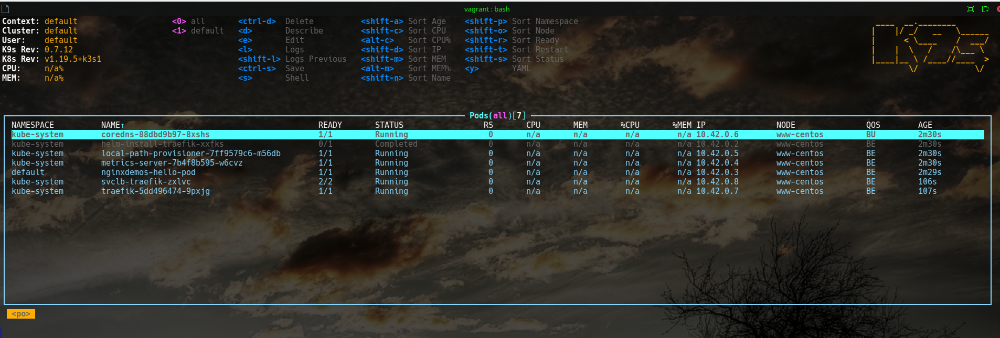

###11. Kubernetes installation

##K3s deployment
```bash
cd ./vagrant
vagrant up
```

##aliases
```bash
 alias k=kubectl
 alias k.all='k get all --all-namespaces'
 alias k_local_k3s="KUBECONFIG=~/.kube/config_local_k3s kubectl"
 alias k_local_k3s.all='k_local_k3s get all --all-namespaces'
 complete -F __start_kubectl k
```

##Kubeconfig merge
```bash
 1035  cd ~/.kube/
 1036  cp ~/.kube/config ~/.kube/config.bak 
 1037  KUBECONFIG=~/.kube/config:~/.kube/config_local_k3s kubectl config view --flatten > ./config_merged
 1038  mv config_merged ./config
 1039  kubectl config use-context
 1040  kubectl config 
 1041  kubectl config get-contexts 
CURRENT   NAME                          CLUSTER      AUTHINFO           NAMESPACE
          default                       default      default            
*         kubernetes-admin@kubernetes   kubernetes   kubernetes-admin 
 1042  kubectl config use-context default
```
##Screen k9s

