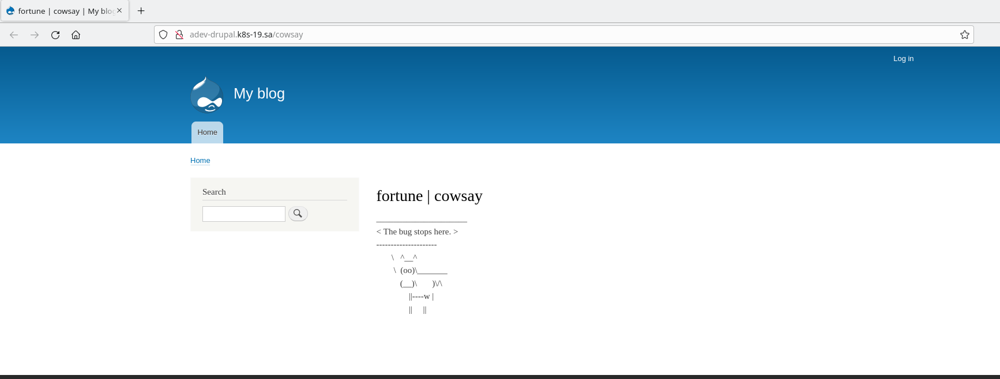

#13.Kubernetes.Helm

## Preparations
```bash
kubectl apply -f ./manifests/00-namespace.yml
helm repo add bitnami https://charts.bitnami.com/bitnami
helm repo add nfs-subdir-external-provisioner https://kubernetes-sigs.github.io/nfs-subdir-external-provisioner
helm install nfs-subdir-external-provisioner nfs-subdir-external-provisioner/nfs-subdir-external-provisioner --set nfs.server=192.168.37.105 --set nfs.path=/mnt/IT-Academy/nfs-data/sa2-20-22/ArtsiomDziavitski --namespace hw-13
```

## Wordpress deploy
```bash
helm install adev-wpress bitnami/wordpress --namespace hw-13 --set global.storageClass=nfs-client,wordpressUsername=wp_admin,wordpressPassword=$Password,mariadb.auth.rootPassword=$Password
kubectl apply -f ./manifests/01-ingress-wordpress.yml
```


## Drupal deploy
```bash
helm install adev-drupal bitnami/drupal --namespace hw-13 --set global.storageClass=nfs-client,drupalUsername=dp_admin,drupalPassword=$Password,mariadb.auth.rootPassword=$Password
kubectl apply -f ./manifests/02-ingress-drupal.yml
```

