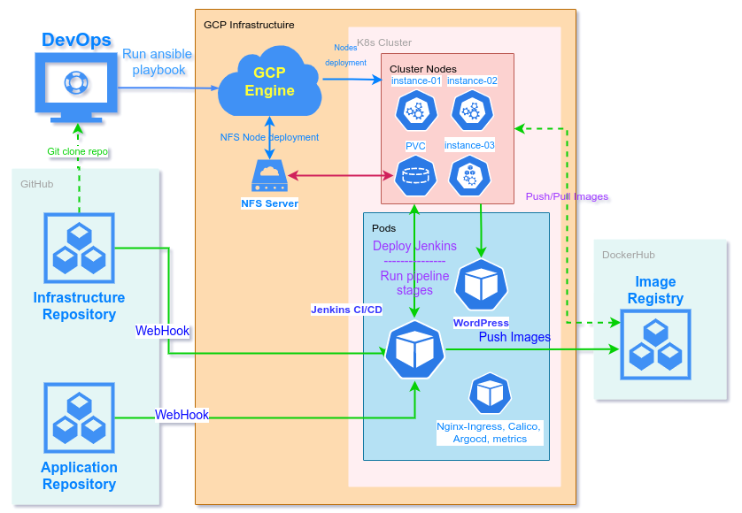

# Final project report
- Group num: md-sa2-20-22
- Student: Artsiom Dziavitski
- Date: 2022/07/25

## Project descriprtion
Deployment of WordPress with all necessary infrastructure in Google Cloud like network, nodes, K8s, Jenkins, etc.

### Nodes:
- 3x CentOS 8 Stream with K8s
- 1x CentOS 8 Stream with NFS server

### Application:
- WordPress ver. 6.0.1/6.0.1
- MariaDB ver. 10.6.4

### CI/CD:
- Jenkins (plugins: )
- GitHub Repository (infrastructure and app)
- DockerHub (image storage)
- Kubernetes (archestration)

### Jenkins plugins
- GiHub plugin
- Kubernetes 
- SSH Agent
- Multibranch Scan Webhook Trigger

### CI/CD description:
Admin clone GHub repo with all necesary manifests for infrastructure and run ansible playbook to deploy nodes, k8s cluster, network and firewall rules in GCP. After that need manually deploy Jenkins (fix this later) and setup necessery plugins, multibranch pipeline with webhooks from infrastructure repo and WordPress repo. First time run pipeline to start image building and deployment of WordPress and MariaDB. If all done right pipeline would start after any commit.
Repos:
- [Infrastructure](https://github.com/artem-devitsky/it-sa-project-private) (private right now)
- [Wordpress](https://github.com/artem-devitsky/project-WordPress)

