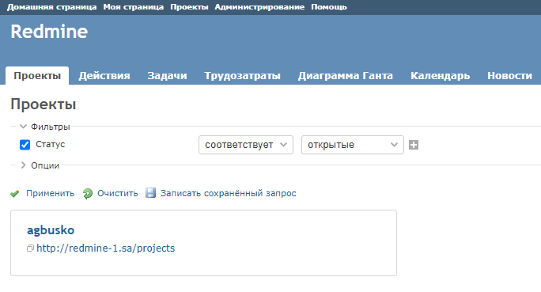

# 08.Ansible.Workshop

## Playbook redmine.yaml
```bash
ansible-playbook -i inventory.yaml redmine.yaml
```
### Result
```
PLAY [host01] ******************************************************************************************************************************************************************

TASK [Gathering Facts] *********************************************************************************************************************************************************
Tuesday 23 August 2022  20:24:24 +0000 (0:00:00.009)       0:00:00.009 ********
ok: [host01]

TASK [debug] *******************************************************************************************************************************************************************
Tuesday 23 August 2022  20:24:26 +0000 (0:00:01.909)       0:00:01.918 ********
ok: [host01] => {
    "msg": "192.168.201.1"
}

TASK [mysql : Mysql. Install packages] *****************************************************************************************************************************************
Tuesday 23 August 2022  20:24:26 +0000 (0:00:00.033)       0:00:01.952 ********
ok: [host01]

TASK [mysql : mysql_db] ********************************************************************************************************************************************************
Tuesday 23 August 2022  20:24:28 +0000 (0:00:02.253)       0:00:04.205 ********
ok: [host01]

TASK [mysql : mysql_user] ******************************************************************************************************************************************************
Tuesday 23 August 2022  20:24:29 +0000 (0:00:00.589)       0:00:04.795 ********
ok: [host01]

TASK [mysql : Config database] *************************************************************************************************************************************************
Tuesday 23 August 2022  20:24:29 +0000 (0:00:00.616)       0:00:05.411 ********
ok: [host01]

TASK [redmine : Redmine. Install packages] *************************************************************************************************************************************
Tuesday 23 August 2022  20:24:30 +0000 (0:00:00.946)       0:00:06.357 ********
ok: [host01]

TASK [redmine : Redmine. Clone repository] *************************************************************************************************************************************
Tuesday 23 August 2022  20:24:32 +0000 (0:00:01.910)       0:00:08.267 ********
ok: [host01]

TASK [redmine : Redmine. Change permissions] ***********************************************************************************************************************************
Tuesday 23 August 2022  20:24:33 +0000 (0:00:00.584)       0:00:08.852 ********
ok: [host01]

TASK [redmine : Redmine. Change permissions] ***********************************************************************************************************************************
Tuesday 23 August 2022  20:24:33 +0000 (0:00:00.522)       0:00:09.375 ********
ok: [host01]

TASK [redmine : Redmine. Setup 01] *********************************************************************************************************************************************
Tuesday 23 August 2022  20:24:34 +0000 (0:00:00.489)       0:00:09.864 ********
changed: [host01]

TASK [redmine : Session store secret generation] *******************************************************************************************************************************
Tuesday 23 August 2022  20:24:38 +0000 (0:00:04.476)       0:00:14.340 ********
ok: [host01]

TASK [redmine : Redmine. Setup 02] *********************************************************************************************************************************************
Tuesday 23 August 2022  20:24:39 +0000 (0:00:00.475)       0:00:14.816 ********
changed: [host01]

TASK [redmine : Configuration files for virtualhost] ***************************************************************************************************************************
Tuesday 23 August 2022  20:24:51 +0000 (0:00:12.043)       0:00:26.859 ********
ok: [host01]

TASK [redmine : meta] **********************************************************************************************************************************************************
Tuesday 23 August 2022  20:24:52 +0000 (0:00:00.831)       0:00:27.691 ********

TASK [redmine : Add redmine-1.sa to host file] *********************************************************************************************************************************
Tuesday 23 August 2022  20:24:52 +0000 (0:00:00.010)       0:00:27.701 ********
changed: [host01]

TASK [redmine : uri] ***********************************************************************************************************************************************************
Tuesday 23 August 2022  20:24:52 +0000 (0:00:00.490)       0:00:28.192 ********
ok: [host01]

TASK [redmine : lineinfile] ****************************************************************************************************************************************************
Tuesday 23 August 2022  20:24:53 +0000 (0:00:00.677)       0:00:28.869 ********
changed: [host01]

PLAY RECAP *********************************************************************************************************************************************************************
host01                     : ok=17   changed=4    unreachable=0    failed=0    skipped=0    rescued=0    ignored=0

Tuesday 23 August 2022  20:24:53 +0000 (0:00:00.569)       0:00:29.439 ********
===============================================================================
redmine : Redmine. Setup 02 -------------------------------------------------------------------------------------------------------------------------------------------- 12.04s
redmine : Redmine. Setup 01 --------------------------------------------------------------------------------------------------------------------------------------------- 4.48s
mysql : Mysql. Install packages ----------------------------------------------------------------------------------------------------------------------------------------- 2.25s
redmine : Redmine. Install packages ------------------------------------------------------------------------------------------------------------------------------------- 1.91s
Gathering Facts --------------------------------------------------------------------------------------------------------------------------------------------------------- 1.91s
mysql : Config database ------------------------------------------------------------------------------------------------------------------------------------------------- 0.95s
redmine : Configuration files for virtualhost --------------------------------------------------------------------------------------------------------------------------- 0.83s
redmine : uri ----------------------------------------------------------------------------------------------------------------------------------------------------------- 0.68s
mysql : mysql_user ------------------------------------------------------------------------------------------------------------------------------------------------------ 0.62s
mysql : mysql_db -------------------------------------------------------------------------------------------------------------------------------------------------------- 0.59s
redmine : Redmine. Clone repository ------------------------------------------------------------------------------------------------------------------------------------- 0.58s
redmine : lineinfile ---------------------------------------------------------------------------------------------------------------------------------------------------- 0.57s
redmine : Redmine. Change permissions ----------------------------------------------------------------------------------------------------------------------------------- 0.52s
redmine : Add redmine-1.sa to host file --------------------------------------------------------------------------------------------------------------------------------- 0.49s
redmine : Redmine. Change permissions ----------------------------------------------------------------------------------------------------------------------------------- 0.49s
redmine : Session store secret generation ------------------------------------------------------------------------------------------------------------------------------- 0.48s
debug ------------------------------------------------------------------------------------------------------------------------------------------------------------------- 0.03s
redmine : meta ---------------------------------------------------------------------------------------------------------------------------------------------------------- 0.01s
Playbook run took 0 days, 0 hours, 0 minutes, 29 seconds
root@dev02-all-u20srv:/opt/ansible#

```

