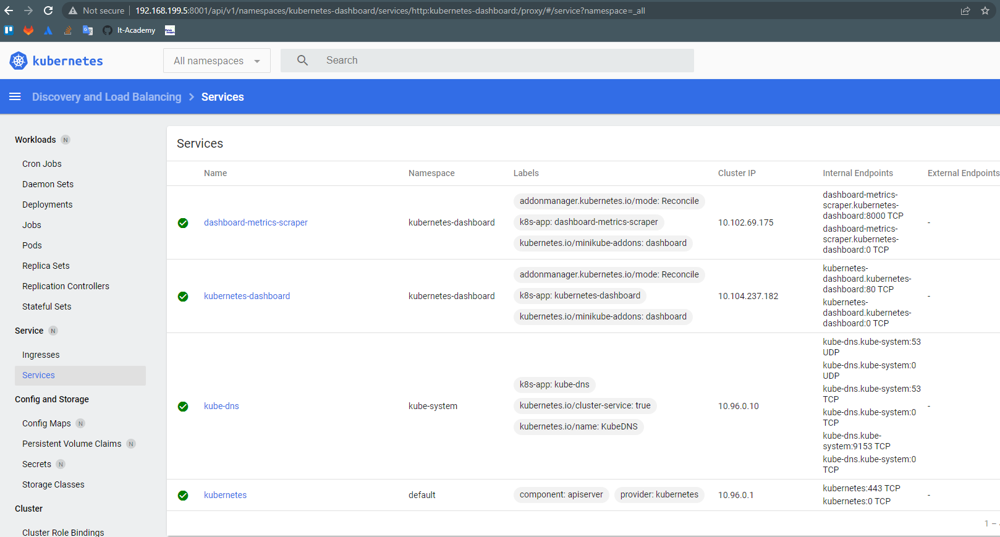

# 10.K8s

## Install kubectl and minikube, start
```
2  sudo apt-get update && sudo apt-get install -y apt-transport-https conntrack
3  curl -s https://packages.cloud.google.com/apt/doc/apt-key.gpg | sudo apt-key add -
4  echo "deb https://apt.kubernetes.io/ kubernetes-xenial main" | sudo tee -a /etc/apt/sources.list.d/kubernetes.list
5  sudo apt-get update
6  sudo apt-get install -y kubectl

20  curl -Lo minikube https://storage.googleapis.com/minikube/releases/v1.21.0/minikube-linux-amd64 && chmod +x minikube && sudo mv minikube /usr/local/bin
	
22	sudo minikube start --driver none
23	sudo kubectl cluster-info
24	sudo kubectl proxy --address='0.0.0.0' --disable-filter=true  &
25	sudo minikube dashboard --url
```
	
## Added ingress
```
root@dev05-all-u20srv:~# minikube addons enable ingress
  - Using image k8s.gcr.io/ingress-nginx/controller:v0.44.0
  - Using image docker.io/jettech/kube-webhook-certgen:v1.5.1
  - Using image docker.io/jettech/kube-webhook-certgen:v1.5.1
* Verifying ingress addon...
* The 'ingress' addon is enabled
root@dev05-all-u20srv:~# kubectl get pods -n ingress-nginx
NAME                                        READY   STATUS      RESTARTS   AGE
ingress-nginx-admission-create-whbfx        0/1     Completed   0          93s
ingress-nginx-admission-patch-pctk6         0/1     Completed   2          93s
ingress-nginx-controller-5d88495688-hggkj   1/1     Running     0          93s
root@dev05-all-u20srv:~# minikube addons list
|-----------------------------|----------|--------------|
|         ADDON NAME          | PROFILE  |    STATUS    |
|-----------------------------|----------|--------------|
| ambassador                  | minikube | disabled     |
| auto-pause                  | minikube | disabled     |
| csi-hostpath-driver         | minikube | disabled     |
| dashboard                   | minikube | enabled ✅   |
| default-storageclass        | minikube | enabled ✅   |
| efk                         | minikube | disabled     |
| freshpod                    | minikube | disabled     |
| gcp-auth                    | minikube | disabled     |
| gvisor                      | minikube | disabled     |
| helm-tiller                 | minikube | disabled     |
| ingress                     | minikube | enabled ✅   |
| ingress-dns                 | minikube | disabled     |
| istio                       | minikube | disabled     |
| istio-provisioner           | minikube | disabled     |
| kubevirt                    | minikube | disabled     |
| logviewer                   | minikube | disabled     |
| metallb                     | minikube | disabled     |
| metrics-server              | minikube | disabled     |
| nvidia-driver-installer     | minikube | disabled     |
| nvidia-gpu-device-plugin    | minikube | disabled     |
| olm                         | minikube | disabled     |
| pod-security-policy         | minikube | disabled     |
| registry                    | minikube | disabled     |
| registry-aliases            | minikube | disabled     |
| registry-creds              | minikube | disabled     |
| storage-provisioner         | minikube | enabled ✅   |
| storage-provisioner-gluster | minikube | disabled     |
| volumesnapshots             | minikube | disabled     |
|-----------------------------|----------|--------------|
```

## RAM/CPU
```
root@dev05-all-u20srv:~# minikube stop
* Stopping node "minikube"  ...
* 1 nodes stopped.
root@dev05-all-u20srv:~# minikube delete
* Uninstalling Kubernetes v1.20.7 using kubeadm ...
* Deleting "minikube" in none ...
* Removed all traces of the "minikube" cluster.
root@dev05-all-u20srv:~# minikube start --memory 1024 --cpus 2
* minikube v1.21.0 on Ubuntu 20.04
* Automatically selected the docker driver. Other choices: none, ssh
! Your cgroup does not allow setting memory.
  - More information: https://docs.docker.com/engine/install/linux-postinstall/#your-kernel-does-not-support-cgroup-swap-limit-capabilities

X Exiting due to RSRC_INSUFFICIENT_REQ_MEMORY: Requested memory allocation 1024MiB is less than the usable minimum of 1800MB

root@dev05-all-u20srv:~# minikube start --memory 3072 --cpus 2
* minikube v1.21.0 on Ubuntu 20.04
* Automatically selected the docker driver. Other choices: none, ssh
! Your cgroup does not allow setting memory.
  - More information: https://docs.docker.com/engine/install/linux-postinstall/#your-kernel-does-not-support-cgroup-swap-limit-capabilities
* The "docker" driver should not be used with root privileges.
* If you are running minikube within a VM, consider using --driver=none:
*   https://minikube.sigs.k8s.io/docs/reference/drivers/none/

X Exiting due to DRV_AS_ROOT: The "docker" driver should not be used with root privileges.

root@dev05-all-u20srv:~# minikube start --driver none --memory 3072 --cpus 2
* minikube v1.21.0 on Ubuntu 20.04
* Using the none driver based on user configuration
! The 'none' driver does not respect the --cpus flag
! The 'none' driver does not respect the --memory flag
* Starting control plane node minikube in cluster minikube
* Running on localhost (CPUs=4, Memory=5614MB, Disk=19986MB) ...
* OS release is Ubuntu 20.04.3 LTS
* Preparing Kubernetes v1.20.7 on Docker 20.10.17 ...
  - kubelet.resolv-conf=/run/systemd/resolve/resolv.conf
  - Generating certificates and keys ...
  - Booting up control plane ...
  - Configuring RBAC rules ...
* Configuring local host environment ...
*
! The 'none' driver is designed for experts who need to integrate with an existing VM
* Most users should use the newer 'docker' driver instead, which does not require root!
* For more information, see: https://minikube.sigs.k8s.io/docs/reference/drivers/none/
*
! kubectl and minikube configuration will be stored in /root
! To use kubectl or minikube commands as your own user, you may need to relocate them. For example, to overwrite your own settings, run:
*
  - sudo mv /root/.kube /root/.minikube $HOME
  - sudo chown -R $USER $HOME/.kube $HOME/.minikube
*
* This can also be done automatically by setting the env var CHANGE_MINIKUBE_NONE_USER=true
* Verifying Kubernetes components...
  - Using image gcr.io/k8s-minikube/storage-provisioner:v5
* Enabled addons: default-storageclass, storage-provisioner

! /usr/bin/kubectl is version 1.25.0, which may have incompatibilites with Kubernetes 1.20.7.
  - Want kubectl v1.20.7? Try 'minikube kubectl -- get pods -A'
* Done! kubectl is now configured to use "minikube" cluster and "default" namespace by default

```

## Dashboard



## Ansible result

```
PLAY RECAP ************************************************************************************************************************
localhost                  : ok=3    changed=0    unreachable=0    failed=0    skipped=0    rescued=0    ignored=0
node1                      : ok=768  changed=143  unreachable=0    failed=0    skipped=1261 rescued=0    ignored=9
node2                      : ok=501  changed=92   unreachable=0    failed=0    skipped=735  rescued=0    ignored=2

Thursday 01 September 2022  21:36:27 +0000 (0:00:00.036)       0:32:18.249 ****
===============================================================================
kubernetes/preinstall : Install packages requirements --------------------------------------------------------------------- 71.33s
download : download_file | Validate mirrors ------------------------------------------------------------------------------- 69.10s
kubernetes-apps/ansible : Kubernetes Apps | Lay Down CoreDNS templates ---------------------------------------------------- 40.05s
download : download_container | Download image if required ---------------------------------------------------------------- 32.39s
kubernetes-apps/ansible : Kubernetes Apps | Start Resources --------------------------------------------------------------- 30.92s
download : download_container | Download image if required ---------------------------------------------------------------- 28.53s
kubernetes/control-plane : kubeadm | Initialize first master -------------------------------------------------------------- 28.20s
kubernetes/kubeadm : Join to cluster -------------------------------------------------------------------------------------- 28.12s
download : download_file | Download item ---------------------------------------------------------------------------------- 26.18s
download : download_container | Download image if required ---------------------------------------------------------------- 24.66s
network_plugin/calico : Calico | Create calico manifests ------------------------------------------------------------------ 23.94s
bootstrap-os : Assign inventory name to unconfigured hostnames (non-CoreOS, non-Flatcar, Suse and ClearLinux, non-Fedora) -- 22.81s
download : download_container | Download image if required ---------------------------------------------------------------- 20.69s
download : download_container | Download image if required ---------------------------------------------------------------- 19.18s
download : download_container | Download image if required ---------------------------------------------------------------- 18.84s
download : download_container | Download image if required ---------------------------------------------------------------- 18.65s
download : download_container | Download image if required ---------------------------------------------------------------- 18.64s
download : download_file | Download item ---------------------------------------------------------------------------------- 18.10s
download : download_container | Download image if required ---------------------------------------------------------------- 18.09s
download : download_container | Download image if required ---------------------------------------------------------------- 17.02s

```