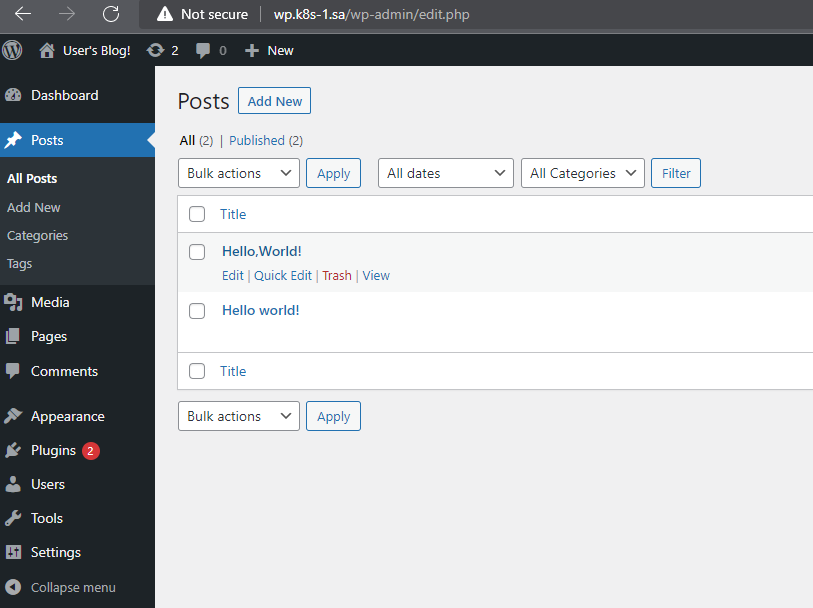
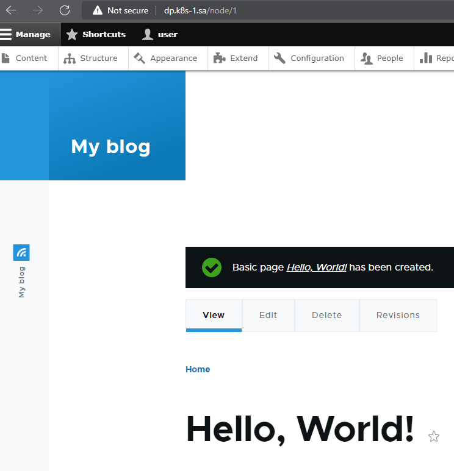

# 13.K8s

## 
```yaml
ansible-playbook -i inventory.yaml mariadb.yaml

helm repo add bitnami https://charts.bitnami.com/bitnami
helm repo update
helm search repo app -l
helm repo add nfs-subdir-external-provisioner https://kubernetes-sigs.github.io/nfs-subdir-external-provisioner
helm repo update

helm install nfs-subdir-external-provisioner nfs-subdir-external-provisioner/nfs-subdir-external-provisioner     --set nfs.server=192.168.37.105 --set nfs.path=/mnt/IT-Academy/nfs-data/sa2-21-22

kubectl apply -f wp_ingress.yaml
kubectl apply -f dp_ingress.yaml

helm install sa-wp --set mariadb.enabled=false,externalDatabase.host=192.168.202.2,externalDatabase.password=wordpress,global.storageClass=nfs-client,wordpressPassword=password bitnami/wordpress
helm install sa-dp --set mariadb.enabled=false,externalDatabase.host=192.168.202.2,externalDatabase.password=drupal,global.storageClass=nfs-client,drupalPassword=password bitnami/drupal
```

## Screenshot

