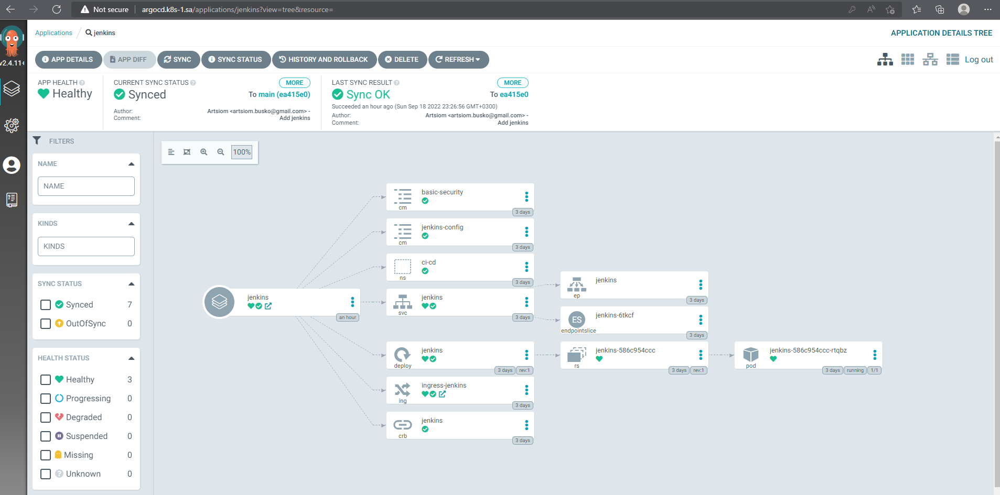
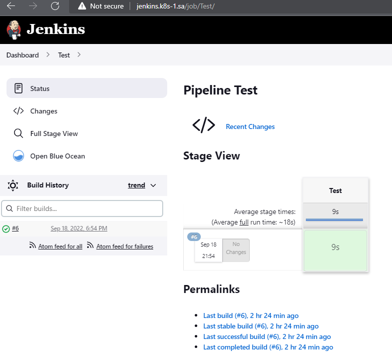
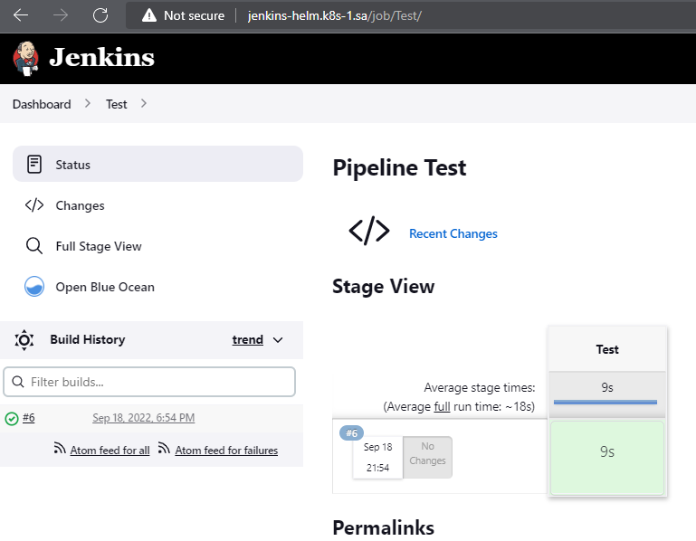

# 14.Kubernetes_application_deployment

## helm
```
---
apiVersion: v2
name: jenkins-helm
description: A Helm chart for Kubernetes
type: application
version: 0.1.0
appVersion: "1.16.0"

---
namespace: ci-cd-new
name: jenkins-helm
image: jfrog.it-academy.by/public/jenkins-ci:agbusko

nfs_path: /mnt/IT-Academy/nfs-data/sa2-21-22/agbusko/jenkins
nfs_server: 192.168.37.105

ingress:
  enabled: enabled
alias: "jenkins-helm.k8s-2.sa"
host: jenkins-helm.k8s-1.sa
port: 8080

resources:
  limits:
    cpu: 3000m
    memory: 4000Mi
  requests:
    cpu: 3000m
    memory: 4000Mi

master_port: 8080
master_targetport: 8080
slave_port: 50000
slave_targetport: 50000

---
apiVersion: v1
kind: Namespace
metadata:
  name: {{ .Values.namespace }}
---
apiVersion: apps/v1
kind: Deployment
metadata:
  name: {{ .Values.name }}
  namespace: {{ .Values.namespace }}
spec:
  replicas: 1
  selector:
    matchLabels:
      app: {{ .Values.name }}
  template:
    metadata:
      labels:
        app: {{ .Values.name }}
    spec:
      containers:
        - name: {{ .Values.name }}
          image: {{ .Values.image }}
          imagePullPolicy: IfNotPresent
          env:
            - name: JAVA_OPTS
              value: "-Djenkins.install.runSetupWizard=false"
            - name: CASC_JENKINS_CONFIG
              value: /var/jenkins_home/casc_configs/jenkins.yaml
          ports:
            - name: http-port
              containerPort: 8080
            - name: jnlp-port
              containerPort: 50000
          securityContext:
            runAsUser: 0
          resources:
          {{- toYaml .Values.resources | nindent 12 }}
          volumeMounts:
            - name: jenkins-auth-config
              mountPath: /var/jenkins_home/init.groovy.d/basic-security.groovy
              subPath: basic-security.groovy
            - name: jenkins-config-yaml
              mountPath: /var/jenkins_home/casc_configs/jenkins.yaml
              subPath: jenkins.yaml
            - name: jenkins-config
              mountPath: /var/jenkins_home
      volumes:
        - name: jenkins-auth-config
          configMap:
            name: {{ .Values.name }}-basic-security
        - name: jenkins-config-yaml
          configMap:
            name: jenkins-config
        - name: jenkins-config
          nfs:
            server: {{ .Values.nfs_server }}
            path: {{ .Values.nfs_path }}

---
apiVersion: v1
kind: ConfigMap
metadata:
  name: {{ .Values.name }}-basic-security
  namespace: {{ .Values.namespace }}
data:
  basic-security.groovy: |
    #!groovy
    import jenkins.model.*
    import hudson.security.*
    def instance = Jenkins.getInstance()
    println "--> creating local user 'admin'"
    def password = System.getenv("PASS")
    def hudsonRealm = new HudsonPrivateSecurityRealm(false)
    hudsonRealm.createAccount('admin',"admin")
    instance.setSecurityRealm(hudsonRealm)
    def strategy = new FullControlOnceLoggedInAuthorizationStrategy()
    strategy.setAllowAnonymousRead(true)
    instance.setAuthorizationStrategy(strategy)
    instance.save()

---
apiVersion: v1
kind: ConfigMap
metadata:
  name: jenkins-config
  namespace: {{ .Values.namespace }}
data:
  jenkins.yaml: |
        jenkins:
          numExecutors: 2
          clouds:
          - kubernetes:
              containerCapStr: "10"
              maxRequestsPerHostStr: "32"
              jenkinsUrl: "http://jenkins:8080"
              name: "kubernetes"
              namespace: "{{ .Values.namespace }}"

              skipTlsVerify: true
        credentials:
          system:
            domainCredentials:
            - credentials:
              - usernamePassword:
                  description: "Githubuser"
                  id: "some_randome"
                  password: "XXXXXXXXXXX"
                  scope: GLOBAL
                  username: "git_hub_user"
        unclassified:
          location:
            adminAddress: "agbusko@gmail.com"
            url: "http://jenkins-helm.k8s-1.sa/"
          shell:
            shell: "/bin/bash"

---
apiVersion: networking.k8s.io/v1
kind: Ingress
metadata:
  name: {{ .Values.name }}
  namespace: {{ .Values.namespace }}
  annotations:
    kubernetes.io/ingress.class: nginx
    nginx.ingress.kubernetes.io/server-alias: {{ .Values.alias }}
spec:
  rules:
    - host: {{ .Values.host }}
      http:
        paths:
          - path: /
            pathType: Prefix
            backend:
              service:
                name: {{ .Values.name }}
                port:
                  number: {{ .Values.port }}

---
apiVersion: v1
kind: Service
metadata:
  name: {{ .Values.name }}
  namespace: {{ .Values.namespace }}
spec:
  ports:
    - name: master
      port: {{ .Values.master_port }}
      targetPort: {{ .Values.master_targetport }}
    - name: slave
      port: {{ .Values.slave_port }}
      targetPort: {{ .Values.slave_targetport }}
  selector:
    app: {{ .Values.name }}
	
---
apiVersion: rbac.authorization.k8s.io/v1
kind: ClusterRoleBinding
metadata:
  name: {{ .Values.name }}
  namespace: {{ .Values.namespace }}
roleRef:
  apiGroup: rbac.authorization.k8s.io
  kind: ClusterRole
  name: cluster-admin
subjects:
- kind: ServiceAccount
  name: default
  namespace: {{ .Values.namespace }}

```

## Screenshot


