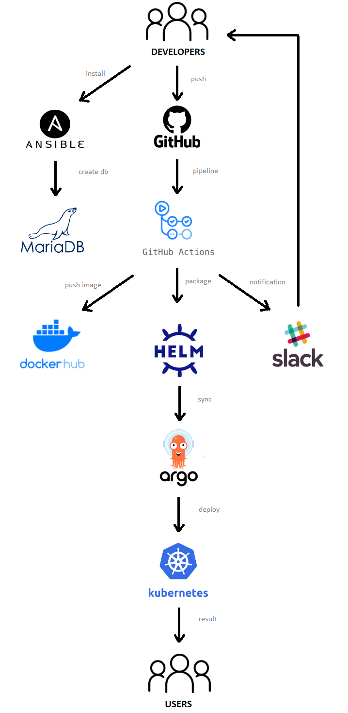

# Project report
---
**Project's reporter:** Artsiom Busko
**Group number:** md-sa2-21-22

### Description of application for deployment
-   Name of application: Wordpress
-   Programming language: PHP
-   DB: MariaDB
-   Links: 
	- https://github.com/docker-library/wordpress
	- https://hub.docker.com/r/agbusko/wordpress

### Pipeline. High Level Design
Ansible creates a database. After pushing to the main branch, Git Action builds and pushes the image to Docker HUB, creates the HELM chart. ArgoCD deploys an application to a k8s cluster.

### Technologies which were used in project
- **Orchestration:** K8s
- **Automation tools:** Ansible, Github Action, ArgoCD
- **CI description:** Github Action
- **Containerization:** Docker
- **Package manager:** HELM
- **Notification:** Slack
- **Rollback flow description and implementation:**
Versioning is used in ArgoCD

### Links
[project](https://github.com/agbusko/wordpress)