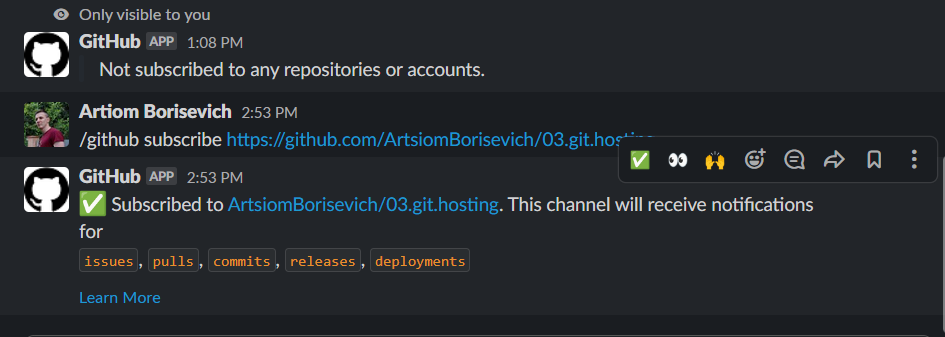

## Remote repositories

[GitHub](https://github.com/ArtsiomBorisevich/03.git.hosting)

[GitLab](https://gitlab.com/borisevich1/03.git.hosting)

## Script
```bash
#!/usr/bin/env zx
$.verbose = true

let repos = await $`git remote show`
let reposArray = repos.stdout.split(/\r?\n/).filter(element => element)
for (const repo of reposArray) {
  await $`git push ${repo}`
}
```

## Slack



