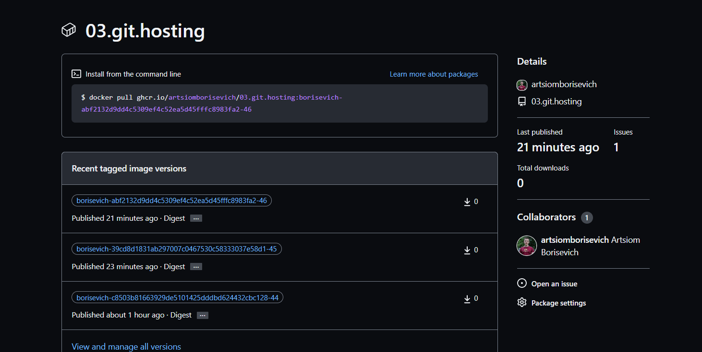
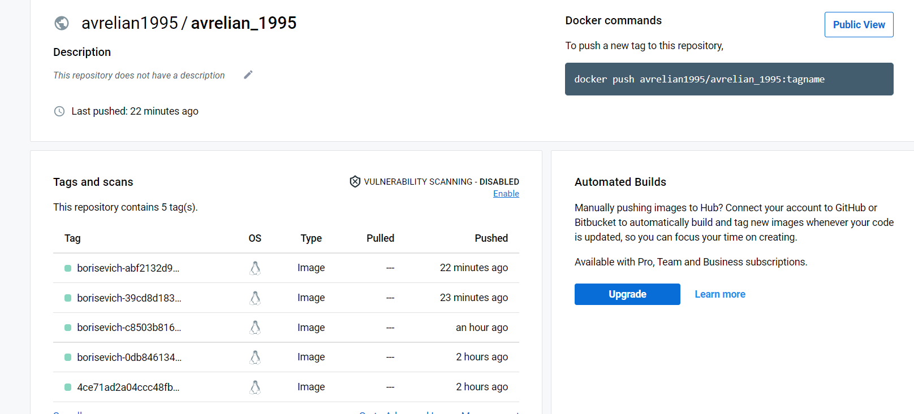

# 08.Docker.Docker-compose

## docker_action file

```bash
name: ci

on:
  push:
    branches:
      - "dev"
  pull_request:
    branches:
      - "master"

jobs:
  docker:
    env:
        IMAGE: borisevich
        IMAGE_NAME: ${{ github.repository }}
    runs-on: ubuntu-latest
    steps:
      -
        name: Checkout
        uses: actions/checkout@v3
      -
        name: Login to GitHub Container Registry
        uses: docker/login-action@v2
        with:
          registry: ghcr.io
          username: ${{ github.repository_owner }}
          password: ${{ secrets.GITHUB_TOKEN }}
      -
        name: Set up QEMU
        uses: docker/setup-qemu-action@v2
      -
        name: Set up Docker Buildx
        uses: docker/setup-buildx-action@v2
      -
        name: Login to Docker Hub
        uses: docker/login-action@v2
        with:
          username: ${{ secrets.DOCKERHUB_USERNAME }}
          password: ${{ secrets.DOCKERHUB_TOKEN }}
      -
        name: Build and push
        id: push
        uses: docker/build-push-action@v3
        with:
          context: .
          push: true
          tags: | 
           avrelian1995/avrelian_1995:${{ env.IMAGE }}-${{ github.sha }}-${{ github.run_number }}
           ghcr.io/${{ env.IMAGE_NAME }}:${{ env.IMAGE }}-${{ github.sha }}-${{ github.run_number }}
      - name: Slack Notification
        uses: rtCamp/action-slack-notify@v2
        env:
            SLACK_CHANNEL: 08-docker
            SLACK_COLOR: ${{ job.status }}
            SLACK_ICON: https://github.com/rtCamp.png?size=48
            SLACK_MESSAGE: 'Post Content :rocket:'
            SLACK_TITLE: 'Image was succesfully pushed ${{ steps.push.outputs.tags }}'
            SLACK_USERNAME: Artiom Borisevich
            SLACK_WEBHOOK: ${{ secrets.SLACK_WEBHOOK }}
```
## Jobs build
[GitHub](https://github.com/artsiomborisevich/03.git.hosting/actions/runs/3648032262/jobs/6160968896)

## Slack


## GitHub Container registry



## DockerHub Container registry



