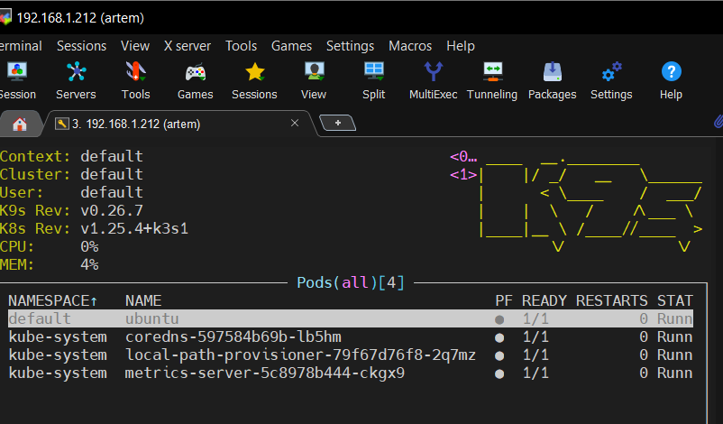
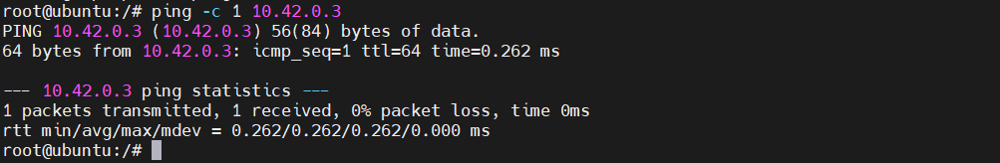
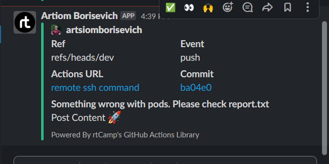

# 09.Kubernetes

## Install k9s to maintain cluster. Make print-screen of k9s with pods in all namespaces


## Deploy shell pod (was used your test_pod) in default namespace which you can you use for internal checks inside the cluster

### Internal check example. Ping from one pod to another



## Create GitHub action to check status of pods and create slack notification if you have crashed/failed pods

### Jobs build

[Jobs result](https://github.com/artsiomborisevich/03.git.hosting/actions/runs/3720293432/jobs/6309670409)

### Github action

```yaml
name: remote ssh command
on:
  schedule:
    - cron: '*/10 * * * *'
  push:
jobs:

  build:
    name: Build
    runs-on: ubuntu-latest
    env:
      report: report.txt
    steps:
      - name: get info using SSH key
        id: info
        run: |
          mkdir ~/.ssh
          eval `ssh-agent -s`
          ssh-add - <<< "${{secrets.SSH_KEY}}" 
          ssh-keyscan -H ${{ secrets.PROXY_HOST }} >> ~/.ssh/known_hosts
          ssh ${{ secrets.PROXY_USERNAME }}@${{ secrets.PROXY_HOST }} ssh-keyscan ${{ secrets.HOST }} >> ~/.ssh/known_hosts
          sshpass -p ${{ secrets.PASSWORD }} ssh -oProxyCommand="sshpass ssh -W %h:%p ${{ secrets.PROXY_USERNAME }}@${{ secrets.PROXY_HOST }}" ${{ secrets.USERNAME }}@${{ secrets.HOST }} "kubectl get pods -A" >> ${{ env.report }}
          OUTPUT=$(cat ${{ env.report }} | grep -c 'Running') && echo "::set-output name=OUTPUT::$OUTPUT"
      - name: Slack Notification
        if: steps.info.outputs.OUTPUT < 4
        uses: rtCamp/action-slack-notify@v2
        env:
          SLACK_CHANNEL: 08-docker
          SLACK_COLOR: ${{ job.status }}
          SLACK_ICON: https://github.com/rtCamp.png?size=48
          SLACK_MESSAGE: 'Post Content :rocket:'
          SLACK_TITLE: 'Something wrong with pods. Please check ${{ env.report }}'
          SLACK_USERNAME: Artiom Borisevich
          SLACK_WEBHOOK: ${{ secrets.SLACK_WEBHOOK }}
      - name: Upload report
        if: steps.info.outputs.OUTPUT < 4
        uses: actions/upload-artifact@v3
        with:
          path: ${{ env.report }}
```

### Slack notification



