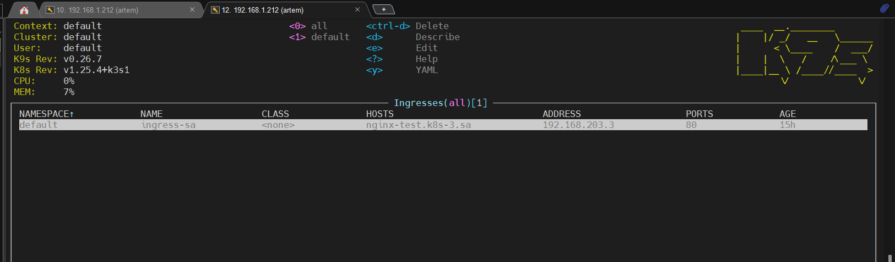
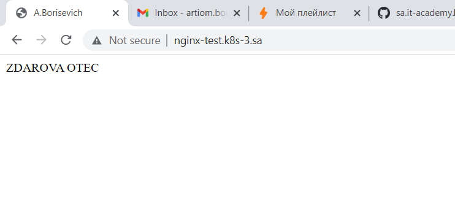

# 11.Kubernetes.Basic Objects

## Create deployment of nginx service:

* replicas: 3
* set resources for pods
* deployment shouldn't have any outage (service is available all time)
* ingress rule for host name (nginx-test.k8s-<NUMBER>.sa)

### Config file - k8-3.yaml

```yaml
---
apiVersion: apps/v1
kind: Deployment
metadata:
  name: webserver
  labels:
    app: simple-web
spec:
  replicas: 3
  strategy:
    type: RollingUpdate
    rollingUpdate:
      maxSurge: "50%"
      maxUnavailable: "0%"
  selector:
    matchLabels:
      app: simple-web
  template:
    metadata:
      labels:
        app: simple-web
    spec:
      containers:
        - name: php-nginx
          image: ubuntu/nginx
          ports:
            - containerPort: 80
          resources:
            requests:
              cpu: 50m
              memory: 50Mi
            limits:
              cpu: 100m
              memory: 100Mi
          volumeMounts:
            - name: test-config-mount
              mountPath: /var/www/html/index.html
              subPath: index.html
      volumes:
        - name: test-config-mount
          configMap:
            name: test-config
---
apiVersion: v1
kind: Service
metadata:
  name: simple-web-service
  labels:
    run: simple-web-service
spec:
  #type: LoadBalancer
  ports:
    - port: 80
      protocol: TCP
  selector:
    app: simple-web

---
apiVersion: networking.k8s.io/v1
kind: Ingress
metadata:
  name: ingress-sa
  annotations:
    kubernetes.io/ingress.class: nginx
    nginx.ingress.kubernetes.io/server-alias: "nginx-test.k8s-3.sa"
spec:
  rules:
    - host: nginx-test.k8s-3.sa
      http:
        paths:
          - path: /
            pathType: Prefix
            backend:
              service:
                name: simple-web-service
                port:
                  number: 80
---
apiVersion: v1
kind: ConfigMap
metadata:
  name: test-config
data:
  index.html: |
    <HTML><HEAD><TITLE>A.Borisevich</TITLE></HEAD>
    <BODY><p>ZDAROVA OTEC</p></BODY></HTML>
```

### Replicas (3)


### Rule for hostname



### Result



## Additional task. Deploy pod inside k8s which should be connected to github as self-hosted runner 

### Have used actions-runner-controller. Commands for kubectl from:

https://github.com/actions/actions-runner-controller

### Config for runner

```yaml
apiVersion: actions.summerwind.dev/v1alpha1
kind: RunnerDeployment
metadata:
  name: example-runnerdeploy
spec:
  replicas: 1
  template:
    spec:
      repository: artsiomborisevich/03.git.hosting
```
### Github action

```yaml
name: Hello-World
on: [push, workflow_dispatch]
jobs:
  build:
    # The type of runner that the job will run on
    runs-on: self-hosted
    steps:
      - name: Say Hello
        run: echo Zdorovo otec!
```

### Jobs build. Result

https://github.com/artsiomborisevich/03.git.hosting/actions/runs/3725941007/jobs/6319053243

