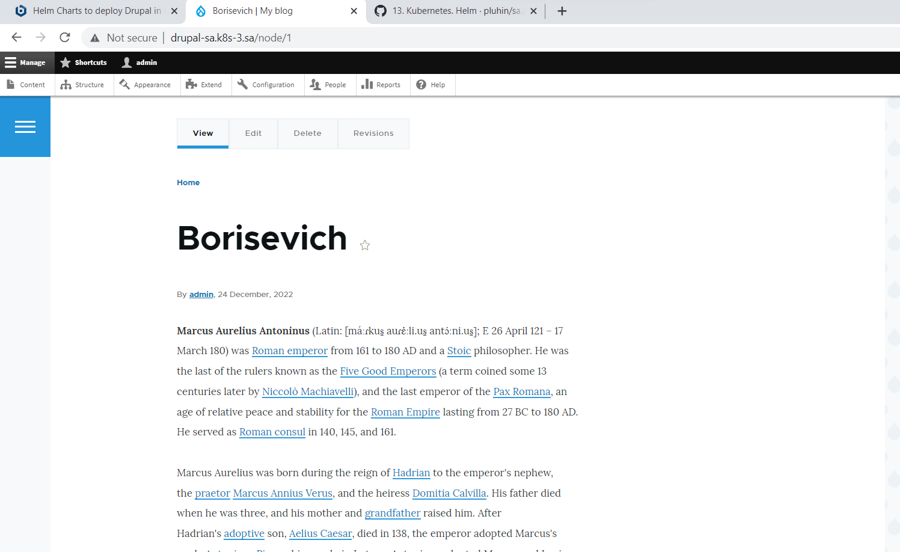

# 13.Kubernetes.Helm

## Deploy in your K8s cluster the following applications using helm charts from public repositories:

* Wordpress
* Drupal 

### History of your helm run commands and printscreens of your articles put into report and create PR

## Drupal has been chosen.  

### History of my helm run commands

```bash
 artem@serverart:~/13.K8s.Helm$ history | grep helm
 1884  cd helm-source/
 1902  helm package helm-source/first-app
 1904  helm repo index --url https://artsiomborisevich.github.io/helm-borisevich/ --merge index.yaml .
 1906  ls helm-
 1907  ls helm-releases/
 1916  helm repo update
 1918  helm repo add my-repo https://charts.bitnami.com/bitnami
 1932  helm install sa-drupal  --set mariadb.enabled=false,externalDatabase.host=192.168.201.3,externalDatabase.password=drupal,externalDatabase.user=drupal,externalDatabase.database=drupal,global.storageClass=nfs,drupalUsername=admin,drupalPassword=drupal my-repo/drupal
 1941  ls helm-releases/
 1942  helm install first-app ../helm-releases/first-app-0.2.0.tgz
 1943  cd helm-source/
 1944  helm install first-app ../helm-releases/first-app-0.2.0.tgz
 1946  helm package first-app
 1947  helm install first-app ../helm-releases/first-app-0.2.0.tgz
 1949  helm uninstall sa-drupal
 1950  helm uninstall first-app
 1999  helm install sa-drupal  --set mariadb.enabled=false,externalDatabase.host=192.168.201.3,externalDatabase.password=drupal,externalDatabase.user=drupal,externalDatabase.database=drupal,global.storageClass=nfs,drupalUsername=admin,drupalPassword=drupal my-repo/drupal
 2000  kubectl describe pod sa-drupal-974d6d5fb-jqscj
```

### Printscreens of my articles 




