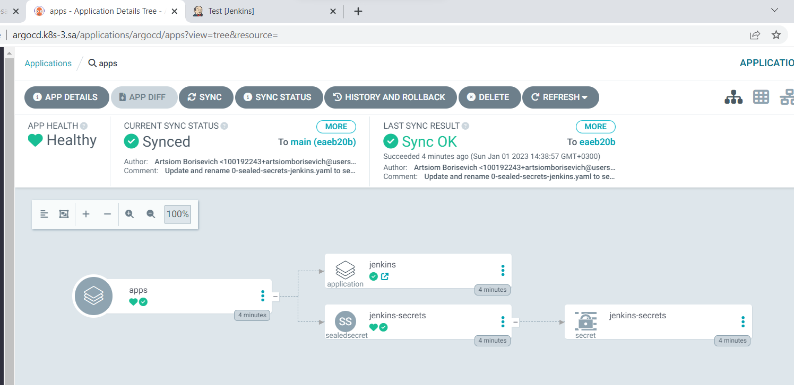
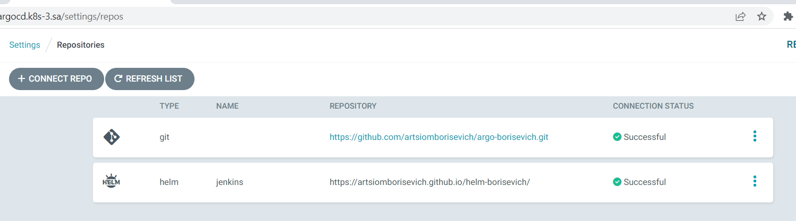
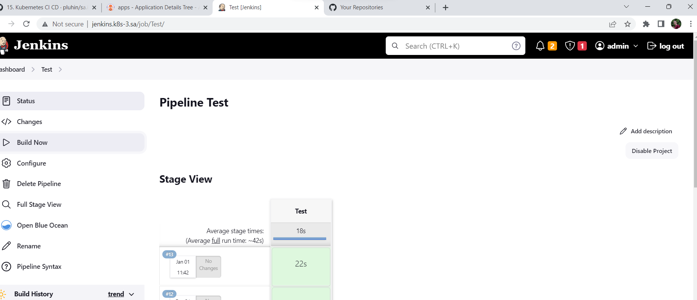

# 15. Kubernetes.CI_CD

## Links your repositories, pritscreen of your project in ArgoCD add to PR

### Links to my repositories

[HelmRepo](https://github.com/artsiomborisevich/helm-borisevich)

[AppsRepo](https://github.com/artsiomborisevich/argo-borisevich)

### PrintScreens (ArgoCd and Jenkins with new credentials)







### Helm manifest

```yaml
---
apiVersion: v1
kind: ConfigMap
metadata:
  name: {{ .Values.configMap.name_basic }}
  namespace: {{ .Values.namespace }}
data:
  basic-security.groovy: |
    #!groovy
    import jenkins.model.*
    import hudson.security.*
    def instance = Jenkins.getInstance()
    def USERNAME = System.getenv('USERNAME').toString().trim()
    def PASSWORD = System.getenv("PASSWORD").toString().trim()
    def hudsonRealm = new HudsonPrivateSecurityRealm(false)
    hudsonRealm.createAccount(USERNAME,PASSWORD)
    instance.setSecurityRealm(hudsonRealm)
    def strategy = new FullControlOnceLoggedInAuthorizationStrategy()
    strategy.setAllowAnonymousRead(true)
    instance.setAuthorizationStrategy(strategy)
    instance.save()
---
apiVersion: v1
kind: ConfigMap
metadata:
  name: {{ .Values.configMap.name_config }}
  namespace: {{ .Values.namespace }}
data:
  jenkins.yaml: |
    jenkins:
      numExecutors: 2
      clouds:
      - kubernetes:
          containerCapStr: "10"
          maxRequestsPerHostStr: "32"
          jenkinsUrl: "http://jenkins:{{ .Values.service.port }}"
          name: "kubernetes"
          namespace: {{ .Values.namespace }}
          skipTlsVerify: true
    credentials:
      system:
        domainCredentials:
        - credentials:
          - usernamePassword:
              description: "Githubuser"
              id: "some_randome"
              password: "XXXXXXXXXXX"
              scope: GLOBAL
              username: "git_hub_user"
    unclassified:
      location:
        adminAddress: {{ .Values.location.adminAddress }}
        url: {{ .Values.location.url }}
      shell:
        shell: "/bin/bash"
---
apiVersion: apps/v1
kind: Deployment
metadata:
  name: {{ .Values.name }}
  namespace: {{ .Values.namespace }}
spec:
  replicas: {{ .Values.replicaCount }}
  selector:
    matchLabels:
      app: {{ .Values.name }}
  template:
    metadata:
      labels:
        app: {{ .Values.name }}
    spec:
      containers:
        - name: {{ .Values.name }}
          image: "{{ .Values.image.repository }}:{{ .Values.image.tag | default .Chart.AppVersion }}"
          imagePullPolicy: {{ .Values.image.pullPolicy }}
          env:
            - name: PASSWORD
              valueFrom:
                secretKeyRef:
                  name: jenkins-secrets
                  key: password
            - name: USERNAME
              valueFrom:
                secretKeyRef:
                  name: jenkins-secrets
                  key: username
            - name: JAVA_OPTS
              value: "-Djenkins.install.runSetupWizard=false"
            - name: CASC_JENKINS_CONFIG
              value: /var/jenkins_home/casc_configs/jenkins.yaml
          ports:
            - name: http
              containerPort: {{ .Values.service.port }}
            - name: jnlp
              containerPort: {{ .Values.service.jnlpport }}
          securityContext:
            runAsUser: 0
          resources:
            requests:
              cpu: {{ .Values.resources.requests.cpu }}
              memory: {{ .Values.resources.requests.memory }}
            limits:
              cpu: {{ .Values.resources.limits.cpu }}
              memory: {{ .Values.resources.limits.memory }}
          volumeMounts:
            - name: jenkins-auth-config
              mountPath: {{ .Values.jenkinsAuthConfig }}
              subPath: {{ .Values.ACsubPath }}
            - name: jenkins-config-yaml
              mountPath: {{ .Values.jenkinsConfigYaml }}
              subPath: {{ .Values.JCsubPath }}
            - name: jenkins-config
              mountPath: {{ .Values.jenkinsConfig }}
      volumes:
        - name: jenkins-auth-config
          configMap:
            name: {{ .Values.configMap.name_basic }}
        - name: jenkins-config-yaml
          configMap:
            name: {{ .Values.configMap.name_config }}
        - name: jenkins-config
          nfs:
            server: {{ .Values.nfs.server }}
            path: {{ .Values.nfs.path }}
---
apiVersion: rbac.authorization.k8s.io/v1
kind: ClusterRoleBinding
metadata:
  name: {{ .Values.name }}
  namespace: {{ .Values.namespace }}
roleRef:
  apiGroup: rbac.authorization.k8s.io
  kind: ClusterRole
  name: cluster-admin
subjects:
  - kind: ServiceAccount
    name: default
    namespace: {{ .Values.namespace }}
---
apiVersion: networking.k8s.io/v1
kind: Ingress
metadata:
  name: ingress-{{ .Values.name }}
  namespace: {{ .Values.namespace }}
  annotations:
    kubernetes.io/ingress.class: nginx
spec:
  rules:
    - host: {{ .Values.ingress.hosts.host }}
      http:
        paths:
          - path: /
            pathType: Prefix
            backend:
              service:
                name: {{ .Values.name }}
                port:
                  number: {{ .Values.service.port }}
---
apiVersion: v1
kind: Service
metadata:
  name: {{ .Values.name }}
  namespace: {{ .Values.namespace }}
spec:
  ports:
    - name: master
      port: {{ .Values.service.port }}
      targetPort: {{ .Values.service.port }}
    - name: slave
      port: {{ .Values.service.jnlpport }}
      targetPort: {{ .Values.service.jnlpport }}
  selector:
    app: {{ .Values.name }}
```

### Helm variables

```yaml
replicaCount: 1
namespace: argocd
name: jenkins

image:
  repository: jfrog.it-academy.by/public/jenkins-ci
  pullPolicy: IfNotPresent
  # Overrides the image tag whose default is the chart appVersion.
  tag: "aborisevich"

service:
  port: 8080
  jnlpport: 50000

jenkinsAuthConfig: /var/jenkins_home/init.groovy.d/basic-security.groovy
ACsubPath: basic-security.groovy
jenkinsConfigYaml: /var/jenkins_home/casc_configs/jenkins.yaml
JCsubPath: jenkins.yaml
jenkinsConfig: /var/jenkins_home
configMap:
  name_basic: basic-security
  name_config: jenkins-config
nfs:
  server: 192.168.37.105
  path: /mnt/IT-Academy/nfs-data/sa2-22-22/aborisevich/jenkins

location:
  adminAddress: "pluhin@gmail.com"
  url: "http://jenkins.k8s-3.sa/"

ingress:
  enabled: true
  className: ""
  hosts:
    host: jenkins.k8s-3.sa

resources:
  requests:
    cpu: 2000m
    memory: 2000Mi
  limits:
    cpu: 2000m
    memory: 3000Mi

autoscaling:
  enabled: false
  minReplicas: 1
  maxReplicas: 100
  targetCPUUtilizationPercentage: 80
  # targetMemoryUtilizationPercentage: 80

nodeSelector: {}

tolerations: []

affinity: {}
```


