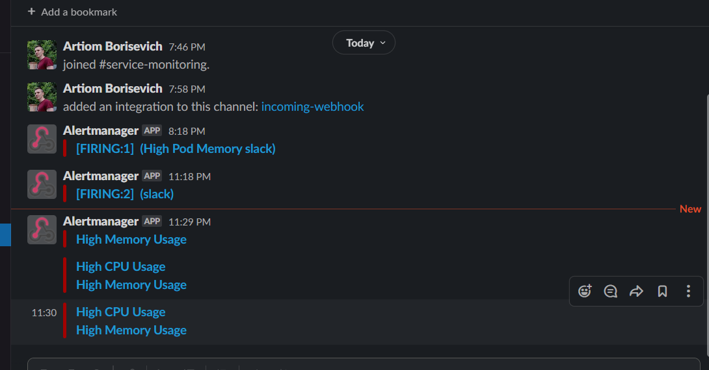
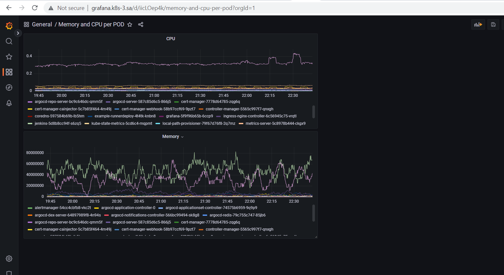

# 16.Monitoring

## Prepare PR with your manifests, config files and screenshots (received notification in slack, Grafana dashboard)

### Screenshots 





### Alert.yaml

```yaml
---
kind: ConfigMap
apiVersion: v1
metadata:
  name: alertmanager-config
  namespace: monitoring
data:
  config.yml: |
    global:
      resolve_timeout: 1m
      slack_api_url: 'https://hooks.slack.com/services/CONFIDENTIAL'
    receivers:
    - name: 'slack-notificaions'
      slack_configs:
      - channel: '#service-monitoring'
        send_resolved: true
        title: "{{ range .Alerts }}{{ .Annotations.summary }}\n{{ end }}"
        text: "{{ range .Alerts }}{{ .Annotations.description }}\n{{ end }}"
    route:
      group_interval: 40s
      group_wait: 10s
      receiver: 'slack-notificaions'
      repeat_interval: 30s
---
apiVersion: apps/v1
kind: Deployment
metadata:
  name: alertmanager
  labels:
    app: alertmanager
  namespace: monitoring
spec:
  replicas: 1
  selector:
    matchLabels:
      app: alertmanager
  template:
    metadata:
      labels:
        app: alertmanager
    spec:
      containers:
        - name: alertmanager
          image: prom/alertmanager:latest
          args:
            - "--config.file=/etc/alertmanager/config.yml"
            - "--storage.path=/alertmanager"
          ports:
            - containerPort: 9093
          resources:
            requests:
              cpu: 10m
              memory: 50Mi
            limits:
              cpu: 10m
              memory: 50Mi
          volumeMounts:
            - name: config-volume
              mountPath: /etc/alertmanager
            - name: alertmanager
              mountPath: /alertmanager
      volumes:
        - name: config-volume
          configMap:
            name: alertmanager-config
        - name: alertmanager
          emptyDir: {}
---
apiVersion: v1
kind: Service
metadata:
  name: alertmanager
  namespace: monitoring
  annotations:
    prometheus.io/scrape: 'true'
    prometheus.io/path:   /
    prometheus.io/port:   '9093'
spec:
  selector:
    app: alertmanager
  type: NodePort
  ports:
    - port: 9093
      targetPort: 9093
      nodePort: 31000
---
apiVersion: networking.k8s.io/v1
kind: Ingress
metadata:
  name: ingress-alertmanager
  namespace: monitoring
  annotations:
    kubernetes.io/ingress.class: nginx
spec:
  rules:
    - host: alertmanager.k8s-3.sa
      http:
        paths:
          - path: /
            pathType: Prefix
            backend:
              service:
                name: alertmanager
                port:
                  number: 9093
```

