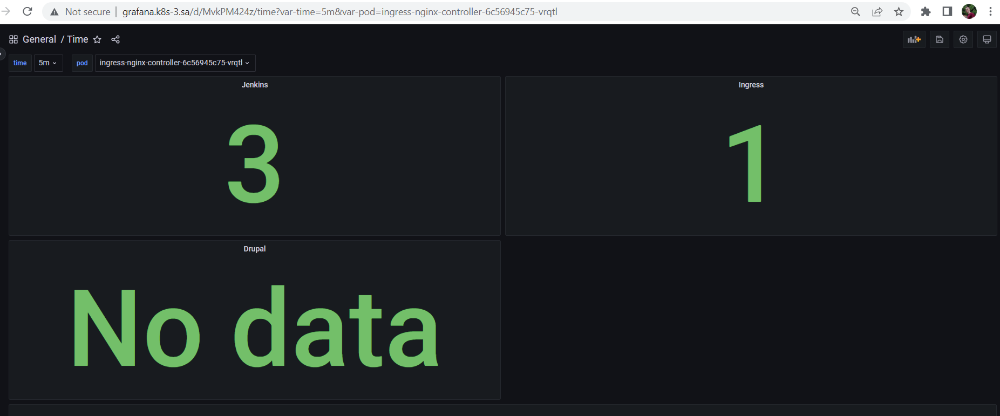
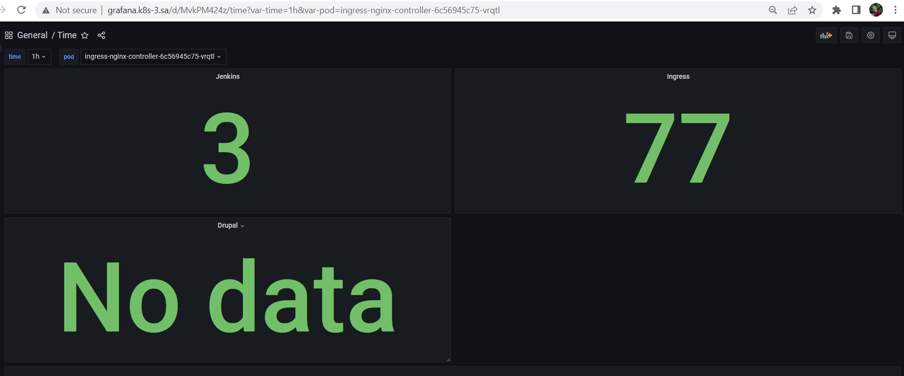
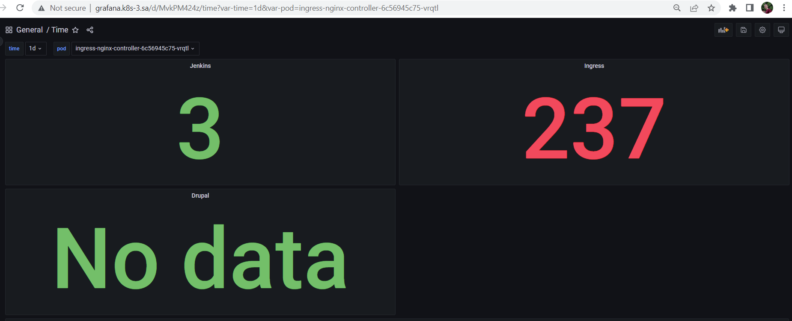

# 17. Logs. Monitoring

## Create screenshot of your dashboard, and json export add to PR

### Screenshots (5 minutes, 1 hour, 1 day)







### Json

```json
{
  "annotations": {
    "list": [
      {
        "builtIn": 1,
        "datasource": {
          "type": "grafana",
          "uid": "-- Grafana --"
        },
        "enable": true,
        "hide": true,
        "iconColor": "rgba(0, 211, 255, 1)",
        "name": "Annotations & Alerts",
        "target": {
          "limit": 100,
          "matchAny": false,
          "tags": [],
          "type": "dashboard"
        },
        "type": "dashboard"
      }
    ]
  },
  "editable": true,
  "fiscalYearStartMonth": 0,
  "graphTooltip": 0,
  "id": 6,
  "links": [],
  "liveNow": false,
  "panels": [
    {
      "datasource": {
        "type": "loki",
        "uid": "DYlC672Vk"
      },
      "fieldConfig": {
        "defaults": {
          "color": {
            "mode": "thresholds"
          },
          "mappings": [],
          "thresholds": {
            "mode": "absolute",
            "steps": [
              {
                "color": "green",
                "value": null
              },
              {
                "color": "red",
                "value": 80
              }
            ]
          }
        },
        "overrides": []
      },
      "gridPos": {
        "h": 8,
        "w": 12,
        "x": 0,
        "y": 0
      },
      "id": 123129,
      "options": {
        "colorMode": "value",
        "graphMode": "none",
        "justifyMode": "auto",
        "orientation": "auto",
        "reduceOptions": {
          "calcs": [
            "lastNotNull"
          ],
          "fields": "",
          "values": false
        },
        "textMode": "auto"
      },
      "pluginVersion": "9.3.2",
      "targets": [
        {
          "datasource": {
            "type": "loki",
            "uid": "DYlC672Vk"
          },
          "editorMode": "builder",
          "expr": "count_over_time({pod=\"jenkins-84dbbdc555-7cjc5\"} |= `error` [$time])",
          "queryType": "range",
          "refId": "A"
        }
      ],
      "title": "Jenkins",
      "type": "stat"
    },
    {
      "datasource": {
        "type": "loki",
        "uid": "DYlC672Vk"
      },
      "fieldConfig": {
        "defaults": {
          "color": {
            "mode": "thresholds"
          },
          "mappings": [],
          "thresholds": {
            "mode": "absolute",
            "steps": [
              {
                "color": "green",
                "value": null
              },
              {
                "color": "red",
                "value": 80
              }
            ]
          }
        },
        "overrides": []
      },
      "gridPos": {
        "h": 8,
        "w": 12,
        "x": 12,
        "y": 0
      },
      "id": 123131,
      "options": {
        "colorMode": "value",
        "graphMode": "none",
        "justifyMode": "auto",
        "orientation": "auto",
        "reduceOptions": {
          "calcs": [
            "lastNotNull"
          ],
          "fields": "",
          "values": false
        },
        "textMode": "auto"
      },
      "pluginVersion": "9.3.2",
      "targets": [
        {
          "datasource": {
            "type": "loki",
            "uid": "DYlC672Vk"
          },
          "editorMode": "code",
          "expr": "count_over_time({pod=\"ingress-nginx-controller-6c56945c75-vrqtl\"} |= `error` [$time])",
          "queryType": "range",
          "refId": "A"
        }
      ],
      "title": "Ingress",
      "type": "stat"
    },
    {
      "datasource": {
        "type": "loki",
        "uid": "DYlC672Vk"
      },
      "fieldConfig": {
        "defaults": {
          "color": {
            "mode": "thresholds"
          },
          "mappings": [],
          "thresholds": {
            "mode": "absolute",
            "steps": [
              {
                "color": "green",
                "value": null
              },
              {
                "color": "red",
                "value": 80
              }
            ]
          }
        },
        "overrides": []
      },
      "gridPos": {
        "h": 8,
        "w": 12,
        "x": 0,
        "y": 8
      },
      "id": 123125,
      "options": {
        "colorMode": "value",
        "graphMode": "none",
        "justifyMode": "auto",
        "orientation": "auto",
        "reduceOptions": {
          "calcs": [
            "lastNotNull"
          ],
          "fields": "",
          "values": false
        },
        "textMode": "auto"
      },
      "pluginVersion": "9.3.2",
      "targets": [
        {
          "datasource": {
            "type": "loki",
            "uid": "DYlC672Vk"
          },
          "editorMode": "builder",
          "expr": "count_over_time({pod=\"sa-drupal-974d6d5fb-dl7xh\"} |= `error` [$time])",
          "queryType": "range",
          "refId": "A"
        }
      ],
      "title": "Drupal",
      "type": "stat"
    },
    {
      "datasource": {
        "type": "datasource",
        "uid": "grafana"
      },
      "gridPos": {
        "h": 3,
        "w": 24,
        "x": 0,
        "y": 16
      },
      "id": 1,
      "targets": [
        {
          "datasource": {
            "type": "datasource",
            "uid": "grafana"
          },
          "refId": "A"
        }
      ],
      "type": "welcome"
    },
    {
      "datasource": {
        "type": "datasource",
        "uid": "grafana"
      },
      "gridPos": {
        "h": 9,
        "w": 24,
        "x": 0,
        "y": 19
      },
      "id": 123123,
      "targets": [
        {
          "datasource": {
            "type": "datasource",
            "uid": "grafana"
          },
          "refId": "A"
        }
      ],
      "type": "gettingstarted"
    },
    {
      "datasource": {
        "type": "datasource",
        "uid": "grafana"
      },
      "gridPos": {
        "h": 15,
        "w": 12,
        "x": 0,
        "y": 28
      },
      "id": 3,
      "links": [],
      "options": {
        "folderId": 0,
        "maxItems": 30,
        "query": "",
        "showHeadings": true,
        "showRecentlyViewed": true,
        "showSearch": false,
        "showStarred": true,
        "tags": []
      },
      "pluginVersion": "9.3.2",
      "tags": [],
      "targets": [
        {
          "datasource": {
            "type": "datasource",
            "uid": "grafana"
          },
          "refId": "A"
        }
      ],
      "title": "Dashboards",
      "type": "dashlist"
    },
    {
      "datasource": {
        "type": "datasource",
        "uid": "grafana"
      },
      "gridPos": {
        "h": 15,
        "w": 12,
        "x": 12,
        "y": 28
      },
      "id": 4,
      "links": [],
      "options": {
        "feedUrl": "https://grafana.com/blog/news.xml",
        "showImage": true
      },
      "targets": [
        {
          "datasource": {
            "type": "datasource",
            "uid": "grafana"
          },
          "refId": "A"
        }
      ],
      "title": "Latest from the blog",
      "type": "news"
    }
  ],
  "schemaVersion": 37,
  "style": "dark",
  "tags": [],
  "templating": {
    "list": [
      {
        "auto": false,
        "auto_count": 30,
        "auto_min": "10s",
        "current": {
          "selected": false,
          "text": "1d",
          "value": "1d"
        },
        "hide": 0,
        "name": "time",
        "options": [
          {
            "selected": false,
            "text": "5m",
            "value": "5m"
          },
          {
            "selected": false,
            "text": "1h",
            "value": "1h"
          },
          {
            "selected": true,
            "text": "1d",
            "value": "1d"
          }
        ],
        "query": "5m, 1h, 1d",
        "queryValue": "",
        "refresh": 2,
        "skipUrlSync": false,
        "type": "interval"
      },
      {
        "current": {
          "selected": true,
          "text": "ingress-nginx-controller-6c56945c75-vrqtl",
          "value": "ingress-nginx-controller-6c56945c75-vrqtl"
        },
        "hide": 0,
        "includeAll": false,
        "label": "pod",
        "multi": false,
        "name": "pod",
        "options": [
          {
            "selected": false,
            "text": "sa-drupal-974d6d5fb-dl7xh",
            "value": "sa-drupal-974d6d5fb-dl7xh"
          },
          {
            "selected": true,
            "text": "ingress-nginx-controller-6c56945c75-vrqtl",
            "value": "ingress-nginx-controller-6c56945c75-vrqtl"
          },
          {
            "selected": false,
            "text": "jenkins-84dbbdc555-7cjc5",
            "value": "jenkins-84dbbdc555-7cjc5"
          }
        ],
        "query": "sa-drupal-974d6d5fb-dl7xh,ingress-nginx-controller-6c56945c75-vrqtl,jenkins-84dbbdc555-7cjc5",
        "queryValue": "",
        "skipUrlSync": false,
        "type": "custom"
      }
    ]
  },
  "time": {
    "from": "now-6h",
    "to": "now"
  },
  "timepicker": {
    "hidden": true,
    "refresh_intervals": [
      "5s",
      "10s",
      "30s",
      "1m",
      "5m",
      "15m",
      "30m",
      "1h",
      "2h",
      "1d"
    ],
    "time_options": [
      "5m",
      "15m",
      "1h",
      "6h",
      "12h",
      "24h",
      "2d",
      "7d",
      "30d"
    ],
    "type": "timepicker"
  },
  "timezone": "browser",
  "title": "Time",
  "uid": "MvkPM424z",
  "version": 1,
  "weekStart": ""
}
```

