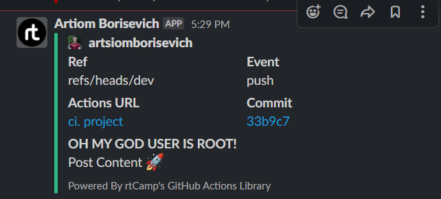

# 18. DevOps. Tests

## Automate Docker images test by github action:

* deploy docker image for test
* test by requesting data from image
* test if image has not root access inside

### Jobs build(dockerfile could be found inside)

https://github.com/artsiomborisevich/03.git.hosting/actions/runs/3884317541

### Dockerfile (refactored according to lint)

```yaml
# base image to build a JRE
FROM amazoncorretto:17.0.3-alpine as corretto-jdk

# Build small JRE image
RUN apk add --no-cache binutils \
    && "$JAVA_HOME"/bin/jlink \
         --verbose \
         --add-modules ALL-MODULE-PATH \
         --strip-debug \
         --no-man-pages \
         --no-header-files \
         --compress=2 \
         --output /customjre

# main app image
FROM alpine:3.17
ENV JAVA_HOME=/jre
ENV PATH="${JAVA_HOME}/bin:${PATH}"

# copy JRE from the base image
COPY --from=corretto-jdk /customjre $JAVA_HOME

# Add app user
ARG APPLICATION_USER=appuser
RUN adduser --no-create-home -u 1000 -D $APPLICATION_USER

# Configure working directory
RUN mkdir /app && \
    chown -R $APPLICATION_USER /app

USER 1000

ARG JAR_FILE=target/spring-3.0.0.jar
COPY --chown=1000:1000 ${JAR_FILE} /app/app.jar
WORKDIR /app

EXPOSE 8080
ENTRYPOINT [ "/jre/bin/java", "-jar", "/app/app.jar" ]
```
### Notification when dockerfile has root user inside (another dockerfile)



### Github action for dockerfile

```yaml
name: ci. project

on:
  push:
    branches:
      - "dev"

jobs:
  docker:
    runs-on: ubuntu-latest
    steps:
      - name: Checkout
        uses: actions/checkout@v3

      - name: Docker lint
        uses: hadolint/hadolint-action@v2.1.0
        with:
          dockerfile: Dockerfile
          failure-threshold: error

      - name: Set up Docker Buildx
        uses: docker/setup-buildx-action@v2

      - name: Install curl
        run: sudo apt update && sudo apt install -y curl

      - name: Check info
        id: info
        continue-on-error: true
        run: |
          docker build --network=host -t spring:1.0.0 .
          docker run -d --name spring -p 8080:8080 -t spring:1.0.0
          sleep 5
          curl --request GET --url http://localhost:8080 >> report.txt

      - name: Check no-root inside
        id: root
        continue-on-error: true
        run: |
          docker ps
          docker exec spring whoami
          docker exec spring su - 

      - name: Upload report
        if: steps.info.outcome == 'success'
        uses: actions/upload-artifact@v3
        with:
          path: report.txt

      - name: Slack Notification
        if: steps.root.outcome == 'success'
        uses: rtCamp/action-slack-notify@v2
        env:
          SLACK_CHANNEL: project_borisevich
          SLACK_COLOR: ${{ job.status }}
          SLACK_ICON: https://github.com/rtCamp.png?size=48
          SLACK_MESSAGE: 'Post Content :rocket:'
          SLACK_TITLE: 'OH MY GOD USER IS ROOT!'
          SLACK_USERNAME: Artiom Borisevich
          SLACK_WEBHOOK: ${{ secrets.SLACK_WEBHOOK }}
```
## Create CI for testing Kubernetes manifests using kubeval

* start on push or create PR to manifests repository
* all tools are inside container/pods
* integrate notification about status of validation
* (optional) if you have more then one manifest, you have to implement parallel validation for them

### Jobs build

https://github.com/artsiomborisevich/03.git.hosting/actions/runs/3884632673

### Github action for manifests

```yaml
name: Test for manifests

on:
  push:
    branches:
      - "dev"

jobs:
  find-files:
    runs-on: ubuntu-latest
    outputs:
      files: ${{ env.files }}
    steps:
      - name: Get files
        uses: actions/checkout@v2
        id: files
      - run: |
          FILES="$(ls -d ./manifests/* | jq -R -s -c 'split("\n")[:-1]')"
          echo "files=`echo -n $FILES`" >> $GITHUB_ENV
  test-files:
    needs: find-files
    runs-on: ubuntu-latest
    strategy:
      matrix:
        manifest-files: ${{fromJson(needs.find-files.outputs.files)}}
      fail-fast: false
    steps:
      - name: Get files
        uses: actions/checkout@v2

      - name: Test files with kubeval
        uses: instrumenta/kubeval-action@master
        with:
          files: ${{matrix.manifest-files}}

      - name: Slack Notification
        if: ${{ always() }}
        uses: rtCamp/action-slack-notify@v2
        env:
          SLACK_CHANNEL: project_borisevich
          SLACK_COLOR: ${{ job.status }}
          SLACK_ICON: https://github.com/rtCamp.png?size=48
          SLACK_MESSAGE: 'Post Content :rocket:'
          SLACK_TITLE: 'Manifests validated!'
          SLACK_USERNAME: Artiom Borisevich
          SLACK_WEBHOOK: ${{ secrets.SLACK_WEBHOOK }}
```