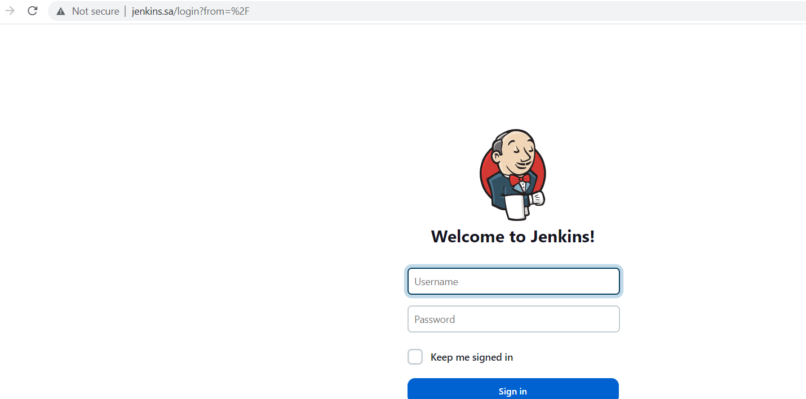

# 19. Jenkins. Start

## Config files with Jenkins proxy on Web server and xml file for job add PR

### Create job to run each day and collect data and send as artefacts to the slack:

* Check if today holiday in Belarus: https://holidayapi.com/countries/by/2023
* Inform about exchange rates for current day (please find any)
* Can be included in one file-artefacts or simple message in slack

### NOTE (https://holidayapi.com) was replaced. In free version, has showed only previous years for free.

### Screenshots of succesful job.


### Xml file for job 

```xml
<?xml version='1.1' encoding='UTF-8'?>
<project>
    <actions/>
    <description></description>
    <keepDependencies>false</keepDependencies>
    <properties>
        <com.sonyericsson.rebuild.RebuildSettings plugin="rebuild@1.34">
            <autoRebuild>false</autoRebuild>
            <rebuildDisabled>false</rebuildDisabled>
        </com.sonyericsson.rebuild.RebuildSettings>
    </properties>
    <scm class="hudson.scm.NullSCM"/>
    <canRoam>true</canRoam>
    <disabled>false</disabled>
    <blockBuildWhenDownstreamBuilding>false</blockBuildWhenDownstreamBuilding>
    <blockBuildWhenUpstreamBuilding>false</blockBuildWhenUpstreamBuilding>
    <triggers>
        <hudson.triggers.TimerTrigger>
            <spec>15 13 * * *</spec>
        </hudson.triggers.TimerTrigger>
    </triggers>
    <concurrentBuild>false</concurrentBuild>
    <builders>
        <hudson.tasks.Shell>
            <command>#!/bin/bash
                now=$(date +&quot;&amp;year=%Y&amp;month=%m&amp;day=%d&quot;)
                echo &quot;Today is $(date) and following holidays in BY&quot;
                curl -s &quot;https://holidays.abstractapi.com/v1/?api_key=HIDDENMYAPIKEY&amp;country=BY$now&quot;
                echo
                echo &quot;Today are the following exchange rates in BY&quot;
                curl -s https://www.nbrb.by/api/exrates/rates?periodicity=0 | jq</command>
            <configuredLocalRules/>
        </hudson.tasks.Shell>
    </builders>
    <publishers>
        <jenkins.plugins.slack.SlackNotifier plugin="slack@631.v40deea_40323b">
            <baseUrl></baseUrl>
            <teamDomain></teamDomain>
            <authToken></authToken>
            <tokenCredentialId></tokenCredentialId>
            <botUser>false</botUser>
            <room></room>
            <sendAsText>false</sendAsText>
            <iconEmoji> :white_check_mark:</iconEmoji>
            <username></username>
            <startNotification>false</startNotification>
            <notifySuccess>true</notifySuccess>
            <notifyAborted>false</notifyAborted>
            <notifyNotBuilt>false</notifyNotBuilt>
            <notifyUnstable>false</notifyUnstable>
            <notifyRegression>false</notifyRegression>
            <notifyFailure>false</notifyFailure>
            <notifyEveryFailure>true</notifyEveryFailure>
            <notifyBackToNormal>false</notifyBackToNormal>
            <notifyRepeatedFailure>false</notifyRepeatedFailure>
            <includeTestSummary>false</includeTestSummary>
            <includeFailedTests>false</includeFailedTests>
            <uploadFiles>true</uploadFiles>
            <artifactIncludes></artifactIncludes>
            <commitInfoChoice>NONE</commitInfoChoice>
            <includeCustomMessage>true</includeCustomMessage>
            <customMessage>$now</customMessage>
            <customMessageSuccess>You can check rates and holidays</customMessageSuccess>
            <customMessageAborted></customMessageAborted>
            <customMessageNotBuilt></customMessageNotBuilt>
            <customMessageUnstable></customMessageUnstable>
            <customMessageFailure></customMessageFailure>
        </jenkins.plugins.slack.SlackNotifier>
    </publishers>
    <buildWrappers/>
</project>
```

### Config files with Jenkins proxing

```text
<Virtualhost *:80>
    ServerName        jenkins.sa
    ProxyRequests     Off
    ProxyPreserveHost On
    AllowEncodedSlashes NoDecode

    <Proxy http://localhost:8080/*>
      Order deny,allow
      Allow from all
    </Proxy>

    ProxyPass         /  http://localhost:8080/
    ProxyPassReverse  /  http://localhost:8080/
    ProxyPassReverse  /  http://jenkins.sa/
</Virtualhost>
```

### Add restricted user to view Jobs, without any changes inside Jobs and Jenkins settings

```groovy
import jenkins.model.*
import hudson.security.*

def instance = Jenkins.getInstance()

def hudsonRealm = new HudsonPrivateSecurityRealm(false)
hudsonRealm.createAccount("boris", HIDDEN)
instance.setSecurityRealm(hudsonRealm)

def strategy = (GlobalMatrixAuthorizationStrategy) instance.getAuthorizationStrategy()
strategy.add(Jenkins.READ, "boris")
instance.setAuthorizationStrategy(strategy)

instance.save()
```

### Screenshot of jenkins host name and 



