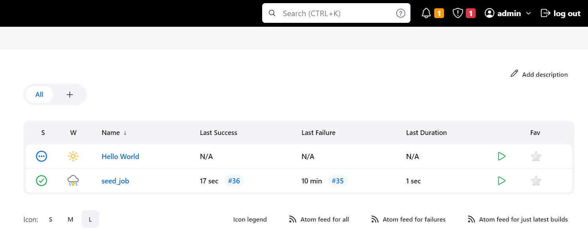

# 20. Jenkins. Routine

## Jenkins config as code

```yaml
credentials:
  system:
    domainCredentials:
      - credentials:
          - basicSSHUserPrivateKey:
              id: "jenkins_ssh"
              privateKeySource:
                directEntry:
                  privateKey: "{HIDDEN}"
              scope: GLOBAL
              username: "jenkins"
          - basicSSHUserPrivateKey:
              id: "Git"
              privateKeySource:
                directEntry:
                  privateKey: "{HIDDEN}"
              scope: GLOBAL
              username: "artsiomborisevich"
          - string:
              id: "slack_webhook"
              scope: GLOBAL
              secret: "{HIDDEN}"
jenkins:
  agentProtocols:
    - "JNLP4-connect"
    - "Ping"
  authorizationStrategy:
    loggedInUsersCanDoAnything:
      allowAnonymousRead: false
  crumbIssuer:
    standard:
      excludeClientIPFromCrumb: false
  disableRememberMe: false
  labelAtoms:
    - name: "built-in"
    - name: "node"
    - name: "slave"
  markupFormatter: "plainText"
  mode: NORMAL
  myViewsTabBar: "standard"
  nodes:
    - permanent:
        labelString: "slave"
        launcher:
          ssh:
            credentialsId: "jenkins_ssh"
            host: "192.168.0.112"
            port: 22
            sshHostKeyVerificationStrategy:
              manuallyTrustedKeyVerificationStrategy:
                requireInitialManualTrust: false
        name: "node"
        numExecutors: 2
        remoteFS: "/var/lib/jenkins/"
        retentionStrategy: "always"
  numExecutors: 4
  primaryView:
    all:
      name: "all"
  projectNamingStrategy: "standard"
  quietPeriod: 5
  remotingSecurity:
    enabled: true
  scmCheckoutRetryCount: 0
  securityRealm:
    local:
      allowsSignup: false
      enableCaptcha: false
      users:
        - id: "admin"
          name: "admin"
          properties:
            - "apiToken"
            - "myView"
            - "timezone"
            - "mailer"
            - "favorite"
            - preferredProvider:
                providerId: "default"
            - "slack"
        - id: "boris"
          name: "boris"
          properties:
            - "apiToken"
            - "mailer"
            - "favorite"
            - "myView"
            - preferredProvider:
                providerId: "default"
            - "slack"
            - "timezone"
  slaveAgentPort: -1
  updateCenter:
    sites:
      - id: "default"
        url: "https://updates.jenkins.io/update-center.json"
  views:
    - all:
        name: "all"
  viewsTabBar: "standard"
globalCredentialsConfiguration:
  configuration:
    providerFilter: "none"
    typeFilter: "none"
security:
  apiToken:
    creationOfLegacyTokenEnabled: false
    tokenGenerationOnCreationEnabled: false
    usageStatisticsEnabled: true
  gitHooks:
    allowedOnAgents: false
    allowedOnController: false
  gitHostKeyVerificationConfiguration:
    sshHostKeyVerificationStrategy: "knownHostsFileVerificationStrategy"
  globalJobDslSecurityConfiguration:
    useScriptSecurity: false
  sSHD:
    port: -1
  scriptApproval:
    approvedScriptHashes:
      - "SHA512:8aef4342f640c4cb834e9707a5d2327402ac30894df4ea613d4cfe28019b0aff6dfb5a7f79dc897575803903ff9b1d730396f15f88cee447a70142617a09050c"
      - "SHA512:a86d445b5122eab52b9d19a011d74d1e0d447ada69ba28f3d10651e3d1ffb381303083f702abaf0c6072055d41bd6860f4d9514f63c31d6e68d85bee50e36458"
      - "SHA512:f8f729a242f29a1255f10f18537c93048f8a538496fc587a9c5276d032d95c15f33de21160f7fd57e7a4bd39fe6e8c0e4d4317b1e1784cb3a69a772c968c3768"
unclassified:
  ansiColorBuildWrapper:
    colorMaps:
      - black: "#000000"
        blackB: "#4C4C4C"
        blue: "#1E90FF"
        blueB: "#4682B4"
        cyan: "#00CDCD"
        cyanB: "#00FFFF"
        green: "#00CD00"
        greenB: "#00FF00"
        magenta: "#CD00CD"
        magentaB: "#FF00FF"
        name: "xterm"
        red: "#CD0000"
        redB: "#FF0000"
        white: "#E5E5E5"
        whiteB: "#FFFFFF"
        yellow: "#CDCD00"
        yellowB: "#FFFF00"
      - black: "#000000"
        blackB: "#555555"
        blue: "#0000AA"
        blueB: "#5555FF"
        cyan: "#00AAAA"
        cyanB: "#55FFFF"
        defaultBackground: 0
        defaultForeground: 7
        green: "#00AA00"
        greenB: "#55FF55"
        magenta: "#AA00AA"
        magentaB: "#FF55FF"
        name: "vga"
        red: "#AA0000"
        redB: "#FF5555"
        white: "#AAAAAA"
        whiteB: "#FFFFFF"
        yellow: "#AA5500"
        yellowB: "#FFFF55"
      - black: "black"
        blackB: "black"
        blue: "blue"
        blueB: "blue"
        cyan: "cyan"
        cyanB: "cyan"
        green: "green"
        greenB: "green"
        magenta: "magenta"
        magentaB: "magenta"
        name: "css"
        red: "red"
        redB: "red"
        white: "white"
        whiteB: "white"
        yellow: "yellow"
        yellowB: "yellow"
      - black: "#2E3436"
        blackB: "#2E3436"
        blue: "#3465A4"
        blueB: "#3465A4"
        cyan: "#06989A"
        cyanB: "#06989A"
        defaultBackground: 0
        defaultForeground: 7
        green: "#4E9A06"
        greenB: "#4E9A06"
        magenta: "#75507B"
        magentaB: "#75507B"
        name: "gnome-terminal"
        red: "#CC0000"
        redB: "#CC0000"
        white: "#D3D7CF"
        whiteB: "#D3D7CF"
        yellow: "#C4A000"
        yellowB: "#C4A000"
  bitbucketEndpointConfiguration:
    endpoints:
      - bitbucketCloudEndpoint:
          enableCache: false
          manageHooks: false
          repositoriesCacheDuration: 0
          teamCacheDuration: 0
  buildDiscarders:
    configuredBuildDiscarders:
      - "jobBuildDiscarder"
  email-ext:
    adminRequiredForTemplateTesting: false
    allowUnregisteredEnabled: false
    charset: "UTF-8"
    debugMode: false
    defaultBody: |-
      $PROJECT_NAME - Build # $BUILD_NUMBER - $BUILD_STATUS:

      Check console output at $BUILD_URL to view the results.
    defaultSubject: "$PROJECT_NAME - Build # $BUILD_NUMBER - $BUILD_STATUS!"
    defaultTriggerIds:
      - "hudson.plugins.emailext.plugins.trigger.FailureTrigger"
    maxAttachmentSize: -1
    maxAttachmentSizeMb: -1
    precedenceBulk: false
    watchingEnabled: false
  fingerprints:
    fingerprintCleanupDisabled: false
    storage: "file"
  gitHubConfiguration:
    apiRateLimitChecker: ThrottleForNormalize
  gitHubPluginConfig:
    hookUrl: "http://192.168.0.110:8080/github-webhook/"
  junitTestResultStorage:
    storage: "file"
  location:
    adminAddress: "address not configured yet <nobody@nowhere>"
  mailer:
    charset: "UTF-8"
    useSsl: false
    useTls: false
  pollSCM:
    pollingThreadCount: 10
  scmGit:
    addGitTagAction: false
    allowSecondFetch: false
    createAccountBasedOnEmail: false
    disableGitToolChooser: false
    hideCredentials: false
    showEntireCommitSummaryInChanges: false
    useExistingAccountWithSameEmail: false
  slackNotifier:
    botUser: false
    sendAsText: false
tool:
  git:
    installations:
      - home: "git"
        name: "Default"
  mavenGlobalConfig:
    globalSettingsProvider: "standard"
    settingsProvider: "standard"
jobs:
  - script: >
      job('seed_job') {
          label('master')
          scm {
              git {
                  remote {
                      url('https://github.com/artsiomborisevich/jenkins_jobs.git')
                  }
                  extensions {
                    relativeTargetDirectory('jobs')
                  }
              }
          }
          steps {
            shell('echo Hello Jenkins')
            shell("cp -rv ./jobs/jobs/ /var/lib/jenkins/")
            dsl {
              external('jobs/*.groovy')  
              // default behavior
              // removeAction('IGNORE')      
              removeAction('DELETE')
            }
          }
      }
```

### Repo with jobs

https://github.com/artsiomborisevich/jenkins_jobs

### Screenshots of succesful job.




