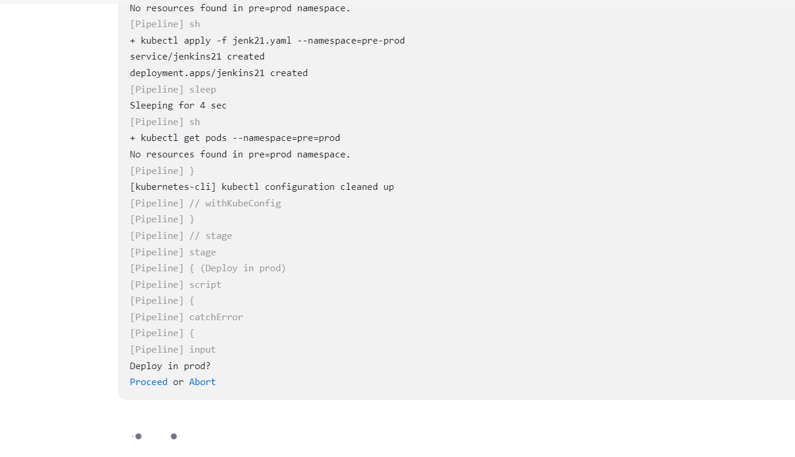
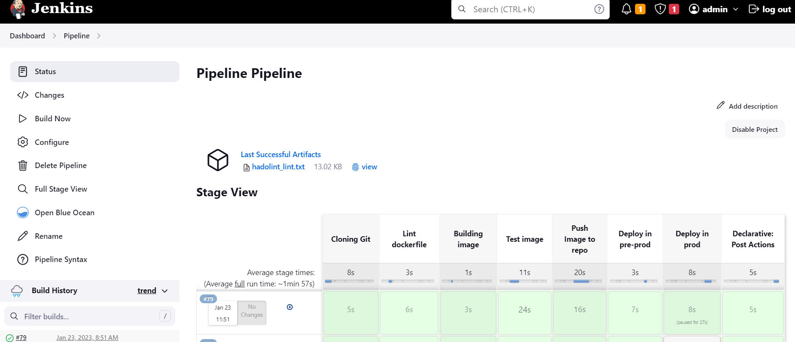
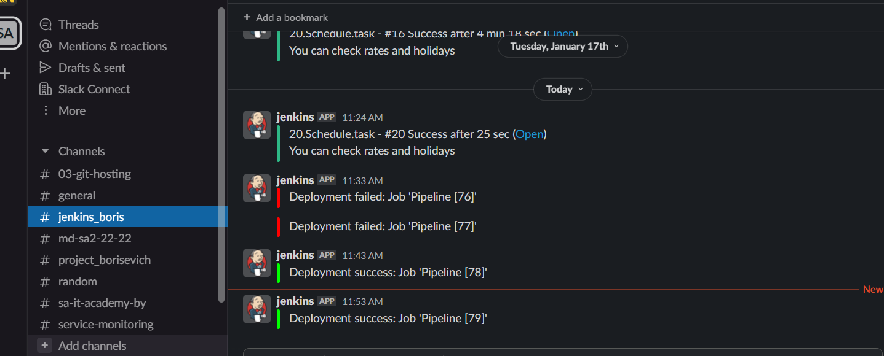

# 21. Jenkins. Docker and Pod

## Repository with Dockerfile and Jenkinsfile with pipeline code:

https://github.com/artsiomborisevich/jenkins_jobs

### Jenkins pipeline:

```groovy
pipeline {
      environment {
    registry = "avrelian1995/avrelian_1995"
    registryCredential = 'dockerhub'
  }
      agent { label 'slave'}
  stages {
    stage('Cloning Git') {
      steps {
        git 'https://github.com/artsiomborisevich/jenkins_jobs.git'
      }
    }

    stage ("Lint dockerfile") {
        agent {
            docker {
                image 'hadolint/hadolint:latest-debian'
                label 'master'
            }
        }
        steps {
            sh 'hadolint Dockerfile | tee -a hadolint_lint.txt'
        }
        post {
            always {
                archiveArtifacts 'hadolint_lint.txt'
            }
        }
    }

    stage('Building image') {
      steps{
        script {
          dockerImage = docker.build registry + ":$BUILD_NUMBER" , "--network host ."
        }
      }
    }
    stage('Test image') {
      steps{
        sh "docker run -d -p 8080:8080 $registry:$BUILD_NUMBER"
        sh" sed -i 's/latest/$BUILD_NUMBER/' jenkins.yaml"
        sh "sleep 5"
        sh 'wget http://localhost:8080'
        sh 'cat index.html'
      }
    }

    stage('Push Image to repo') {
      steps{
        script {
            docker.withRegistry( '', registryCredential ) {
            dockerImage.push()
          }
        }
      }
    }
    stage('Deploy in pre-prod') {
      steps{
          withKubeConfig([credentialsId: 'mykubeconfig']) {
          sh "kubectl get pods --namespace=pre=prod"
          sh "kubectl apply -f jenkins.yaml --namespace=pre-prod"
          sleep 4
          sh "kubectl get pods --namespace=pre=prod"
          }
      }
    }
    stage('Deploy in prod') {
      steps{
        script {
          catchError(buildResult: 'SUCCESS', stageResult: 'FAILURE'){
            def depl = true
            try{
              input("Deploy in prod?")
            }
            catch(err){
              depl = false
            }
            try{
              if(depl){
                withKubeConfig([credentialsId: 'mykubeconfig']) {
                sh "kubectl apply -f jenkins.yaml --namespace=prod"
                sleep 4
                sh "kubectl get pods --namespace=prod"
                sh "kubectl delete -f jenkins.yaml --namespace=pre-prod"
                }
              }
            }
            catch(Exception err){
              error "Deployment failed"
            }
          }
        }
      }
    }
  }
  post {
    success {
      slackSend (color: '#00FF00', message: "Deployment success: Job '${env.JOB_NAME} [${env.BUILD_NUMBER}]'")
    }
    failure {
      slackSend (color: '#FF0000', message: "Deployment failed: Job '${env.JOB_NAME} [${env.BUILD_NUMBER}]'")
    }
  }
}
```

### Manual approve of deployment.



### Succesfull pipeline and notification in slack





