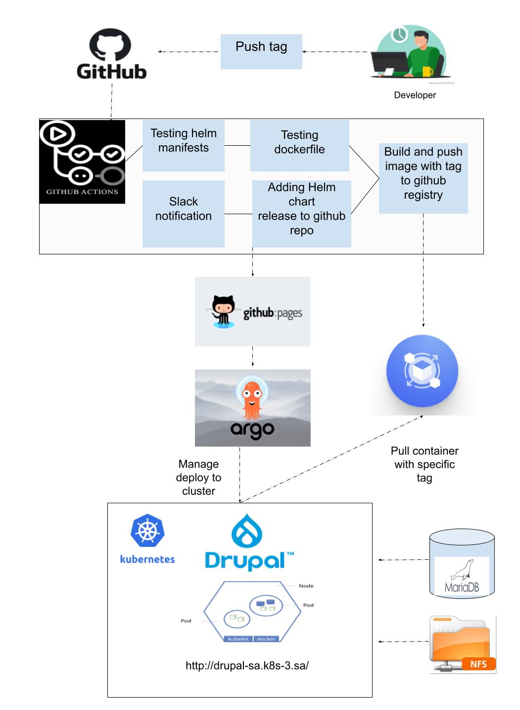

# **Project report**
### **Project's reporter:** Artyom Borisevich   
### **Group number:** md-sa2-22-22
---
## **Description of application for deployment**
- **Application:** Drupal
- **Programimg language:** PHP
- **DB:** MariaDB
---
## Pipeline. High Level Design



---
## Technologies which were used in project
- **Orchestration:** Kubernetes
- **Automation tools:** Github actions, ArgoCD, Argo Rollouts, Ansible
- **SCM:** GitHub
- **Notification:** Slack
- **Other tools:** Docker, Helm , MariaDB, NFS
---

## CI/CD description:
GitHub actions workflow starting after pushing tag to the repo. You can use following commands(with your tag version):
```bash
git tag -a v1.0.0 -m "v1.0.0"
git push origin v1.0.0 
```
### CI has following steps:
| Action                       | Description                                                                                                                                            |
|------------------------------|--------------------------------------------------------------------------------------------------------------------------------------------------------|
| **Push tag**                 | Developer pushes tag with the new version of app which triggers github actions.                                                                        |
| **Testing**                  | Verification of `Helm manifests` and `Dockerfile`.                                                                                                     |
| **Build and push**           | Build docker image app with the tag from developer and push it to the Github Packages.                                                                 |
| **Helm Package**             | This action generates a helm package and updates files `values.yaml` and `index.yaml` . Also *appVersion* and *version* are updated in the `Chart.yaml`. |
| **Push helm package to git** | Push changes to the **gh-pages** branch (**main**).                                                                                                    |
| **Slack Notification**       | Send notification to the Slack.                                                                                                                |

### CD following steps:

- GitHub pages is used as helm artifactory
- ArgoCD WebUI or console is used for deployment
- Argo Rollouts are used for Blue-Green update strategy
---

## Links:
Project repository: https://github.com/artsiomborisevich/devops-project

Argo rollouts: https://argo-rollouts.readthedocs.io/en/stable/
