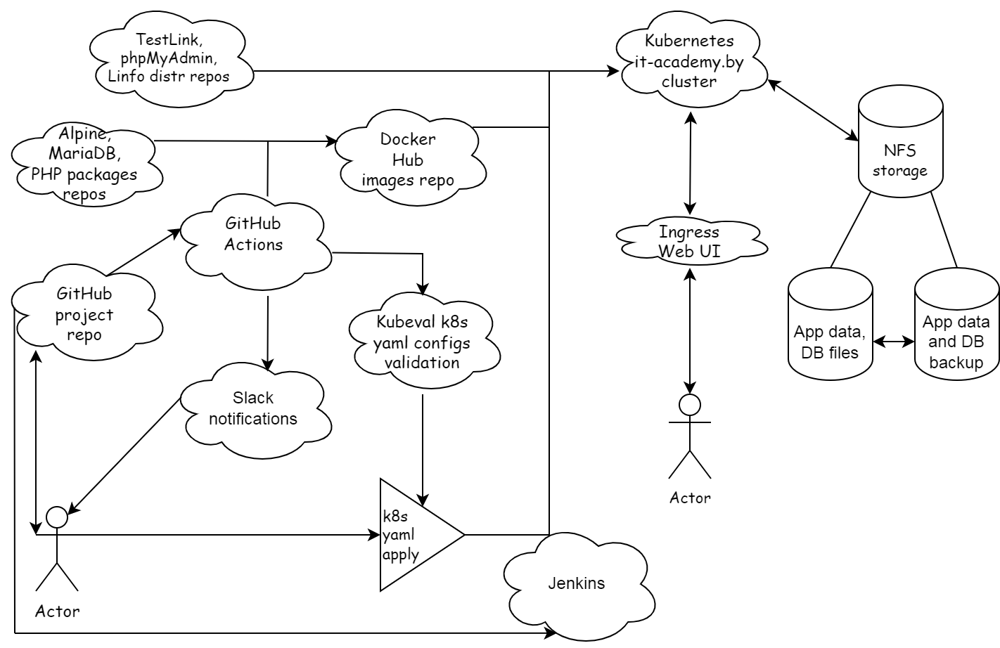

# Project report

### Project's reporter: Bogdan Babinets

### Group number: md-sa2-20-22

## Description of application for deployment

- Applications: TestLink, phpMyAdmin, Linfo
- Programming language: PHP
- Kind of DB: MariaDB (MySQL)
- Link on git repository: phpserver on [GitHub.com/BB8312](https://github.com/BB8312/phpserver) (consists of main and test branches)
- Links on package repositories: [TestLink](https://sourceforge.net/projects/testlink/files/), [phpMyAdmin](https://www.phpmyadmin.net/files/), [Linfo](https://sourceforge.net/projects/linfo/files/)

## Pipeline. High Level Design

## Technologies which were used in project

### Orchestration

Kubernetes

### Automation tools

GitHub Actions, Jenkins, Shell

### Code validation

Kubeval

### Notification

Slack

### CI description

By push to the GitHub repository, yaml files of Kubernetes deployment configuration are validated by Kubeval, appropriate software packages URL's are prepared for deployment and published in Docker Hub image tagged by target version. When workflow ends Slack notification occurred and says about changes in repository and new Docker image tag available.

### Deployment flows short description

New deployment begins from preparing empty NFS data storage, getting docker image and software packages, applying installation scripts, DB initialization and after it application Web UI is provided.
Upgrade stops Web UI first, after applications are closed NFS data with application files and DB are backed up to other NFS directories.
When backup is done new version of software deployed, software initialization and DB migration scripts aplied, and if result is successfull application Web UI is provided again.

### Rollback flow description and implementation

If some scripts during upgrade process failed, Kubernetes will not provide Web UI and will try to redeploy target version again, in case of technical problems with packages access latency or NFS temporary troubles for example. Jenkins will show this in it's UI like continuous time count of last deployment stage, and according to internet and NFS storage speeds, a decision to stop suspicious pipeline can be made, and "Restore_<version>" pipeline can be applied. Also, in case of successfull new version deployment, but user unsatisfaction because of some functional misexpectations, restore pipeline also can be started. In any case it will stop applications along with Web UI access and last deployment from Kubernetes will be deleted, then unchanged application data with DB files will be restored from last backup on unmounted from applications NFS directories, and after it deployment with previous software versions will be applied.

## Links

[Repository of Pipeline code](https://github.com/BB8312/phpserver)

[Stable Docker images](https://hub.docker.com/r/bb8312/phpstable/tags)

[Test Docker images](https://hub.docker.com/r/bb8312/phpdev/tags)

[Versioning How-to](Versioning.png)
