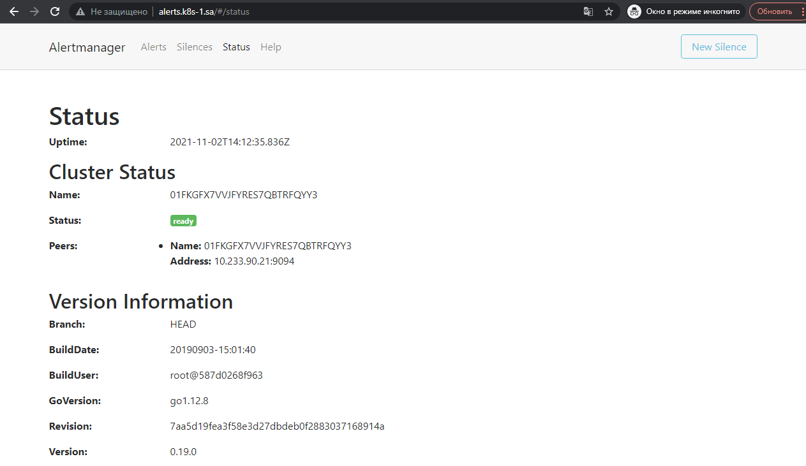

# 15.Technical and service monitoring

## Deploy Prometheus + Alert manager + Grafana

```bash
sneg@sneg-work:~/k8s/monitoring$ kubectl apply -f ns.yaml 
namespace/monitoring created

sneg@sneg-work:~/k8s/monitoring$ kubectl apply -f prometheus.yaml 
clusterrole.rbac.authorization.k8s.io/prometheus created
clusterrolebinding.rbac.authorization.k8s.io/prometheus created
configmap/prometheus-server-conf created
deployment.apps/prometheus-deployment created
service/prometheus-service created
ingress.networking.k8s.io/ingress-prometheus created

sneg@sneg-work:~/k8s/monitoring$ kubectl apply -f node-exporter.yaml 
daemonset.apps/node-exporter created
service/node-exporter created

sneg@sneg-work:~/k8s/monitoring/alertmanager$ kubectl create -f AlertManagerConfigmap.yaml
configmap/alertmanager-config created

sneg@sneg-work:~/k8s/monitoring/alertmanager$ kubectl create -f AlertTemplateConfigMap.yaml
configmap/alertmanager-templates created

sneg@sneg-work:~/k8s/monitoring/alertmanager$ kubectl create -f Deployment.yaml
deployment.apps/alertmanager created

sneg@sneg-work:~/k8s/monitoring/alertmanager$ kubectl create -f Service.yaml
service/alertmanager created
ingress.networking.k8s.io/ingress-alertmanager created

sneg@sneg-work:~/k8s/monitoring$ kubectl apply -f grafana.yaml
configmap/grafana-datasources created
deployment.apps/grafana created
service/grafana created
ingress.networking.k8s.io/ingress-grafana created

sneg@sneg-work:~/k8s/monitoring$ kubectl get pod --namespace monitoring
NAME                                     READY   STATUS    RESTARTS   AGE
alertmanager-896fd948-9grkk              1/1     Running   0          18h
grafana-6cb5cf45bf-msvvc                 1/1     Running   0          94m
node-exporter-fn744                      1/1     Running   0          20h
node-exporter-zsw28                      1/1     Running   0          20h
prometheus-deployment-599bbd9457-rcmt7   1/1     Running   0          14h

sneg@sneg-work:~/k8s/monitoring$ kubectl get ingress --namespace monitoring
NAME                   CLASS    HOSTS                 ADDRESS         PORTS   AGE
ingress-alertmanager   <none>   alerts.k8s-1.sa       192.168.203.2   80      19h
ingress-grafana        <none>   grafana.k8s-1.sa      192.168.203.2   80      95m
ingress-prometheus     <none>   prometheus.k8s-1.sa   192.168.203.2   80      14h
```
---
## Screenshots:

### Slack notification


### Alertmanager web UI



### Prometheus web UI


### Grafana Dashboard

