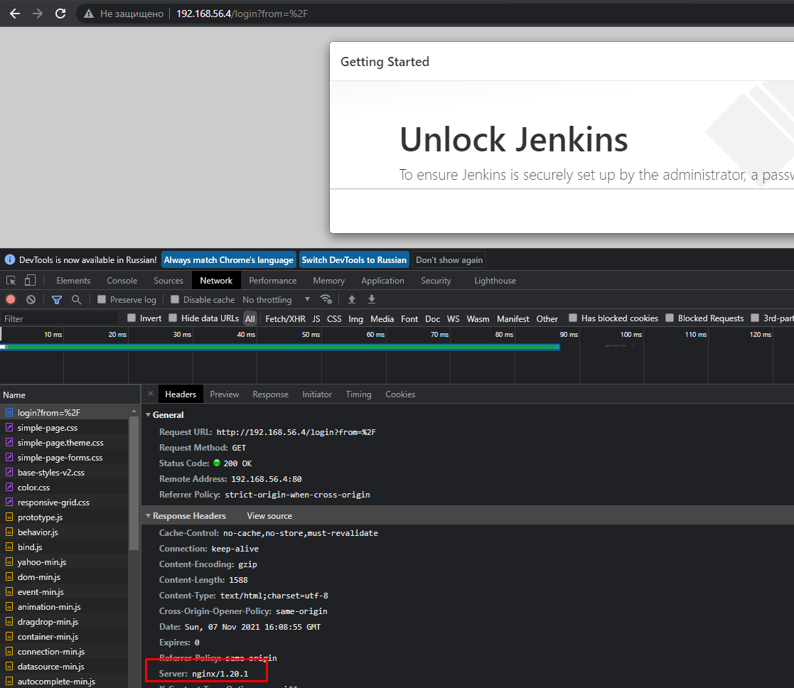

# 16.Jenkins additional task

## Screenshot



## Ansible playbook output

```bash
sneg@home-ubuntu:~/ansible_jenkins$ ansible-playbook -i inv.yaml jenkins.yaml

PLAY [jenkins] ************************************************************************************************************************************************************************************************

TASK [Gathering Facts] ****************************************************************************************************************************************************************************************
Sunday 07 November 2021  16:08:07 +0000 (0:00:00.010)       0:00:00.010 ******* 
ok: [jenkins]

TASK [debug] **************************************************************************************************************************************************************************************************
Sunday 07 November 2021  16:08:08 +0000 (0:00:00.890)       0:00:00.901 ******* 
ok: [jenkins] => {
    "msg": "192.168.56.4"
}

TASK [jenkins : Jenkins. Install required packages] ***********************************************************************************************************************************************************
Sunday 07 November 2021  16:08:08 +0000 (0:00:00.024)       0:00:00.926 ******* 
ok: [jenkins]

TASK [jenkins : Jenkins. Add repository] **********************************************************************************************************************************************************************
Sunday 07 November 2021  16:08:20 +0000 (0:00:12.508)       0:00:13.434 ******* 
ok: [jenkins]

TASK [jenkins : Jenkins. Import jenkins key from url] *********************************************************************************************************************************************************
Sunday 07 November 2021  16:08:21 +0000 (0:00:00.439)       0:00:13.874 ******* 
ok: [jenkins]

TASK [jenkins : Jenkins. Install jenkins] *********************************************************************************************************************************************************************
Sunday 07 November 2021  16:08:22 +0000 (0:00:01.328)       0:00:15.203 ******* 
ok: [jenkins]

TASK [jenkins : Jenkins. Add firewall rule] *******************************************************************************************************************************************************************
Sunday 07 November 2021  16:08:32 +0000 (0:00:10.203)       0:00:25.407 ******* 
ok: [jenkins]

TASK [jenkins : Jenkins. Add firewall rule 2] *****************************************************************************************************************************************************************
Sunday 07 November 2021  16:08:33 +0000 (0:00:00.429)       0:00:25.836 ******* 
ok: [jenkins]

TASK [jenkins : Jenkins. Start and enable service] ************************************************************************************************************************************************************
Sunday 07 November 2021  16:08:33 +0000 (0:00:00.344)       0:00:26.181 ******* 
ok: [jenkins]

TASK [jenkins : Jenkins. Wait until the file is present before continuing] ************************************************************************************************************************************
Sunday 07 November 2021  16:08:33 +0000 (0:00:00.386)       0:00:26.567 ******* 
ok: [jenkins]

TASK [jenkins : Jenkins. Init password Jenkins] ***************************************************************************************************************************************************************
Sunday 07 November 2021  16:08:34 +0000 (0:00:00.234)       0:00:26.801 ******* 
ok: [jenkins]

TASK [jenkins : Jenkins. Print init password] *****************************************************************************************************************************************************************
Sunday 07 November 2021  16:08:34 +0000 (0:00:00.247)       0:00:27.049 ******* 
ok: [jenkins] => {
    "result.stdout": "4468ca87784549649d0e015e7ea29b38"
}

TASK [jenkins : Jenkins. Test port availability] **************************************************************************************************************************************************************
Sunday 07 November 2021  16:08:34 +0000 (0:00:00.020)       0:00:27.069 ******* 
ok: [jenkins]

TASK [nginx : NGINX. Install packages] ************************************************************************************************************************************************************************
Sunday 07 November 2021  16:08:34 +0000 (0:00:00.176)       0:00:27.246 ******* 
ok: [jenkins]

TASK [nginx : NGINX. Enable and start service] ****************************************************************************************************************************************************************
Sunday 07 November 2021  16:08:34 +0000 (0:00:00.275)       0:00:27.521 ******* 
ok: [jenkins]

TASK [nginx : NGINX. Enable firewall port] ********************************************************************************************************************************************************************
Sunday 07 November 2021  16:08:35 +0000 (0:00:00.382)       0:00:27.904 ******* 
ok: [jenkins]

TASK [nginx : NGINX. Check connection to Localhost] ***********************************************************************************************************************************************************
Sunday 07 November 2021  16:08:35 +0000 (0:00:00.319)       0:00:28.223 ******* 
ok: [jenkins]

TASK [nginx : NGINX. Print out connection test] ***************************************************************************************************************************************************************
Sunday 07 November 2021  16:08:35 +0000 (0:00:00.158)       0:00:28.381 ******* 
ok: [jenkins] => {
    "msg": {
        "changed": false,
        "elapsed": 0,
        "failed": false,
        "match_groupdict": {},
        "match_groups": [],
        "path": null,
        "port": 80,
        "search_regex": null,
        "state": "started"
    }
}

TASK [nginx : NGINX. Create user jenkins and add in group nginx] **********************************************************************************************************************************************
Sunday 07 November 2021  16:08:35 +0000 (0:00:00.027)       0:00:28.408 ******* 
ok: [jenkins]

TASK [nginx : NGINX. Template nginx.conf] *********************************************************************************************************************************************************************
Sunday 07 November 2021  16:08:36 +0000 (0:00:00.283)       0:00:28.691 ******* 
ok: [jenkins]

TASK [nginx : NGINX. Create nginx log directory for jenkins] **************************************************************************************************************************************************
Sunday 07 November 2021  16:08:36 +0000 (0:00:00.455)       0:00:29.147 ******* 
ok: [jenkins]

TASK [nginx : NGINX. Set jenkins listen address] **************************************************************************************************************************************************************
Sunday 07 November 2021  16:08:36 +0000 (0:00:00.244)       0:00:29.392 ******* 
ok: [jenkins]

TASK [nginx : NGINX. Disable SELinux] *************************************************************************************************************************************************************************
Sunday 07 November 2021  16:08:36 +0000 (0:00:00.242)       0:00:29.634 ******* 
[WARNING]: SELinux state change will take effect next reboot
ok: [jenkins]

PLAY RECAP ****************************************************************************************************************************************************************************************************
jenkins                    : ok=23   changed=0    unreachable=0    failed=0    skipped=0    rescued=0    ignored=0   

Sunday 07 November 2021  16:08:37 +0000 (0:00:00.377)       0:00:30.012 ******* 
=============================================================================== 
jenkins : Jenkins. Install required packages ---------------------------------------------------------------------------------------------------------------------------------------------------------- 12.51s
jenkins : Jenkins. Install jenkins -------------------------------------------------------------------------------------------------------------------------------------------------------------------- 10.20s
jenkins : Jenkins. Import jenkins key from url --------------------------------------------------------------------------------------------------------------------------------------------------------- 1.33s
Gathering Facts ---------------------------------------------------------------------------------------------------------------------------------------------------------------------------------------- 0.89s
nginx : NGINX. Template nginx.conf --------------------------------------------------------------------------------------------------------------------------------------------------------------------- 0.46s
jenkins : Jenkins. Add repository ---------------------------------------------------------------------------------------------------------------------------------------------------------------------- 0.44s
jenkins : Jenkins. Add firewall rule ------------------------------------------------------------------------------------------------------------------------------------------------------------------- 0.43s
jenkins : Jenkins. Start and enable service ------------------------------------------------------------------------------------------------------------------------------------------------------------ 0.39s
nginx : NGINX. Enable and start service ---------------------------------------------------------------------------------------------------------------------------------------------------------------- 0.38s
nginx : NGINX. Disable SELinux ------------------------------------------------------------------------------------------------------------------------------------------------------------------------- 0.38s
jenkins : Jenkins. Add firewall rule 2 ----------------------------------------------------------------------------------------------------------------------------------------------------------------- 0.34s
nginx : NGINX. Enable firewall port -------------------------------------------------------------------------------------------------------------------------------------------------------------------- 0.32s
nginx : NGINX. Create user jenkins and add in group nginx ---------------------------------------------------------------------------------------------------------------------------------------------- 0.28s
nginx : NGINX. Install packages ------------------------------------------------------------------------------------------------------------------------------------------------------------------------ 0.28s
jenkins : Jenkins. Init password Jenkins --------------------------------------------------------------------------------------------------------------------------------------------------------------- 0.25s
nginx : NGINX. Create nginx log directory for jenkins -------------------------------------------------------------------------------------------------------------------------------------------------- 0.24s
nginx : NGINX. Set jenkins listen address -------------------------------------------------------------------------------------------------------------------------------------------------------------- 0.24s
jenkins : Jenkins. Wait until the file is present before continuing ------------------------------------------------------------------------------------------------------------------------------------ 0.23s
jenkins : Jenkins. Test port availability -------------------------------------------------------------------------------------------------------------------------------------------------------------- 0.18s
nginx : NGINX. Check connection to Localhost ----------------------------------------------------------------------------------------------------------------------------------------------------------- 0.16s
Playbook run took 0 days, 0 hours, 0 minutes, 30 seconds
```