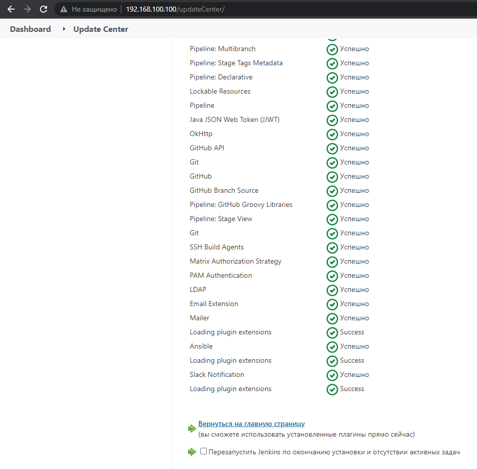
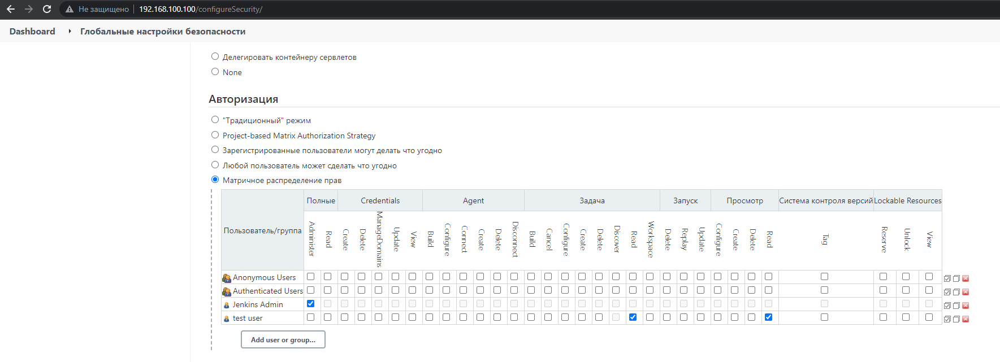
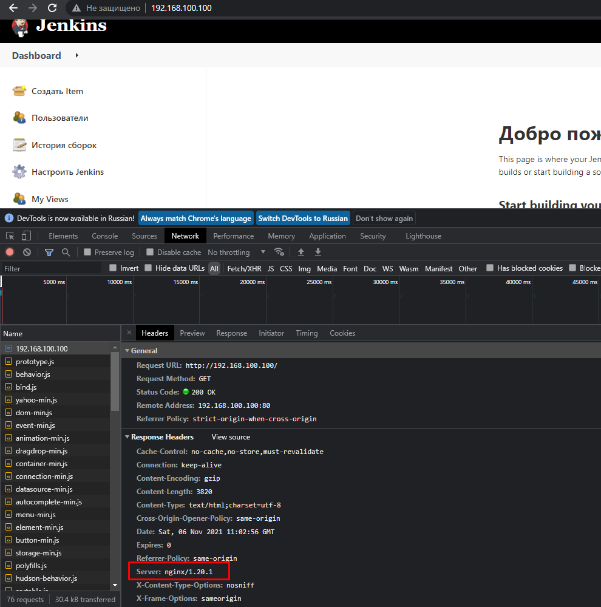

## 16.Jenkins.Start

## Screenshots

### Install plugins: Ansible, slack notification



### Add restricted user



### Hide Jenkins behind NGINX



---

## Installing and configuring NGINX

```bash
[vagrant@10 ~]$ sudo yum install nginx
[vagrant@10 ~]$ sudo usermod -aG jenkins nginx
[vagrant@10 ~]$ sudo vi /etc/nginx/nginx.conf
[vagrant@10 ~]$ sudo mkdir /var/log/nginx/jenkins/
[vagrant@10 ~]$ sudo systemctl restart nginx.service
[vagrant@10 ~]$ sudo cat /var/log/audit/audit.log | grep nginx | grep denied | audit2allow -M mynginx
[vagrant@10 ~]$ sudo semodule -i mynginx.pp
## Set JENKINS_LISTEN_ADDRESS to 127.0.0.1 (default 0.0.0.0)
[vagrant@10 ~]$ sudo vi /etc/sysconfig/jenkins
[vagrant@10 ~]$ sudo systemctl restart jenkins.service
```

## NGINX config (/etc/nginx/nginx.conf):

```bash
# For more information on configuration, see:
#   * Official English Documentation: http://nginx.org/en/docs/
#   * Official Russian Documentation: http://nginx.org/ru/docs/

user nginx;
worker_processes auto;
error_log /var/log/nginx/error.log;
pid /run/nginx.pid;

# Load dynamic modules. See /usr/share/doc/nginx/README.dynamic.
include /usr/share/nginx/modules/*.conf;

events {
    worker_connections 1024;
}

http {
    log_format  main  '$remote_addr - $remote_user [$time_local] "$request" '
                      '$status $body_bytes_sent "$http_referer" '
                      '"$http_user_agent" "$http_x_forwarded_for"';

    access_log  /var/log/nginx/access.log  main;

    sendfile            on;
    tcp_nopush          on;
    tcp_nodelay         on;
    keepalive_timeout   65;
    types_hash_max_size 4096;

    include             /etc/nginx/mime.types;
    default_type        application/octet-stream;

    # Load modular configuration files from the /etc/nginx/conf.d directory.
    # See http://nginx.org/en/docs/ngx_core_module.html#include
    # for more information.
    include /etc/nginx/conf.d/*.conf;

    server {
        listen       80;
        listen       [::]:80;
        server_name  _;
        root         /usr/share/nginx/html;

        # Load configuration files for the default server block.
        include /etc/nginx/default.d/*.conf;

        error_page 404 /404.html;
        location = /404.html {
        }

        error_page 500 502 503 504 /50x.html;
        location = /50x.html {
        }
    }

# Settings for a TLS enabled server.
#
#    server {
#        listen       443 ssl http2;
#        listen       [::]:443 ssl http2;
#        server_name  _;
#        root         /usr/share/nginx/html;
#
#        ssl_certificate "/etc/pki/nginx/server.crt";
#        ssl_certificate_key "/etc/pki/nginx/private/server.key";
#        ssl_session_cache shared:SSL:1m;
#        ssl_session_timeout  10m;
#        ssl_ciphers HIGH:!aNULL:!MD5;
#        ssl_prefer_server_ciphers on;
#
#        # Load configuration files for the default server block.
#        include /etc/nginx/default.d/*.conf;
#
#        error_page 404 /404.html;
#            location = /40x.html {
#        }
#
#        error_page 500 502 503 504 /50x.html;
#            location = /50x.html {
#        }
#    }

upstream jenkins {
  keepalive 32; # keepalive connections
  server 127.0.0.1:8080; # jenkins ip and port
}

# Required for Jenkins websocket agents
map $http_upgrade $connection_upgrade {
  default upgrade;
  '' close;
}

server {
  listen          80;       # Listen on port 80 for IPv4 requests

  server_name     192.168.100.100;  # replace 'jenkins.example.com' with your server domain name

  # this is the jenkins web root directory
  # (mentioned in the /etc/default/jenkins file)
  root            /var/run/jenkins/war/;

  access_log      /var/log/nginx/jenkins.access.log;
  error_log       /var/log/nginx/jenkins.error.log;

  # pass through headers from Jenkins that Nginx considers invalid
  ignore_invalid_headers off;

  location ~ "^/static/[0-9a-fA-F]{8}\/(.*)$" {
    # rewrite all static files into requests to the root
    # E.g /static/12345678/css/something.css will become /css/something.css
    rewrite "^/static/[0-9a-fA-F]{8}\/(.*)" /$1 last;
  }

  location /userContent {
    # have nginx handle all the static requests to userContent folder
    # note : This is the $JENKINS_HOME dir
    root /var/lib/jenkins/;
    if (!-f $request_filename){
      # this file does not exist, might be a directory or a /**view** url
      rewrite (.*) /$1 last;
      break;
    }
    sendfile on;
  }

  location / {
      sendfile off;
      proxy_pass         http://localhost:8080;
      proxy_redirect     default;
      proxy_http_version 1.1;

      # Required for Jenkins websocket agents
      proxy_set_header   Connection        $connection_upgrade;
      proxy_set_header   Upgrade           $http_upgrade;

      proxy_set_header   Host              $host;
      proxy_set_header   X-Real-IP         $remote_addr;
      proxy_set_header   X-Forwarded-For   $proxy_add_x_forwarded_for;
      proxy_set_header   X-Forwarded-Proto $scheme;
      proxy_max_temp_file_size 0;

      #this is the maximum upload size
      client_max_body_size       10m;
      client_body_buffer_size    128k;

      proxy_connect_timeout      90;
      proxy_send_timeout         90;
      proxy_read_timeout         90;
      proxy_buffering            off;
      proxy_request_buffering    off; # Required for HTTP CLI commands
      proxy_set_header Connection ""; # Clear for keepalive
  }

}

}
```