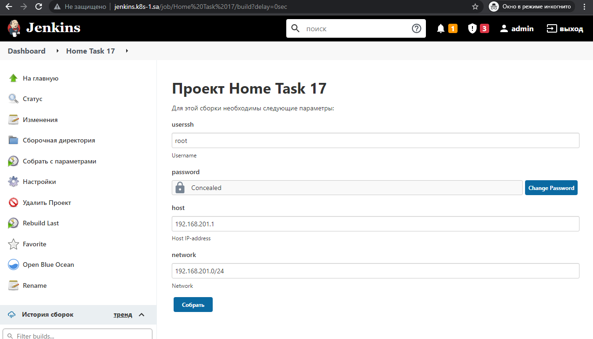

# 17.Jenkins.Routine

## Start job with parameters



## Output of my Jenkins task

```bash
Started by user admin
Running as SYSTEM
Building in workspace /var/jenkins_home/workspace/Home Task 17 #Check connection to the host
[Home Task 17] $ /bin/bash /tmp/jenkins4158322160983892579.sh
PING 192.168.201.1 (192.168.201.1) 56(84) bytes of data.
64 bytes from 192.168.201.1: icmp_seq=1 ttl=63 time=0.204 ms
64 bytes from 192.168.201.1: icmp_seq=2 ttl=63 time=0.170 ms
64 bytes from 192.168.201.1: icmp_seq=3 ttl=63 time=0.179 ms
64 bytes from 192.168.201.1: icmp_seq=4 ttl=63 time=0.219 ms
64 bytes from 192.168.201.1: icmp_seq=5 ttl=63 time=0.198 ms

--- 192.168.201.1 ping statistics ---
5 packets transmitted, 5 received, 0% packet loss, time 4101ms
rtt min/avg/max/mdev = 0.170/0.194/0.219/0.017 ms

[Home Task 17] $ /bin/bash /tmp/jenkins5102514593536200009.sh #Connect to a host using SSH
Pseudo-terminal will not be allocated because stdin is not a terminal.
Warning: Permanently added '192.168.201.1' (ECDSA) to the list of known hosts.
Welcome to Ubuntu 16.04.5 LTS (GNU/Linux 5.3.10-1-pve x86_64)

 * Documentation:  https://help.ubuntu.com
 * Management:     https://landscape.canonical.com
 * Support:        https://ubuntu.com/advantage
New release '18.04.6 LTS' available.
Run 'do-release-upgrade' to upgrade to it.

mesg: ttyname failed: Inappropriate ioctl for device

[Home Task 17] $ /bin/bash /tmp/jenkins11412439803729559180.sh #Install/upgrade nmap

WARNING: apt does not have a stable CLI interface. Use with caution in scripts.

Hit:1 http://security.debian.org/debian-security bullseye-security InRelease
Hit:2 http://deb.debian.org/debian bullseye InRelease
Hit:3 http://deb.debian.org/debian bullseye-updates InRelease
Hit:4 https://download.docker.com/linux/debian bullseye InRelease
Reading package lists...
Building dependency tree...
Reading state information...
1 package can be upgraded. Run 'apt list --upgradable' to see it.

WARNING: apt does not have a stable CLI interface. Use with caution in scripts.

Reading package lists...
Building dependency tree...
Reading state information...
The following additional packages will be installed:
  libblas3 liblinear4 liblua5.3-0 libpcap0.8 lua-lpeg nmap-common
Suggested packages:
  liblinear-tools liblinear-dev ncat ndiff zenmap
The following NEW packages will be installed:
  libblas3 liblinear4 liblua5.3-0 libpcap0.8 lua-lpeg nmap nmap-common
0 upgraded, 7 newly installed, 0 to remove and 1 not upgraded.
Need to get 6425 kB of archives.
After this operation, 27.4 MB of additional disk space will be used.
Get:1 http://deb.debian.org/debian bullseye/main amd64 libblas3 amd64 3.9.0-3 [153 kB]
Get:2 http://deb.debian.org/debian bullseye/main amd64 liblinear4 amd64 2.3.0+dfsg-5 [43.6 kB]
Get:3 http://deb.debian.org/debian bullseye/main amd64 liblua5.3-0 amd64 5.3.3-1.1+b1 [120 kB]
Get:4 http://deb.debian.org/debian bullseye/main amd64 libpcap0.8 amd64 1.10.0-2 [159 kB]
Get:5 http://deb.debian.org/debian bullseye/main amd64 lua-lpeg amd64 1.0.2-1 [33.3 kB]
Get:6 http://deb.debian.org/debian bullseye/main amd64 nmap-common all 7.91+dfsg1+really7.80+dfsg1-2 [4017 kB]
Get:7 http://deb.debian.org/debian bullseye/main amd64 nmap amd64 7.91+dfsg1+really7.80+dfsg1-2 [1899 kB]
debconf: delaying package configuration, since apt-utils is not installed
Fetched 6425 kB in 0s (14.9 MB/s)
Selecting previously unselected package libblas3:amd64.
(Reading database ... 
(Reading database ... 5%
(Reading database ... 10%
(Reading database ... 15%
(Reading database ... 20%
(Reading database ... 25%
(Reading database ... 30%
(Reading database ... 35%
(Reading database ... 40%
(Reading database ... 45%
(Reading database ... 50%
(Reading database ... 55%
(Reading database ... 60%
(Reading database ... 65%
(Reading database ... 70%
(Reading database ... 75%
(Reading database ... 80%
(Reading database ... 85%
(Reading database ... 90%
(Reading database ... 95%
(Reading database ... 100%
(Reading database ... 16304 files and directories currently installed.)
Preparing to unpack .../0-libblas3_3.9.0-3_amd64.deb ...
Unpacking libblas3:amd64 (3.9.0-3) ...
Selecting previously unselected package liblinear4:amd64.
Preparing to unpack .../1-liblinear4_2.3.0+dfsg-5_amd64.deb ...
Unpacking liblinear4:amd64 (2.3.0+dfsg-5) ...
Selecting previously unselected package liblua5.3-0:amd64.
Preparing to unpack .../2-liblua5.3-0_5.3.3-1.1+b1_amd64.deb ...
Unpacking liblua5.3-0:amd64 (5.3.3-1.1+b1) ...
Selecting previously unselected package libpcap0.8:amd64.
Preparing to unpack .../3-libpcap0.8_1.10.0-2_amd64.deb ...
Unpacking libpcap0.8:amd64 (1.10.0-2) ...
Selecting previously unselected package lua-lpeg:amd64.
Preparing to unpack .../4-lua-lpeg_1.0.2-1_amd64.deb ...
Unpacking lua-lpeg:amd64 (1.0.2-1) ...
Selecting previously unselected package nmap-common.
Preparing to unpack .../5-nmap-common_7.91+dfsg1+really7.80+dfsg1-2_all.deb ...
Unpacking nmap-common (7.91+dfsg1+really7.80+dfsg1-2) ...
Selecting previously unselected package nmap.
Preparing to unpack .../6-nmap_7.91+dfsg1+really7.80+dfsg1-2_amd64.deb ...
Unpacking nmap (7.91+dfsg1+really7.80+dfsg1-2) ...
Setting up lua-lpeg:amd64 (1.0.2-1) ...
Setting up libblas3:amd64 (3.9.0-3) ...
update-alternatives: using /usr/lib/x86_64-linux-gnu/blas/libblas.so.3 to provide /usr/lib/x86_64-linux-gnu/libblas.so.3 (libblas.so.3-x86_64-linux-gnu) in auto mode
Setting up libpcap0.8:amd64 (1.10.0-2) ...
Setting up nmap-common (7.91+dfsg1+really7.80+dfsg1-2) ...
Setting up liblua5.3-0:amd64 (5.3.3-1.1+b1) ...
Setting up liblinear4:amd64 (2.3.0+dfsg-5) ...
Setting up nmap (7.91+dfsg1+really7.80+dfsg1-2) ...
Processing triggers for libc-bin (2.31-13+deb11u2) ...

[Home Task 17] $ /bin/bash /tmp/jenkins18243921039090727998.sh #Checks all online hosts
192.168.201.1
192.168.201.2
192.168.201.3
192.168.201.4
192.168.201.5
192.168.201.6
192.168.201.7
192.168.201.8
192.168.201.9
192.168.201.10
192.168.201.11
192.168.201.12
192.168.201.13
192.168.201.14

[Home Task 17] $ /bin/bash /tmp/jenkins10438634498548226700.sh #Remove nmap

WARNING: apt does not have a stable CLI interface. Use with caution in scripts.

Reading package lists...
Building dependency tree...
Reading state information...
The following packages were automatically installed and are no longer required:
  libblas3 liblinear4 liblua5.3-0 libpcap0.8 lua-lpeg nmap-common
Use 'apt autoremove' to remove them.
The following packages will be REMOVED:
  nmap
0 upgraded, 0 newly installed, 1 to remove and 1 not upgraded.
After this operation, 4617 kB disk space will be freed.
(Reading database ... 
(Reading database ... 5%
(Reading database ... 10%
(Reading database ... 15%
(Reading database ... 20%
(Reading database ... 25%
(Reading database ... 30%
(Reading database ... 35%
(Reading database ... 40%
(Reading database ... 45%
(Reading database ... 50%
(Reading database ... 55%
(Reading database ... 60%
(Reading database ... 65%
(Reading database ... 70%
(Reading database ... 75%
(Reading database ... 80%
(Reading database ... 85%
(Reading database ... 90%
(Reading database ... 95%
(Reading database ... 100%
(Reading database ... 17206 files and directories currently installed.)
Removing nmap (7.91+dfsg1+really7.80+dfsg1-2) ...
Finished: SUCCESS

```