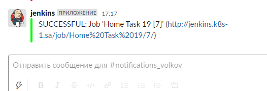

# 19. Jenkins. Docker and Pod

## Github repo

https://github.com/snegboris/jenkins_kubeval

## Slack notification screenshot



## Pipeline console output

```bash
Started by user admin
Obtained Jenkinsfile from git https://github.com/snegboris/jenkins_kubeval.git
[Pipeline] Start of Pipeline
[Pipeline] podTemplate
[Pipeline] {
[Pipeline] node
Created Pod: kubernetes ci-cd/home-task-19-7-mqpct-gm8vl-9k0kb
[Normal][ci-cd/home-task-19-7-mqpct-gm8vl-9k0kb][Scheduled] Successfully assigned ci-cd/home-task-19-7-mqpct-gm8vl-9k0kb to node1
[Normal][ci-cd/home-task-19-7-mqpct-gm8vl-9k0kb][Pulling] Pulling image "garethr/kubeval:latest"
Still waiting to schedule task
‘home-task-19-7-mqpct-gm8vl-9k0kb’ is offline
[Normal][ci-cd/home-task-19-7-mqpct-gm8vl-9k0kb][Pulled] Successfully pulled image "garethr/kubeval:latest" in 16.728716726s
[Normal][ci-cd/home-task-19-7-mqpct-gm8vl-9k0kb][Created] Created container eval
[Normal][ci-cd/home-task-19-7-mqpct-gm8vl-9k0kb][Started] Started container eval
[Normal][ci-cd/home-task-19-7-mqpct-gm8vl-9k0kb][Pulled] Container image "jenkins/inbound-agent:4.3-4-jdk11" already present on machine
[Normal][ci-cd/home-task-19-7-mqpct-gm8vl-9k0kb][Created] Created container jnlp
[Normal][ci-cd/home-task-19-7-mqpct-gm8vl-9k0kb][Started] Started container jnlp
Agent home-task-19-7-mqpct-gm8vl-9k0kb is provisioned from template Home_Task_19_7-mqpct-gm8vl
---
apiVersion: "v1"
kind: "Pod"
metadata:
  annotations:
    buildUrl: "http://jenkins:8080/job/Home%20Task%2019/7/"
    runUrl: "job/Home%20Task%2019/7/"
  labels:
    jenkins: "slave"
    jenkins/label-digest: "775ec6fbcff4573a5c885414d8ba9780b27fcd6e"
    jenkins/label: "Home_Task_19_7-mqpct"
  name: "home-task-19-7-mqpct-gm8vl-9k0kb"
spec:
  containers:
  - command:
    - "cat"
    image: "garethr/kubeval:latest"
    name: "eval"
    tty: true
    volumeMounts:
    - mountPath: "/home/jenkins/agent"
      name: "workspace-volume"
      readOnly: false
  - env:
    - name: "JENKINS_SECRET"
      value: "********"
    - name: "JENKINS_AGENT_NAME"
      value: "home-task-19-7-mqpct-gm8vl-9k0kb"
    - name: "JENKINS_NAME"
      value: "home-task-19-7-mqpct-gm8vl-9k0kb"
    - name: "JENKINS_AGENT_WORKDIR"
      value: "/home/jenkins/agent"
    - name: "JENKINS_URL"
      value: "http://jenkins:8080/"
    image: "jenkins/inbound-agent:4.3-4-jdk11"
    name: "jnlp"
    resources:
      limits: {}
      requests:
        memory: "256Mi"
        cpu: "100m"
    volumeMounts:
    - mountPath: "/home/jenkins/agent"
      name: "workspace-volume"
      readOnly: false
  nodeSelector:
    kubernetes.io/os: "linux"
  restartPolicy: "Never"
  volumes:
  - emptyDir:
      medium: ""
    name: "workspace-volume"

Running on home-task-19-7-mqpct-gm8vl-9k0kb in /home/jenkins/agent/workspace/Home Task 19
[Pipeline] {
[Pipeline] stage
[Pipeline] { (Declarative: Checkout SCM)
[Pipeline] checkout
Selected Git installation does not exist. Using Default
The recommended git tool is: NONE
using credential github
Cloning the remote Git repository
Cloning repository https://github.com/snegboris/jenkins_kubeval.git
 > git init /home/jenkins/agent/workspace/Home Task 19 # timeout=10
Fetching upstream changes from https://github.com/snegboris/jenkins_kubeval.git
 > git --version # timeout=10
 > git --version # 'git version 2.20.1'
using GIT_ASKPASS to set credentials github
 > git fetch --tags --force --progress -- https://github.com/snegboris/jenkins_kubeval.git +refs/heads/*:refs/remotes/origin/* # timeout=10
Avoid second fetch
Checking out Revision 39f138f4bd48a210ce19d26553d1d9eebc2f2dc2 (refs/remotes/origin/master)
 > git config remote.origin.url https://github.com/snegboris/jenkins_kubeval.git # timeout=10
 > git config --add remote.origin.fetch +refs/heads/*:refs/remotes/origin/* # timeout=10
 > git rev-parse refs/remotes/origin/master^{commit} # timeout=10
 > git config core.sparsecheckout # timeout=10
 > git checkout -f 39f138f4bd48a210ce19d26553d1d9eebc2f2dc2 # timeout=10
Commit message: "init commit"
First time build. Skipping changelog.
[Pipeline] } > git rev-list --no-walk 18a9382865a156fc4936f1fd5ea512483617f267 # timeout=10

[Pipeline] // stage
[Pipeline] withEnv
[Pipeline] {
[Pipeline] container
[Pipeline] {
[Pipeline] stage
[Pipeline] { (Clone repository)
[Pipeline] git
Selected Git installation does not exist. Using Default
The recommended git tool is: NONE
No credentials specified
Warning: JENKINS-30600: special launcher org.csanchez.jenkins.plugins.kubernetes.pipeline.ContainerExecDecorator$1@4769bf61; decorates RemoteLauncher[hudson.remoting.Channel@5513c9b1:JNLP4-connect connection from 10.233.90.71/10.233.90.71:50928] will be ignored (a typical symptom is the Git executable not being run inside a designated container)
Fetching changes from the remote Git repository
Checking out Revision 39f138f4bd48a210ce19d26553d1d9eebc2f2dc2 (refs/remotes/origin/master)
Commit message: "init commit"
[Pipeline] }
[Pipeline] // stage
[Pipeline] stage
[Pipeline] { (Kubeval manifests)
[Pipeline] parallel
[Pipeline] { (Branch: Check node-exporter.yaml)
[Pipeline] { (Branch: Check ms.yaml)
[Pipeline] stage
[Pipeline] { (Check node-exporter.yaml)
 > git rev-parse --resolve-git-dir /home/jenkins/agent/workspace/Home Task 19/.git # timeout=10
 > git config remote.origin.url https://github.com/snegboris/jenkins_kubeval.git # timeout=10
Fetching upstream changes from https://github.com/snegboris/jenkins_kubeval.git
 > git --version # timeout=10
 > git --version # 'git version 2.20.1'
 > git fetch --tags --force --progress -- https://github.com/snegboris/jenkins_kubeval.git +refs/heads/*:refs/remotes/origin/* # timeout=10
 > git rev-parse refs/remotes/origin/master^{commit} # timeout=10
 > git config core.sparsecheckout # timeout=10
 > git checkout -f 39f138f4bd48a210ce19d26553d1d9eebc2f2dc2 # timeout=10
 > git branch -a -v --no-abbrev # timeout=10
 > git checkout -b master 39f138f4bd48a210ce19d26553d1d9eebc2f2dc2 # timeout=10
[Pipeline] stage
[Pipeline] { (Check ms.yaml)
[Pipeline] container
[Pipeline] {
[Pipeline] container
[Pipeline] {
[Pipeline] sh
[Pipeline] sh
PASS - manifests/node-exporter.yaml contains a valid DaemonSet (monitoring.node-exporter)
PASS - manifests/node-exporter.yaml contains a valid Service (monitoring.node-exporter)
[Pipeline] }
PASS - manifests/ms.yaml contains a valid ServiceAccount (kube-system.metrics-server)
PASS - manifests/ms.yaml contains a valid ClusterRole (system:aggregated-metrics-reader)
PASS - manifests/ms.yaml contains a valid ClusterRole (system:metrics-server)
PASS - manifests/ms.yaml contains a valid RoleBinding (kube-system.metrics-server-auth-reader)
PASS - manifests/ms.yaml contains a valid ClusterRoleBinding (metrics-server:system:auth-delegator)
PASS - manifests/ms.yaml contains a valid ClusterRoleBinding (system:metrics-server)
PASS - manifests/ms.yaml contains a valid Service (kube-system.metrics-server)
PASS - manifests/ms.yaml contains a valid Deployment (kube-system.metrics-server)
PASS - manifests/ms.yaml contains a valid APIService (v1beta1.metrics.k8s.io)
[Pipeline] // container
[Pipeline] }
[Pipeline] }
[Pipeline] // stage
[Pipeline] // container
[Pipeline] }
[Pipeline] }
[Pipeline] // stage
[Pipeline] }
[Pipeline] // parallel
[Pipeline] }
[Pipeline] // stage
[Pipeline] stage
[Pipeline] { (Declarative: Post Actions)
[Pipeline] slackSend
Slack Send Pipeline step running, values are - baseUrl: <empty>, teamDomain: sa-itacademy-by, channel: #notifications_volkov, color: #00FF00, botUser: false, tokenCredentialId: slack_token, notifyCommitters: false, iconEmoji: <empty>, username: <empty>, timestamp: <empty>
[Pipeline] }
[Pipeline] // stage
[Pipeline] }
[Pipeline] // container
[Pipeline] }
[Pipeline] // withEnv
[Pipeline] }
[Pipeline] // node
[Pipeline] }
[Pipeline] // podTemplate
[Pipeline] End of Pipeline
Finished: SUCCESS
```