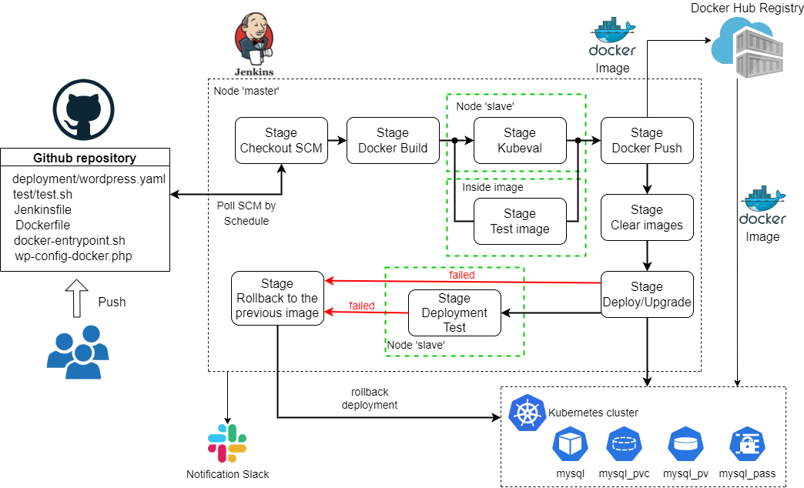

# Project report

### Project's reporter: Boris Volkov

### Group number: md-sa2-18-21

### Linkedin: linkedin.com/in/boris-volkov

---

## Description of application for deployment:

- Application: Wordpress

- Programming language: PHP

- DB: MySQL 5.7

- Link on git repository: https://github.com/docker-library/wordpress

---

## Pipeline. High Level Design:



---

## Technologies which were used in project:

### Orchestration: 
Kubernetes

### Automation tools:
Jenkins

### SCM:
Github

### Notification:
Slack

### Infrastructure:
Virtual hosts in EC HTP

## CI description:

Jenkins polls the project's Git repository once an hour on weekdays. If a new commit is detected, Jenkins runs a job. The first time the pipeline is started manually.

## Deployment flows short description:

- Stage "**Docker Build**": the application docker-image is built.
- Stage "**Kubeval**": the application deployment configuration files are validated with ```kubeval```
- Stage "**Image Test**": the ```test.sh``` script is launched in the built image, which checks for the presence of some application files and the installation of the Apache2.
- Stage "**Docker Push**": the built image is pushed into the Docker Hub Registry.
- Stage "**Clear Images**": the images are removed from the host node.
- Stage "**Deploy/Upgrade**": if the application deployment does not exist in the kubernetes cluster, then it is created. If it exists, then the image is updated to the new version.
- Stage "**Deployment Test**": the ```test.sh``` script is launched on the "slave" node, which checks the response header and the presence of a certain string in the code of the web page.

At the end, a notification about the result of the build is sent to the Slack.

## Rollback flow description and implementation:

If the "**Deploy/Upgrade**" stage or the "**Deployment Test**" stage fails, then the "**Rollback**" stage is executed, which rolls back the deployment to the previous image.

## Links:

Project repository: https://github.com/snegboris/it_academy_project
