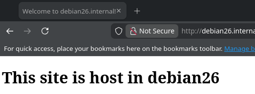

# 08.Ansible.Workshop

## Homework Assignment 1

В файле интевнтаризации помимо служебных ```ansible_host/user/port``` указаны также используемые в этом сценарии значения для настройки ```hostname``` и ``FQDN``

В файле playbook написаны 3 PLAY: для настройки hostname/FQDN, непосредственно установка и настройка NGINX и html страницы с уникальными данными хостов и для валидации установки с помощью GET-запросов

В PLAY `Set hostname and new_fqdn` для установки `hostname` использован встроенный модуль `ansible.builtin.hostname` и `ansible.builtin.lineinfile` для установки `FQDN` в файле `/etc/hosts` в нужном формате. Все значения берутся из файла инвентарции узлов

В PLAY `Setup nginx` для настройка виртаульного хоста и `index.html` используются шаблоны Ansible, в которые вставляются уникальные для каждого из хостов `hostname` и `FQDN`, полученные из `facts` Ansible, <u>а не из файла инфентаризации</u>. Полученные файлы устанавливаются в нужные места с явным указанием владельцев, так как владельцем непосредственно отдаваемых веб-сервером данных в NGINX должен являться `www-data`, а не `root`. Так же удаляется дефолтный конфиг сайта NGINX и создается символьная ссылка файла виртуального хоста в папку `sites-enabled`. Это необходимо для удобной смены отдаваемых веб-сервером вирульаных хостов с сохранением их конфигов на будущее, так как NGINX считает вертульаные хосты из папки `sites-enabled`, а `sites-available` предназначен просто для хранения доступных виртуальных хостов. Перед перезапуском NGINX проводится валидация конфига с помощью встроенной комманды `nginx -t`, которую вызывает `ansible.builtin.command`. При неудаче `nginx -t` вернет <u>ненулевой код</u> и `Ansible` прервет дальнейшее выполнение задач для данного хоста. Для применения новых конфигов NGINX перезапускается как `systemd-служба`.

В PLAY `Validation Install` вызывается `ansible.builtin.uri` для отправки GET-запросов на настроенные веб-сервера и вывод полученных данных. 

```bash
PLAY [Validation Install] ****************************************************************************************************************************************************************************************************************************************

TASK [GET hosts] *************************************************************************************************************************************************************************************************************************************************
ok: [PC_26]
ok: [PC_27]

TASK [Show response content] *************************************************************************************************************************************************************************************************************************************
ok: [PC_26] => {
    "msg": {
        "content": "<!DOCTYPE html>\n<head>\n    <title> Welcome to debian26.internal!</title>\n</head>\n<body>\n<h1> This site is host in debian26</h1>\n</body>",
        "status": 200
    }
}
ok: [PC_27] => {
    "msg": {
        "content": "<!DOCTYPE html>\n<head>\n    <title> Welcome to debian27.internal!</title>\n</head>\n<body>\n<h1> This site is host in debian27</h1>\n</body>",
        "status": 200
    }
}
```

