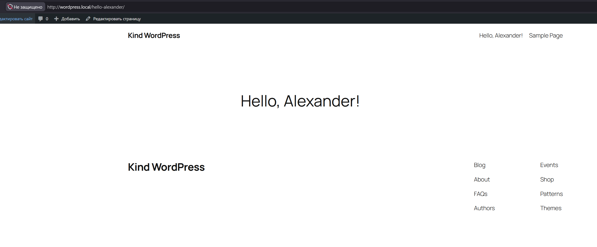
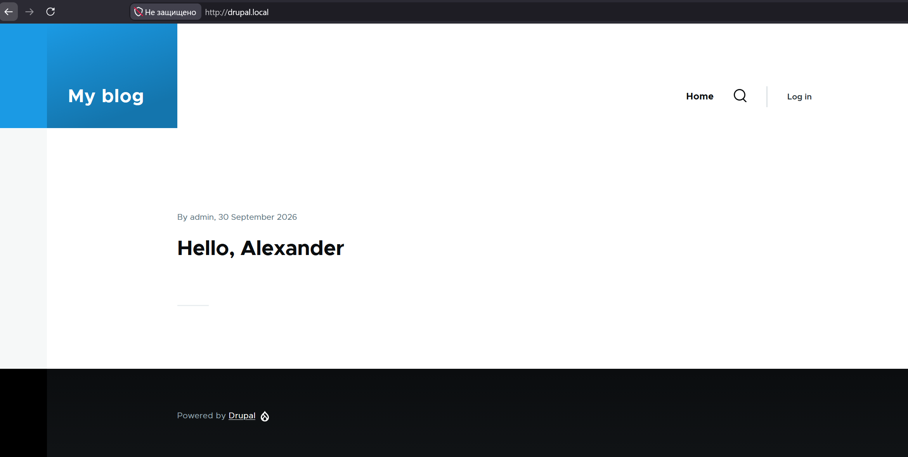

# 14.Kubernetes.Helm

## HW 1

### WordPress

Так как я использовал локальный Kind на ВМ и Cilium Gateway, мне пришлось добавить DNAT правило на ВМ для проброса 80 порта в сеть контейнеров и заранее создать Gateway для wordpress. 

Сам Helm Chart от bitnami создает HTTPRoute и ему лишь надо указать название Gateway в параметрах HTTPRoute

Для доступа с рабочего ПК прописал файл hosts на wordpress.local

```bash
helm install wordpress oci://registry-1.docker.io/bitnamicharts/wordpress -n wordpress -f values.yaml

kubectl -n wordpress get all
NAME                             READY   STATUS    RESTARTS      AGE
pod/wordpress-5cbd6d6669-ztkkg   1/1     Running   0             60m
pod/wordpress-mariadb-0          1/1     Running   1 (44m ago)   60m

NAME                                       TYPE        CLUSTER-IP      EXTERNAL-IP   PORT(S)          AGE
service/cilium-gateway-wordpress-gateway   NodePort    10.96.179.106   <none>        80:32615/TCP     43m
service/wordpress                          ClusterIP   10.96.138.133   <none>        80/TCP,443/TCP   60m
service/wordpress-mariadb                  ClusterIP   10.96.154.125   <none>        3306/TCP         60m
service/wordpress-mariadb-headless         ClusterIP   None            <none>        3306/TCP         60m

NAME                        READY   UP-TO-DATE   AVAILABLE   AGE
deployment.apps/wordpress   1/1     1            1           60m

NAME                                   DESIRED   CURRENT   READY   AGE
replicaset.apps/wordpress-5cbd6d6669   1         1         1       60m

NAME                                 READY   AGE
statefulset.apps/wordpress-mariadb   1/1     60m

kubectl -n wordpress get gateway,httproute
NAME                                                  CLASS    ADDRESS     PROGRAMMED   AGE
gateway.gateway.networking.k8s.io/wordpress-gateway   cilium   10.89.0.2   True         43m

NAME                                            HOSTNAMES             AGE
httproute.gateway.networking.k8s.io/wordpress   ["wordpress.local"]   42m

```



### Drupal


```bash
kubectl -n drupal get all
NAME                          READY   STATUS    RESTARTS   AGE
pod/drupal-6788d94585-wtckz   1/1     Running   0          107s
pod/drupal-mariadb-0          1/1     Running   0          107s

NAME                                    TYPE        CLUSTER-IP      EXTERNAL-IP   PORT(S)          AGE
service/cilium-gateway-drupal-gateway   NodePort    10.96.33.244    <none>        80:32486/TCP     115s
service/drupal                          ClusterIP   10.96.117.187   <none>        80/TCP,443/TCP   107s
service/drupal-mariadb                  ClusterIP   10.96.88.164    <none>        3306/TCP         107s
service/drupal-mariadb-headless         ClusterIP   None            <none>        3306/TCP         107s

NAME                     READY   UP-TO-DATE   AVAILABLE   AGE
deployment.apps/drupal   1/1     1            1           107s

NAME                                DESIRED   CURRENT   READY   AGE
replicaset.apps/drupal-6788d94585   1         1         1       107s

NAME                              READY   AGE
statefulset.apps/drupal-mariadb   1/1     107s
```

