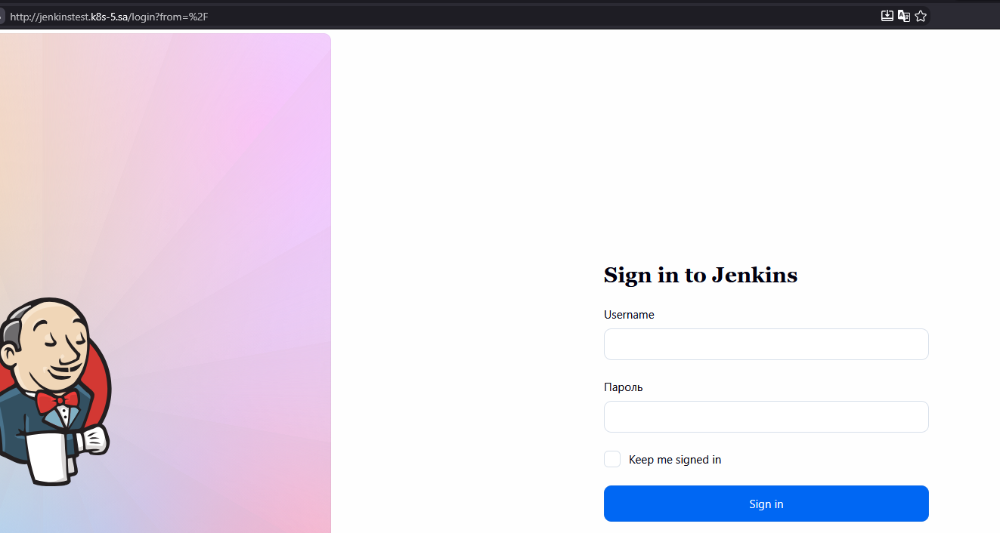

# 15.Kubernetes.Application deployment

## Homework Assignment 1. Transform Jenkins deployment to Helm
```
jenkins-local
├── charts
├── Chart.yaml
├── templates
│   ├── 01-namespace-rbac.yaml
│   ├── 02-storage.yaml
│   ├── 03-config.yaml
│   ├── 04-jenkins.yaml
│   └── jenkins-istio.yaml
└── values.yaml
```
```bash
helm create jenkins-local
helm template my-jenkins-release . --namespace ci-cd
kubectl apply -f namespace.yaml
helm install jenkins . --namespace test-helm
```

```yaml
# Default values for jenkins-local.
# This is a YAML-formatted file.
# Declare variables to be passed into your templates.

# This will set the replicaset count more information can be found here: https://kubernetes.io/docs/concepts/workloads/controllers/replicaset/
replicaCount: 1

# This sets the container image more information can be found here: https://kubernetes.io/docs/concepts/containers/images/
image: "jfrog.it-academy.by/public/jenkins-ci:alexb_36"

nfs:
  path: "/mnt/IT-Academy/nfs-data/sa2-36-26/alexb/jenkins"
  server: "192.168.37.105"

secrets:
  adminPassword: "admin"
  githubToken: "admin"

location:
  url: "http://jenkinstest.k8s-5.sa/"

hosts: "jenkinstest.k8s-5.sa"
```


