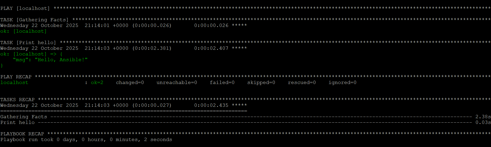
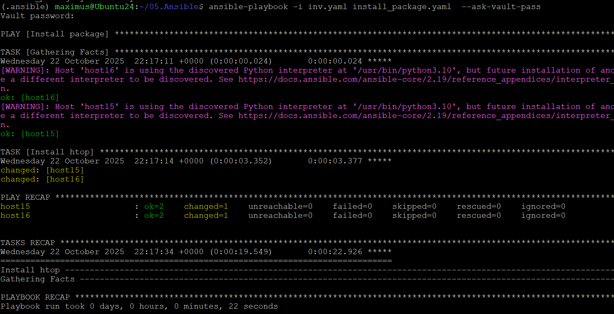
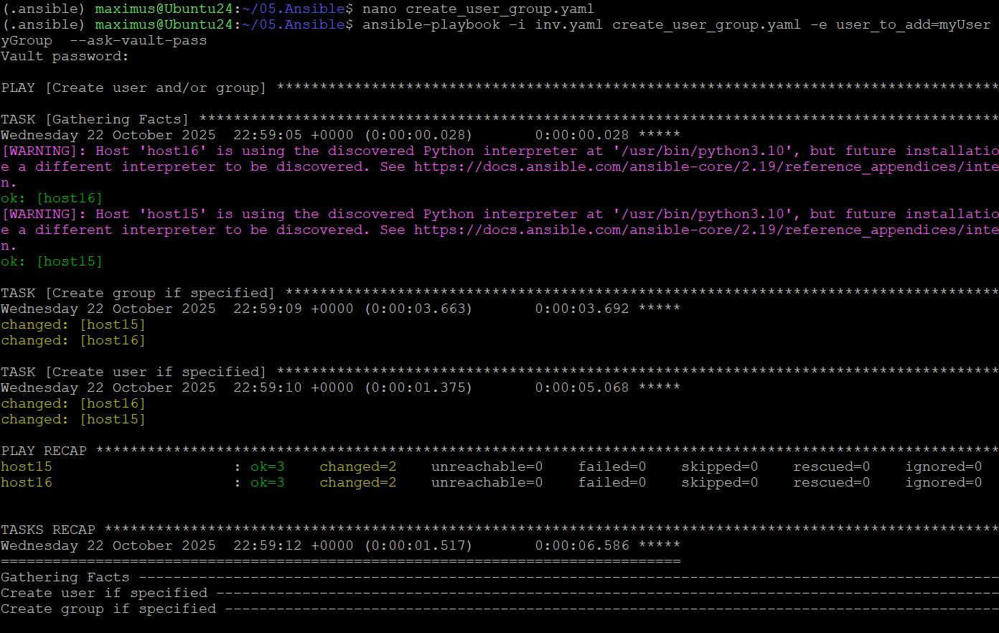

- ## Homework Assignment 1: Setting Up Ansible
``` bash
sudo apt update 
sudo apt install pip
sudo apt install virtualenv 
mkdir 05.Ansible
cd 05.Ansible
``` 
``` bash
nano ansible.cfg
```
ansible.cfg
``` ini
[defaults]
forks          = 3
host_key_checking = false
callbacks_enabled = profile_tasks, timer
```
``` bash
nano hello_ansible.yaml
```
hello_ansible.yaml
``` yaml
- hosts: localhost
  vars:
    mess: "Hello, Ansible!"
  tasks:
    - name: Print hello
      debug:
        msg: "{{ mess }}"
```
``` bash
ansible-playbook hello_ansible.yaml
```


## Homework Assignment 2: Managing Remote Hosts

``` bash
sudo apt install sshpass
ssh-keygen -t rsa -b 4096
ssh-copy-id -p 32511 jump_sa@178.124.206.53
nano inv.yaml
nano /group_vars/all_workers/vars.yaml
ansible-vault create group_vars/all_workers/vault.yaml
# ansible_user: root
```
inv.yaml
``` yaml
all_workers:
  children:
    work_sa:
     hosts:
      host15:
        ansible_host: 192.168.202.15
      host16:
        ansible_host: 192.168.202.16
jump_sa:
  vars:
    env: "it-academy"
  hosts:
    bastion:
      ansible_host: 178.124.206.53
      ansible_user: jump_sa
```
vars.yaml
```yaml
ansible_ssh_common_args: '-o ProxyCommand="ssh -W %h:%p -q jump_sa@178.124.206.53  -p 32511"'
```
``` bash
ansible -i inv.yaml -m authorized_key -a "user=root key=\"{{lookup('file', '~/.ssh/id_rsa.pub') }}\"" -u root all_workers –ask--pass
ansible-playbook -i inv.yaml install_package.yaml  --ask-vault-pass
```
install_package.yaml
``` yaml
- name: Install package
  hosts: all_workers
  become: yes
  tasks:
    - name: Install htop
      apt:
        pkg:
        - htop
        - vim
        update_cache: yes
```


## Homework Assignment 3: Managing Users and Groups
```bash
 ansible-playbook -i inv.yaml create_user_group.yaml -e user_to_add=myUser -e group_host=all_workers -e group_users=myGroup  --ask-vault-pass
```

```yaml
- name: Create user and/or group
  hosts: "{{ group_host | default('all_workers') }}"
  become: yes
  tasks:
    - name: Create group if specified
      group:
        name: "{{ group_users }}"
        state: present
      when: group_users is defined

    - name: Create user if specified
      user:
        name: "{{ user_to_add }}"
        group: "{{ group_users | default(omit) }}"
        state: present
        create_home: yes
        shell: /bin/bash
      when: user_to_add is defined

```



