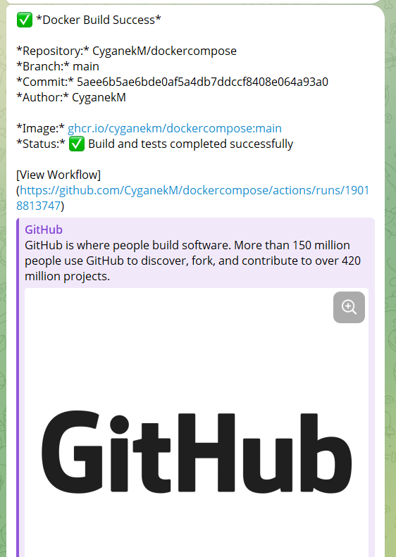

## Homework Assignment 1: Docker Compose for Application Stacks
```bash
docker-compose up -d --build

time="2025-11-02T00:39:17+03:00" level=warning msg="C:\\maximus\\It-academy\\devops\\HomeWork\\08DockerCompose\\DockerCompose\\docker-compose.yml: `version` is obsolete"
[+] Building 1.5s (15/15) FINISHED                                                                                                           docker:default
 => [spring-app internal] load build definition from Dockerfile                                                                                        0.0s
 => => transferring dockerfile: 385B                                                                                                                   0.0s
 => [spring-app internal] load metadata for docker.io/library/eclipse-temurin:21-jre-jammy                                                             1.2s
 => [spring-app internal] load metadata for docker.io/library/maven:3.9.9-eclipse-temurin-21                                                           1.3s
 => [spring-app internal] load .dockerignore                                                                                                           0.0s
 => => transferring context: 2B                                                                                                                        0.0s
 => [spring-app build 1/6] FROM docker.io/library/maven:3.9.9-eclipse-temurin-21@sha256:3a4ab3276a087bf276f79cae96b1af04f53731bec53fb2e651aca79e4b102  0.0s
 => [spring-app stage-1 1/3] FROM docker.io/library/eclipse-temurin:21-jre-jammy@sha256:db1689535962d757a5adabf57387584ed543d38c0b9d1fe870123ea362ad7  0.0s
 => [spring-app internal] load build context                                                                                                           0.0s
 => => transferring context: 1.62kB                                                                                                                    0.0s
 => CACHED [spring-app stage-1 2/3] WORKDIR /app                                                                                                       0.0s
 => CACHED [spring-app build 2/6] WORKDIR /app                                                                                                         0.0s
 => CACHED [spring-app build 3/6] COPY pom.xml .                                                                                                       0.0s
 => CACHED [spring-app build 4/6] RUN mvn dependency:go-offline -B                                                                                     0.0s
 => CACHED [spring-app build 5/6] COPY src ./src                                                                                                       0.0s
 => CACHED [spring-app build 6/6] RUN mvn clean package -DskipTests                                                                                    0.0s
 => CACHED [spring-app stage-1 3/3] COPY --from=build /app/target/*.jar app.jar                                                                        0.0s
 => [spring-app] exporting to image                                                                                                                    0.0s
 => => exporting layers                                                                                                                                0.0s
 => => writing image sha256:67c2ae980c3379fe4bc6fb3591601b09192f21e64bee703057f50a95bf3dd75c                                                           0.0s
 => => naming to docker.io/library/dockercompose-spring-app                                                                                            0.0s
[+] Running 4/4
 ✔ Network dockercompose_spring-network  Created                                                                                                       0.1s
 ✔ Container spring-mysql-db             Started                                                                                                       0.2s
 ✔ Container spring-boot-app             Started                                                                                                       0.2s
 ✔ Container mysql-adminer               Started                                                                                                       0.2s
```
## Homework Assignment 2: Docker build automation (github action)
- https://github.com/CyganekM/dockercompose


