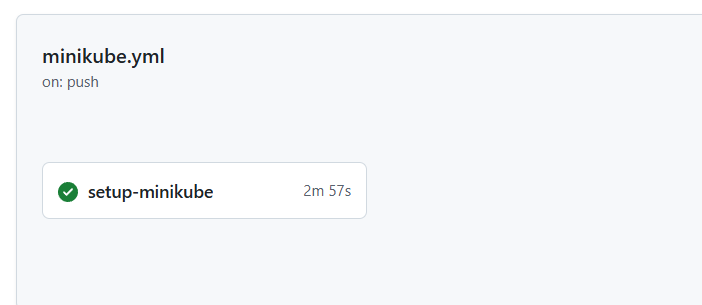

## Homework Assignment 0: Finish full install k8s
```bash
mkdir 09.K8s
cd 09.K8s
git clone https://github.com/kubernetes-sigs/kubespray.git
cd kubespray/
sudo pip install -U -r requirements.txt
cp -rfp inventory/sample/ inventory/myclaster
nano inventory/myclaster/inventory.ini
ansible-playbook -i inventory/mycluster/inventory.ini cluster.yml -u root --ask-pass

PLAY RECAP *****************************************************************************************
node1                      : ok=644  changed=110  unreachable=0    failed=0    skipped=990  rescued=                                                          0    ignored=5
node2                      : ok=428  changed=52   unreachable=0    failed=0    skipped=616  rescued=                                                          0    ignored=0

Monday 03 November 2025  21:43:56 +0000 (0:00:00.080)       0:33:15.997 *******
===============================================================================
download : Download_container | Download image if required -------------------------------- 407.14s
network_plugin/calico : Calico | Copy calicoctl binary from download dir ------------------ 400.12s
download : Download_container | Download image if required --------------------------------- 31.45s
kubernetes/control-plane : Kubeadm | Initialize first control plane node (1st try) --------- 27.97s
download : Download_container | Download image if required --------------------------------- 27.59s                                                                                               0.2s
```
### file inventory/myclaster/inventory.ini
```bash
node1 ansible_host=192.168.208.15 ip=192.168.208.15 ansible_python_interpreter=/usr/bin/python3
node2 ansible_host=192.168.208.16 ip=192.168.208.16 ansible_python_interpreter=/usr/bin/python3

[kube_control_plane]
node1

[etcd:children]
kube_control_plane

[kube_node]
node1
node2
```

## Homework Assignment 1: KinD Kubernetes Cluster Setup
- [Install Docker](https://docs.docker.com/engine/install/ubuntu/)
```bash
# удаление конфликтных пакетов
for pkg in docker.io docker-doc docker-compose docker-compose-v2 podman-docker containerd runc; do sudo apt-get remove $pkg; done
# Обновление пакетов
sudo apt update
sudo apt upgrade -y
# Установка необходимых пакетов
sudo apt install -y \
    apt-transport-https \
    ca-certificates \
    curl \
    gnupg \
    lsb-release \
    git \
    wget
# Создание директории для ключей
sudo install -m 0755 -d /etc/apt/keyrings
# Загрузка GPG ключа
sudo curl -fsSL https://download.docker.com/linux/ubuntu/gpg -o /etc/apt/keyrings/docker.asc
# Установка прав на ключ
sudo chmod a+r /etc/apt/keyrings/docker.asc
# Добавление репазитория
echo \
  "deb [arch=$(dpkg --print-architecture) signed-by=/etc/apt/keyrings/docker.asc] https://download.docker.com/linux/ubuntu \
  $(. /etc/os-release && echo "${UBUNTU_CODENAME:-$VERSION_CODENAME}") stable" | \
  sudo tee /etc/apt/sources.list.d/docker.list > /dev/null
sudo apt update
sudo apt install docker-ce docker-ce-cli containerd.io docker-buildx-plugin docker-compose-plugin
sudo systemctl status docker
● docker.service - Docker Application Container Engine
     Loaded: loaded (/usr/lib/systemd/system/docker.service; enabled; preset: enabled)
     Active: active (running) since Mon 2025-11-03 18:39:32 UTC; 3h 50min ago
TriggeredBy: ● docker.socket
       Docs: https://docs.docker.com
   Main PID: 843 (dockerd)
      Tasks: 20
     Memory: 118.9M (peak: 120.1M)
        CPU: 7.901s
     CGroup: /system.slice/docker.service
             ├─ 843 /usr/bin/dockerd -H fd:// --containerd=/run/containerd/containerd.sock
             └─1273 /usr/bin/docker-proxy -proto tcp -host-ip 127.0.0.1 -host-port 41207 -container>
```
- [Install kubectl](https://kubernetes.io/docs/tasks/tools/install-kubectl-linux/)
```bash
curl -LO "https://dl.k8s.io/release/$(curl -L -s https://dl.k8s.io/release/stable.txt)/bin/linux/amd64/kubectl"
sudo install -o root -g root -m 0755 kubectl /usr/local/bin/kubectl
kubectl version --client --output=yaml

clientVersion:
  buildDate: "2025-09-09T19:44:50Z"
  compiler: gc
  gitCommit: 93248f9ae092f571eb870b7664c534bfc7d00f03
  gitTreeState: clean
  gitVersion: v1.34.1
  goVersion: go1.24.6
  major: "1"
  minor: "34"
  platform: linux/amd64
kustomizeVersion: v5.7.1
```

```bash
curl -Lo ./kind https://kind.sigs.k8s.io/dl/v0.30.0/kind-linux-amd64
chmod +x ./kind
sudo mv ./kind /usr/local/bin/kind
kind v0.30.0 go1.24.6 linux/amd64
kind create cluster --name maximus-cluster
kubectl get nodes

NAME                            STATUS   ROLES           AGE     VERSION
maximus-cluster-control-plane   Ready    control-plane   2m24s   v1.34.0
```

## Homework Assignment 2: Minikube Kubernetes Cluster Setup
Устанавливаем docker и kubectl также как в первом задании
```bash
curl -LO https://github.com/kubernetes/minikube/releases/latest/download/minikube-linux-amd64
sudo install minikube-linux-amd64 /usr/local/bin/minikube && rm minikube-linux-amd64
minikube start
kubectl get po -A
kubectl get nodes
```
## Homework Assignment 3: GitHub Actions for KinD Cluster Setup
#### GitHub Action workflow: kind-cluster.yaml


## Homework Assignment 4: GitHub Actions for Minikube Cluster Setup
#### GitHub Action workflow: minicube.yaml

